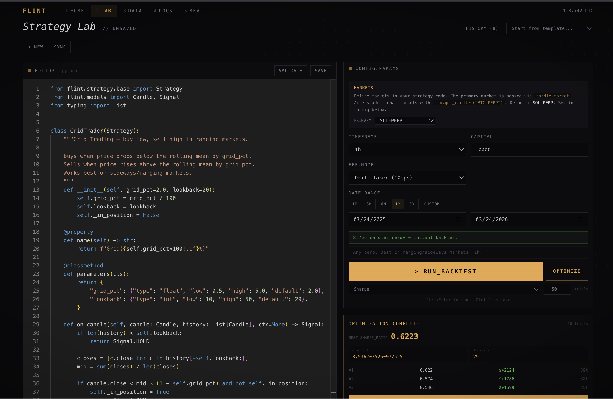

<p align="center">
  <br/>
  <picture>
    <source media="(prefers-color-scheme: dark)" srcset="https://img.shields.io/badge/FLINT-Solana_Trading_Engine-e8a849?style=for-the-badge&labelColor=09090b">
    
  </picture>
  <br/><br/>
  <strong>Backtest, paper trade, and go live on Solana and Hyperliquid. Free data, local-first, no cloud.</strong>
  <br/><br/>
  <a href="#getting-started"></a>
  <a href="#writing-strategies"></a>
  <a href="#where-data-comes-from"></a>
  <a href="#live-trading"></a>
  
  
</p>

---

## What is Flint?

Flint is a **local trading lab for Solana and Hyperliquid**. You write a strategy in Python, backtest it against historical market data with realistic fills, fees, and funding rates, then deploy it to paper trading or live execution on Drift and Hyperliquid.

Everything runs on your machine. Market data comes free from Drift Protocol and Hyperliquid's public APIs (no signup, no keys). You get a web UI with a code editor, interactive charts, and one-click backtesting. When you're ready, paper trade with live prices, optimize parameters with Optuna, or go live on-chain.

Flint supports **cross-venue strategies** -- arbitrage funding rate spreads between Drift and Hyperliquid, run basis trades across venues, or monitor MEV opportunities on Solana DEXs. Candle data, positions, and margin are tracked per-venue with `venue:market` composite keys.

<p align="center">
  
</p>

### Why Flint?

| | Flint | Freqtrade | Hummingbot | TradingView |
|---|:---:|:---:|:---:|:---:|
| **Solana-native** (Drift, Jupiter, Raydium) | Yes | No | Partial | No |
| **Multi-venue live trading** (Drift + Hyperliquid) | Yes | No | Partial | No |
| **Free data** (no API keys needed) | Yes | No | No | Paid |
| **Cross-venue strategies** (arb, basis) | Yes | No | Limited | No |
| **Browser-based strategy editor** | Yes | No | No | Yes |
| **Paper trading with live data** | Yes | Yes | Yes | No |
| **Funding rate analysis** (10 venues) | Yes | Limited | No | No |
| **4-tier fill models** (vAMM, orderbook, sqrt, flat) | Yes | Flat only | Flat only | N/A |
| **Slippage calibration from live fills** | Yes | No | No | No |
| **Optuna optimization** | Yes | Hyperopt | No | No |
| **MCP server** (AI integration) | Yes | No | No | No |
| **Local-first** (nothing leaves your machine) | Yes | Yes | Yes | No |
| **Setup time** | 1 command | 10+ min | Docker | Browser |

---

## Getting Started

### Option 1: One-line install (recommended)

```bash
curl -fsSL https://raw.githubusercontent.com/sohan-shingade/flint/main/install.sh | bash
```

This installs Python, Node, clones the repo, builds the UI, and opens your browser. A **setup wizard** walks you through picking venues, markets, and downloading data -- no terminal required after the initial command.

### Option 2: Docker

```bash
git clone https://github.com/sohan-shingade/flint.git && cd flint
docker compose up
```

Open [localhost:8000](http://localhost:8000) -- the setup wizard handles the rest. Data persists in a Docker volume.

### Option 3: From source (developers)

```bash
git clone https://github.com/sohan-shingade/flint.git && cd flint
pip install -e .
flint init
flint serve               # starts everything at localhost:8000
```

Or use the **Makefile** for dev workflows:

```bash
make install              # pip install + npm install
make dev                  # API (hot reload) + UI dev server
make test                 # run all tests
make serve                # production build + serve
make build                # build Docker image
```

For UI development:

```bash
flint serve --dev         # API only on :8000
cd ui && npm run dev      # UI on :5173 with hot reload
```

---

## Core Features

### Strategy Lab

Write strategies directly in the browser with a full Monaco editor (same editor as VS Code). Pick a market and venue, set your date range and capital, and click **Run**. Results appear inline -- no context switching.

Flint ships with **20 built-in strategy templates**: momentum, EMA/MA crossover, RSI, Bollinger Bands, MACD, VWAP reversion, grid trading, funding rate harvesting, cross-venue funding arbitrage, basis trading, MEV monitoring, and more. Or write your own from scratch.

The lab **auto-detects your strategy type** from the code -- single-venue, multi-market, multi-venue, or monitor -- and adjusts the UI accordingly (venue selectors, capital allocation inputs, market pickers).

<p align="center">
  
</p>

### Backtest Results

Every backtest produces a full tearsheet: equity curve vs. buy-and-hold, drawdown chart, price chart with trade entry/exit markers, and a complete metrics panel (Sharpe, Sortino, max drawdown, win rate, profit factor, and more).

<p align="center">
  
  <br/>
  <em>Equity curve, drawdown, price action with trade markers, and all metrics at a glance</em>
</p>

Below the overview you get PnL distribution, an exposure timeline, monthly returns heatmap, and a full trade log showing every entry and exit with prices, sizes, venue, and PnL.

<p align="center">
  
  <br/>
  <em>PnL distribution, exposure timeline, monthly returns, and trade-by-trade breakdown</em>
</p>

Backtests simulate realistic execution with a 4-tier fill pipeline:

- **vAMM curve model** -- constant-product AMM fill pricing calibrated to Drift's on-chain depth (Tier 0)
- **Orderbook walk** -- volume-weighted fills from L2 snapshots (Tier 1)
- **Sqrt participation model** -- per-venue impact coefficients (Tier 2)
- **Flat bps fallback** -- configurable basis-point slippage (Tier 3)
- **Fee models** -- per-venue maker/taker tiers (Drift, Hyperliquid, Binance, OKX, Bybit, dYdX)
- **Transaction costs** -- Solana priority fees + Jito tips, Hyperliquid settlement
- **Stop-loss / take-profit** -- checked against each bar's high and low
- **Funding rates** -- applied hourly to open positions from real multi-venue data
- **Margin tracking** -- per-venue margin with liquidation detection
- **Capital allocation** -- per-venue cash with transfer delays
- **Multi-market** -- run strategies across multiple markets simultaneously
- **Monte Carlo** -- 500-iteration bootstrap with confidence intervals on every run with 5+ trades

### Optimization

Define a `parameters()` method on your strategy and Flint uses **Optuna** to find the best combination. Bayesian search, grid search, or random -- your choice. Results show a ranked table of all trials with metrics so you can see parameter stability, not just the best single result.

<p align="center">
  
  <br/>
  <em>Optuna optimization -- 10 trials ranked by Sharpe ratio with one-click "backtest with best params"</em>
</p>

### Paper Trading

Deploy any backtested strategy to run live against real market data with simulated execution. Click **Deploy to Paper** on any backtest result and it goes live immediately. Select the venue (Drift, Hyperliquid, or both) for paper execution.

Each strategy runs as its own independent portfolio with:

- **Venue selection** -- paper trade on Drift, Hyperliquid, or both simultaneously
- **Replay-forward execution** -- replays up to 30 days of history, then seamlessly transitions to live candle processing
- **Risk guardrails** -- configurable max drawdown, daily loss limit, position size cap, and perp liquidation simulation
- **Realistic fills** -- 5bps slippage, venue-specific fee schedule, optional order latency
- **Funding rate payments** -- applied hourly from real multi-venue data
- **Live PnL updates** -- DLOB mid-price polling every 5 seconds
- **Equity curve with buy-and-hold baseline** -- see your strategy vs just holding the asset
- **Trade markers** -- entry/exit dots on the equity chart
- **Session persistence** -- survives server restarts, resumes automatically
- **Per-venue capital allocation** -- allocate capital per venue with simulated transfer delays

### Live Trading

Deploy strategies to **Drift** (Solana) and **Hyperliquid** with real on-chain execution.

- **Drift**: driftpy SDK, Solana keypair signing, devnet/mainnet support
- **Hyperliquid**: native REST + EIP-712 signing, API wallets (recommended -- no withdrawals), testnet/mainnet
- **Multi-venue**: `MultiVenueLiveContext` routes orders by venue, maintains separate margin/positions per venue
- **Paired leg submission**: cross-venue orders with timeout + auto-unwind on partial fill
- **Kill switch**: `EquityMonitor` flattens all positions across all venues on drawdown breach
- **Risk guards**: position limits, drawdown circuit breaker, daily loss limit, rate limiter
- **Dry-run mode**: full pipeline without submitting transactions
- **Parity testing**: verify backtest-vs-live behavior before deploying
- **WebSocket feeds**: Drift + Hyperliquid + Pyth for real-time data

See the [Live Deployment Guide](docs/guides/live-deployment.md) for full setup instructions.

### Data Explorer

Interactive TradingView-quality charts powered by lightweight-charts v5. Overlay indicators (SMA, EMA, VWAP, Bollinger Bands, RSI) and toggle between price and funding views. **Venue selector** lets you switch between Drift and Hyperliquid candles, or overlay both for price comparison.

<p align="center">
  
  <br/>
  <em>Candlestick chart with volume, moving average overlay, and crosshair</em>
</p>

The Data tab also has a **download manager** where you pick which markets, venues, and time ranges to fetch. Presets make it easy -- "Starter Pack" gets you the top 5 markets, "Everything" gets all 48 Drift markets plus Hyperliquid equivalents and funding from 10 venues.

<p align="center">
  
  <br/>
  <em>Download presets, venue selection, and market inventory with one-click bulk download</em>
</p>

### Cross-Venue Funding Analysis

Flint pulls funding rates from **10 venues** (Drift, Binance, Hyperliquid, OKX, Bybit, Gate.io, Bitget, dYdX, plus any CCXT exchange) and normalizes them to hourly. The Data Explorer lets you overlay all venues on one chart to spot dislocations -- when one venue's funding diverges from the rest, there's a potential arb.

<p align="center">
  
  <br/>
  <em>Funding rates across 7 venues with per-venue statistics -- spot dislocations at a glance</em>
</p>

### Slippage Calibration

Fit your fill models from real live trading data using `flint calibrate`. The `CalibrationEngine` fits power-law and sqrt models via 5-fold cross-validation, detects coefficient drift at 15%, and writes calibrated coefficients back to `VenueConfig`. Pre-trade cost estimation is available in strategies via `ctx.estimate_cost()`.

---

## Writing Strategies

Every strategy is a Python class with one method: `on_candle`. It gets called once per candle with the current price and all history. You decide what to do.

### Simple approach -- return a signal

```python
from flint.strategy.base import Strategy
from flint.models import Candle, Signal
from flint.indicators import sma

class GoldenCross(Strategy):
    @property
    def name(self): return "golden-cross"

    def on_candle(self, candle, history, ctx=None):
        if len(history) < 50:
            return Signal.HOLD
        if sma(history, 20) > sma(history, 50):
            return Signal.BUY
        elif sma(history, 20) < sma(history, 50):
            return Signal.SELL
        return Signal.HOLD

    def reset(self): pass
```

Return `Signal.BUY` and Flint opens a long. Return `Signal.SELL` and it closes. That's it.

### Advanced approach -- full execution control

```python
def on_candle(self, candle, history, ctx=None):
    if ctx is None:
        return Signal.HOLD

    from flint.indicators import rsi, atr

    r = rsi(history, 14)
    risk = atr(history, 14)

    if r < 30 and not ctx.positions:
        ctx.market_order(candle.market, "long", size=1.0)
        ctx.stop_order(candle.market, "short", size=1.0,
                       trigger_price=candle.close - 2 * risk)
    elif r > 70 and ctx.positions:
        ctx.close_position(candle.market)
        ctx.cancel_all()

    return Signal.HOLD
```

With `ctx` you get market orders, limit orders, stop-losses, take-profits, multi-market data access (`ctx.get_candles("BTC-PERP")`), funding rates, open interest, orderbook depth, and cross-venue order routing (`venue="drift"` or `venue="hyperliquid"`).

### Cross-venue strategies

```python
# Long on Drift (low funding), short on Hyperliquid (high funding)
ctx.market_order("SOL-PERP", "long", size, venue="drift")
ctx.market_order("SOL-PERP", "short", size, venue="hyperliquid")
```

### Making strategies optimizable

Add a `parameters()` classmethod and Flint's optimizer will search the space:

```python
@classmethod
def parameters(cls):
    return {
        "fast_period": {"type": "int", "low": 5, "high": 50, "default": 20},
        "slow_period": {"type": "int", "low": 20, "high": 200, "default": 50},
    }
```

### 20 built-in indicators

`sma`, `ema`, `wma`, `rsi`, `stochastic`, `macd`, `bollinger`, `bollinger_width`, `atr`, `volatility`, `vwap`, `volume_ratio`, `roc`, `adx`, `z_score`, `highest_high`, `lowest_low` -- all take `(history, period)` and return floats.

See the [Strategy Authoring Guide](docs/guides/strategy-authoring.md) for the full API reference.

---

## Where Data Comes From

All core data is **free** -- no API keys, no signup. Flint pulls from Drift Protocol's and Hyperliquid's public APIs and stores everything locally in DuckDB with per-venue candle storage.

### Free (no keys needed)

| Source | What you get |
|---|---|
| **Drift Data API** | OHLCV candles for 48 markets (1m to daily), funding rates, L2/L3 orderbook |
| **Drift S3** | Archival trade records for backfilling older data |
| **Drift Open Interest** | Long/short OI for all perp markets |
| **Hyperliquid** | OHLCV candles for Hyperliquid perp markets |
| **Pyth Network** | Real-time oracle prices for 20 pairs (SOL, BTC, ETH...) |
| **GeckoTerminal** | DEX pool candles for any Solana pool |
| **CoinGecko** | Spot candles for BTC, ETH, SOL (fills gaps for non-Drift assets) |
| **Jupiter** | Swap quotes and routing for any SPL token pair |
| **Raydium + Orca** | AMM/CLMM pool data, TVL, volume from the two largest Solana DEXs |
| **Cross-venue funding** | 10 venues: Drift, Binance, Hyperliquid, OKX, Bybit, Gate.io, Bitget, dYdX + CCXT adapters |

### Optional (free API key, no credit card)

| Source | What you get | Sign up |
|---|---|---|
| **Birdeye** | OHLCV for **any** Solana token | [birdeye.so](https://birdeye.so/developers) |
| **Helius** | Liquidation detection, whale tracking | [helius.dev](https://helius.dev) |

### CCXT (100+ centralized exchanges)

```bash
pip install flint[ccxt]
```

Pull candles, funding, and orderbooks from Binance, Coinbase, Kraken, KuCoin, and 100+ more. Symbol mapping is automatic (`SOL-PERP` maps to each exchange's native format).

### Local storage

Everything is cached in a local DuckDB file (`./data/flint.duckdb`). No data leaves your machine. Candles are stored per-venue (`PRIMARY KEY (venue, market, resolution_s, ts)`), so you can have Drift and Hyperliquid data side by side. Subsequent backtests on the same market are instant -- no re-downloading.

---

## CLI Quick Reference

```bash
flint init                                          # download sample data + run demo backtest
flint serve                                         # build UI + start API at localhost:8000
flint serve --dev                                   # API only (run UI separately with npm run dev)
flint backtest <strategy.py>                        # run backtest from CLI
flint optimize <strategy.py>                        # hyperparameter search
flint data download --market SOL-PERP --days 180    # download market data
flint data status                                   # show what data you have
flint new my_strategy                               # scaffold a new strategy file
flint live --paper                                  # paper trade with live prices
flint live --strategy momentum --market SOL-PERP    # live trade (requires venue keys)
flint calibrate --venue drift --market SOL-PERP     # calibrate slippage model from live fills
```

## MCP Server (AI Integration)

Flint includes an MCP server so AI models (Claude, etc.) can run backtests, query data, and optimize strategies directly.

```bash
pip install flint[mcp]
claude mcp add flint -- python -m flint.mcp_server
```

11 tools available: `run_backtest`, `optimize_strategy`, `get_candles`, `download_market_data`, `list_available_markets`, `list_local_markets`, `list_strategies`, `get_funding_rates`, `get_open_interest`, `get_correlation`, `get_data_freshness`.

2 resources: `flint://guide` (usage overview), `flint://markets` (market list).

---

## Documentation

| Guide | Description |
|---|---|
| [Quickstart](docs/guides/quickstart.md) | Zero to backtest in 5 minutes |
| [Strategy Authoring](docs/guides/strategy-authoring.md) | Write strategies, 4 strategy types, ExecutionContext API, optimization |
| [Data Providers](docs/guides/data-providers.md) | 15 providers, multi-venue downloads, funding venues, custom providers |
| [Live Deployment](docs/guides/live-deployment.md) | Drift + Hyperliquid setup, risk config, multi-venue live trading |
| [Architecture](docs/guides/architecture.md) | Execution hierarchy, fill pipeline, margin engine, WebSocket feeds |
| [Slippage Models](docs/guides/slippage-models.md) | 4-tier impact model, vAMM, calibration, transaction costs, CLMM |

---

## Tech Stack

| Layer | Technology |
|---|---|
| Backend | Python 3.10+, FastAPI, DuckDB, Optuna, NumPy |
| Frontend | React 19, Vite, Tailwind CSS, Monaco Editor, lightweight-charts v5 |
| Data | 15 providers (Drift, Hyperliquid, Pyth, Birdeye, Helius, Raydium, Orca, GeckoTerminal, CoinGecko, Jupiter, CCXT) |
| Funding | 10 venues (Drift, Binance, Hyperliquid, OKX, Bybit, Gate.io, Bitget, dYdX + CCXT) |
| Execution | Drift (driftpy), Hyperliquid (REST + EIP-712), multi-venue routing |
| Fill Models | vAMM, orderbook walk, sqrt participation, flat bps, calibration engine |
| Testing | 676 tests, all mocked (no network calls) |

---

## Limitations

Flint is a **backtesting, research, and live trading platform** -- but understand what it is and what it isn't:

- **Backtests are not predictions.** Past performance doesn't guarantee future results. Overfitting to historical data is easy -- use walk-forward validation and Monte Carlo to stress-test your strategies.
- **Fill simulation is approximate.** Even with the 4-tier fill pipeline (vAMM, orderbook, sqrt, flat), simulated fills cannot capture real-time liquidity dynamics, queue priority, or MEV-induced price impact. Use calibration from live fills to improve accuracy.
- **Funding rate data varies by venue.** Some venues don't provide historical mark/index prices per record, so funding payments in backtests use the candle close price as a proxy for notional calculation.
- **Live trading requires care.** Live execution on Drift and Hyperliquid is functional but carries real financial risk. Always validate with dry-run, devnet, and parity testing before deploying with real capital. Use API wallets on Hyperliquid.
- **Single-machine only.** Flint runs locally on one machine. There's no distributed mode, no cloud deployment, and no multi-user support. DuckDB is single-writer.
- **Solana + Hyperliquid focus.** The core platform is built around Solana (Drift, Jupiter, Raydium, Orca) and Hyperliquid. CEX data is available via CCXT but live execution targets Drift and Hyperliquid.
- **Jupiter Perps: no historical data.** Jupiter Perps has no public API for historical borrow rates, volume, or OHLCV. Borrow rate data is forward-collected only (accumulates while the collector runs). Volume is approximated from Helius transaction data (USDC transfer proxy, not notional). Do not backtest strategies that depend on Jupiter Perps borrow rates or volume beyond what has been forward-collected.
- **Orca / Raydium are spot DEXes.** They have no funding rates (that's a perps concept). Historical pool volume is available via GeckoTerminal. Current pool data (TVL, reserves, tick liquidity) is available via their native APIs.

---

<p align="center">
  <sub>Built for Solana. Powered by Drift Protocol and Hyperliquid.</sub>
</p>
