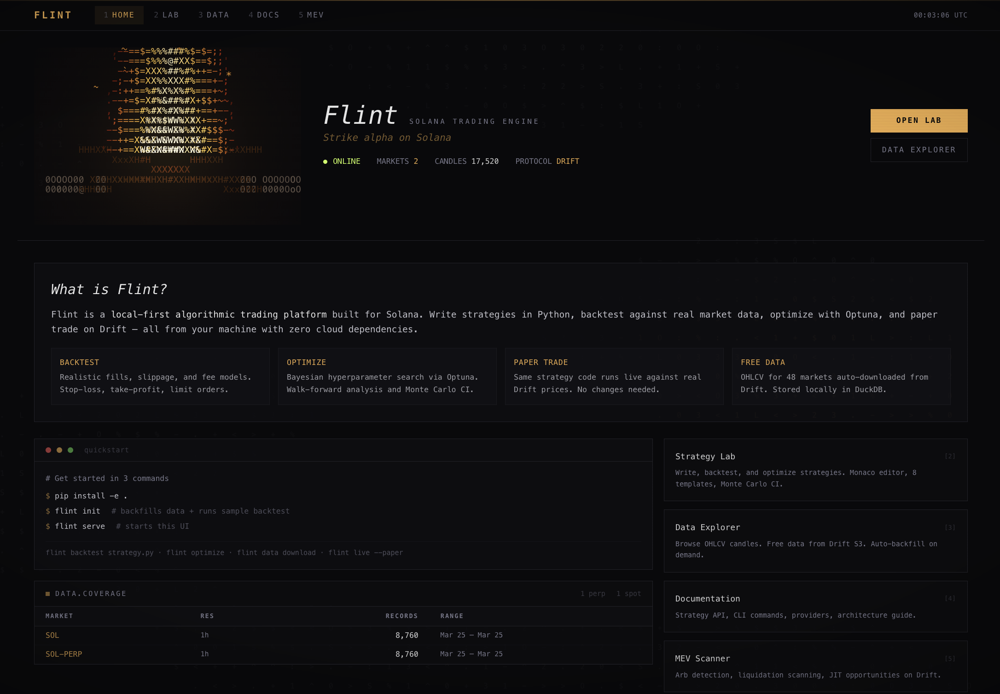
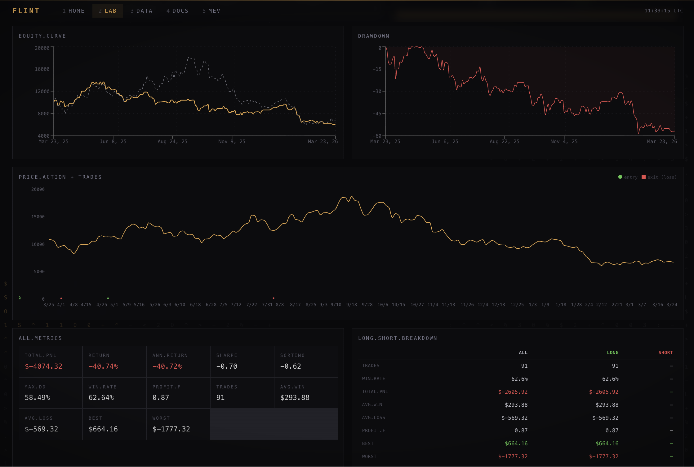
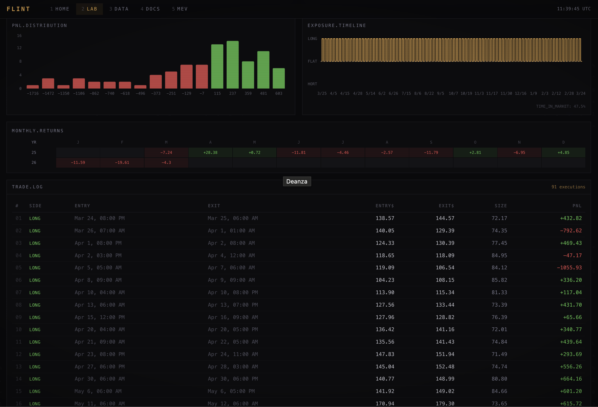
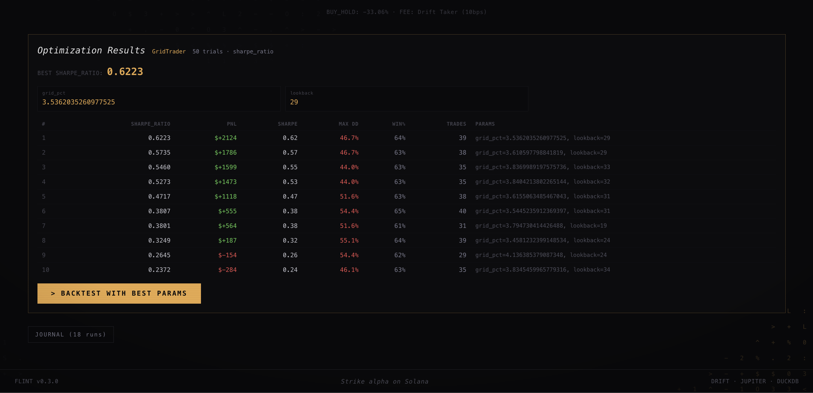
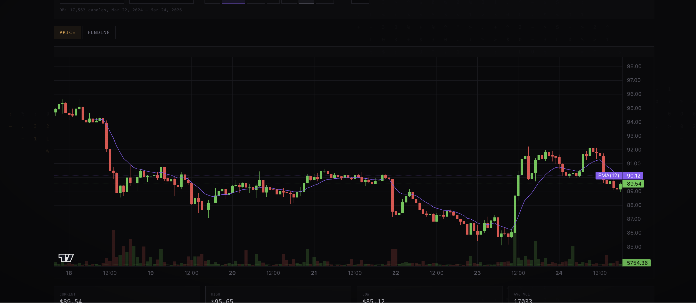
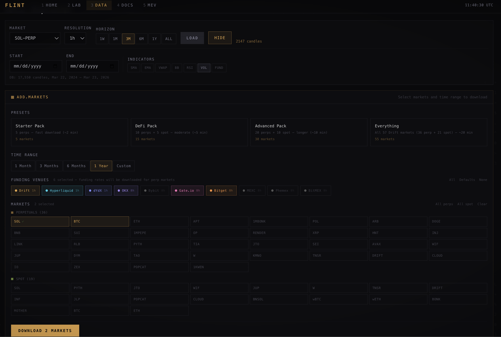
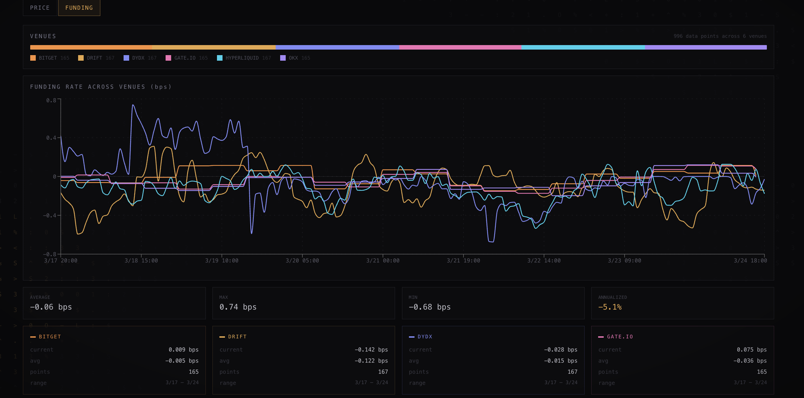

<p align="center">
  <br/>
  <picture>
    <source media="(prefers-color-scheme: dark)" srcset="https://img.shields.io/badge/FLINT-Solana_Trading_Lab-e8a849?style=for-the-badge&labelColor=09090b">
    
  </picture>
  <br/><br/>
  <strong>The open-source trading engine for Drift and Hyperliquid. Backtest with realistic fills, paper trade with live data, go live when ready. Data from 100+ CEXs via CCXT. One command to install, free data, nothing leaves your machine.</strong>
  <br/><br/>
  <a href="#getting-started"></a>
  <a href="#writing-strategies"></a>
  <a href="#where-data-comes-from"></a>
  <a href="#live-trading"></a>
  
  
</p>

---

<!-- counts:auto -->
- **22 built-in strategies** · **26 data providers** · **75 REST endpoints** · **17 MCP tools** · **1763 tests**

_Counts auto-generated by `scripts/update_readme_counts.py`._
<!-- /counts:auto -->

---

## What is Flint?

Flint is a **complete trading engine for Solana and Hyperliquid perps**. Write a strategy in Python, backtest it against real market data with venue-accurate fills, funding rates, and margin simulation, then paper trade with live WebSocket prices or deploy directly to Drift and Hyperliquid. Pull data from 100+ centralized exchanges via CCXT for cross-venue analysis and backtesting. No other open-source framework does this for DeFi perps.

Market data is free -- Drift and Hyperliquid publish OHLCV candles, funding rates, open interest, and orderbook snapshots via public APIs. No signup, no API keys, no monthly bills. Everything runs locally and stays on your machine. You get a full browser UI with a VS Code-quality editor, interactive charts, and one-click backtesting, plus a CLI for automation.

<p align="center">
  
</p>

### Why Flint over Freqtrade / Hummingbot / TradingView?

Most trading frameworks were built for centralized exchanges. They bolt on crypto support as an afterthought, use flat-fee fill models, and have zero concept of on-chain funding rates, vAMM mechanics, or Solana priority fees. Flint was built from the ground up for DeFi perps.

| | Flint | Freqtrade | Hummingbot | TradingView |
|---|:---:|:---:|:---:|:---:|
| **Solana-native** (Drift, Jupiter, Raydium, Orca) | Yes | No | No | No |
| **Multi-venue live trading** (Drift + Hyperliquid) | Yes | No | Partial | No |
| **Free data** (no API keys, no monthly cost) | Yes | No | No | Paid |
| **Cross-venue strategies** (funding arb, basis trades) | Yes | No | Limited | No |
| **Browser-based strategy editor** | Yes | No | No | Yes |
| **Paper trading with live WebSocket data** | Yes | Yes | Yes | No |
| **Funding rate analysis** (10 venues, normalized hourly) | Yes | No | No | No |
| **3-stage fill pipeline** (latency → impact → partial) with **4 impact models** (vAMM, orderbook walk, sqrt, flat) | Yes | Close-price | Close-price | N/A |
| **Slippage calibration from live fills** | Yes | No | No | No |
| **Per-venue margin + liquidation simulation** | Yes | No | No | No |
| **Optuna hyperparameter optimization** | Yes | Hyperopt | No | No |
| **Monte Carlo confidence intervals** | Yes | No | No | No |
| **MCP server** (Claude / AI integration) | Yes | No | No | No |
| **Local-first** (nothing leaves your machine) | Yes | Yes | Yes | No |
| **Setup time** | 1 command | 10+ min | Docker | Browser |

Freqtrade is a good tool for Binance spot bots. Flint is what you use when you're trading perps on Drift and Hyperliquid and you need fills that actually model how these venues work.

---

## Getting Started

### Option 1: pip install (recommended)

```bash
pip install flint-trading
flint init                    # download sample data + run demo backtest
flint serve                   # starts everything at localhost:8000
```

Note: The web UI requires a separate build step when installing from pip. For the full browser experience out of the box, use the one-line installer or install from source.

### Option 2: One-line install

```bash
curl -fsSL https://raw.githubusercontent.com/sohan-shingade/flint/main/install.sh | bash
```

This installs Python, Node, clones the repo, builds the UI, and opens your browser. A setup wizard walks you through picking venues, markets, and downloading data.

For CI or automated environments:

```bash
curl -fsSL https://raw.githubusercontent.com/sohan-shingade/flint/main/install.sh | bash -s -- --non-interactive
```

This skips all interactive prompts. You can also set `FLINT_NONINTERACTIVE=1` or `FLINT_HOME=/custom/path`.

### Option 3: Docker

```bash
git clone https://github.com/sohan-shingade/flint.git && cd flint
docker compose up
```

Open [localhost:8000](http://localhost:8000). Data persists in a Docker volume.

### Option 4: From source (developers)

```bash
git clone https://github.com/sohan-shingade/flint.git && cd flint
pip install -e .
flint init                    # download sample data + run demo backtest
flint serve                   # starts everything at localhost:8000
```

For UI development:

```bash
flint serve --dev             # API only on :8000
cd ui && npm run dev          # UI on :5173 with hot reload
```

---

## Try It Yourself

After installing, run the canonical backtest to verify everything works:

```bash
python examples/canonical_backtest.py
```

This downloads 90 days of SOL-PERP hourly data from Drift and runs a momentum breakout strategy with the full fill pipeline (latency, market impact, partial fills). Expected output:

```
Loaded 2,160 candles for SOL-PERP.

============================================================
  FLINT BACKTEST RESULTS
============================================================
  Strategy:        Momentum Breakout (lookback=20, stop=2%)
  Market:          SOL-PERP
  Period:          2026-01-06 to 2026-04-06
  Candles:         2,160 (1h bars)
  Initial capital: $10,000
  Fill model:      FillPipeline (latency + impact + partial)
  Fee rate:        5 bps
------------------------------------------------------------
  Total PnL:       ...
  Return:          ...
  Sharpe ratio:    ...
  Max drawdown:    ...
  Total trades:    ...
============================================================
```

To see how fill model choice affects results:

```bash
python examples/fill_model_comparison.py
```

This runs the same strategy through `ClosePriceFill`, `NextBarOpenFill`, `SlippageFill`, and `FillPipeline` side by side -- so you can see how fill assumptions change performance. See the [Fill Model Comparison](docs/validation/fill-model-comparison.md) for the full technical writeup.

To validate that backtests predict paper trading behavior:

```bash
python examples/parity_test_example.py
```

This runs the backtest engine and paper broker on identical data and reports PnL divergence, fill price MAE, and equity curve correlation. Pass threshold: <2% PnL divergence. See [Known Limitations](docs/validation/known-limitations.md) for what the backtester does and does not model.

---

## Writing Strategies

Every strategy is a Python class with one method: `on_candle`. It gets called once per candle with the current price and all history. You decide what to do.

### Simple approach -- return a signal

```python
from flint.strategy.base import Strategy
from flint.models import Candle, Signal
from flint.indicators import sma

class GoldenCross(Strategy):
    @property
    def name(self): return "golden-cross"

    def on_candle(self, candle, history, ctx=None):
        if len(history) < 50:
            return Signal.HOLD
        if sma(history, 20) > sma(history, 50):
            return Signal.BUY
        elif sma(history, 20) < sma(history, 50):
            return Signal.SELL
        return Signal.HOLD

    def reset(self): pass
```

Return `Signal.BUY` and Flint opens a long. Return `Signal.SELL` and it closes. That's it.

### Advanced approach -- full execution control

```python
def on_candle(self, candle, history, ctx=None):
    if ctx is None:
        return Signal.HOLD

    from flint.indicators import rsi, atr

    r = rsi(history, 14)
    risk = atr(history, 14)

    if r < 30 and not ctx.positions:
        ctx.market_order(candle.market, "long", size=1.0)
        ctx.stop_order(candle.market, "short", size=1.0,
                       trigger_price=candle.close - 2 * risk)
    elif r > 70 and ctx.positions:
        ctx.close_position(candle.market)
        ctx.cancel_all()

    return Signal.HOLD
```

With `ctx` you get market orders, limit orders, stop-losses, take-profits, multi-market data access (`ctx.get_candles("BTC-PERP")`), funding rates, open interest, and orderbook depth.

### Making strategies optimizable

Add a `parameters()` classmethod and Flint's optimizer will search the space:

```python
@classmethod
def parameters(cls):
    return {
        "fast_period": {"type": "int", "low": 5, "high": 50, "default": 20},
        "slow_period": {"type": "int", "low": 20, "high": 200, "default": 50},
    }
```

### Built-in indicators

`sma`, `ema`, `wma`, `rsi`, `stochastic`, `macd`, `bollinger`, `bollinger_width`, `atr`, `volatility`, `vwap`, `volume_ratio`, `roc`, `adx`, `z_score`, `highest_high`, `lowest_low` -- all take `(history, period)` and return floats.

See the [Strategy Authoring Guide](docs/guides/strategy-authoring.md) for the full API reference.

---

## Where Data Comes From

All core data is **free** -- no API keys, no signup. Flint pulls from Drift Protocol's and Hyperliquid's public APIs and stores everything locally in DuckDB.

### Free (no keys needed)

| Source | What you get |
|---|---|
| **Drift Data API** | OHLCV candles for 48 markets (1m to daily), funding rates, L2/L3 orderbook |
| **Drift S3** | Archival trade records for backfilling older data |
| **Drift Open Interest** | Long/short OI for all perp markets |
| **Hyperliquid** | OHLCV candles for Hyperliquid perp markets |
| **Pyth Network** | Real-time oracle prices for 20 pairs (SOL, BTC, ETH...) |
| **GeckoTerminal** | DEX pool candles for any Solana pool |
| **CoinGecko** | Spot candles for BTC, ETH, SOL (fills gaps for non-Drift assets) |
| **Jupiter** | Swap quotes and routing for any SPL token pair |
| **Raydium + Orca** | AMM/CLMM pool data, TVL, volume from the two largest Solana DEXs |

### Optional (free API key, no credit card)

| Source | What you get | Sign up |
|---|---|---|
| **Birdeye** | OHLCV for any Solana token | [birdeye.so](https://birdeye.so/developers) |
| **Helius** | Liquidation detection, whale tracking | [helius.dev](https://helius.dev) |

### Local storage

Everything is cached in a local DuckDB file (`./data/flint.duckdb`). No data leaves your machine. Candles are stored per-venue, so you can have Drift and Hyperliquid data side by side. Subsequent backtests on the same market are instant -- no re-downloading.

---

## Backtesting

Every backtest produces a full tearsheet: equity curve vs. buy-and-hold, drawdown chart, price chart with trade entry/exit markers, and a complete metrics panel (Sharpe, Sortino, max drawdown, win rate, profit factor, and more).

<p align="center">
  
  <br/>
  <em>Equity curve, drawdown, price action with trade markers, and all metrics at a glance</em>
</p>

Below the overview you get PnL distribution, an exposure timeline, monthly returns heatmap, and a full trade log showing every entry and exit with prices, sizes, venue, and PnL.

<p align="center">
  
  <br/>
  <em>PnL distribution, exposure timeline, monthly returns, and trade-by-trade breakdown</em>
</p>

Flint ships with 20 built-in strategy templates: momentum, EMA/MA crossover, RSI, Bollinger Bands, MACD, VWAP reversion, grid trading, funding rate harvesting, and more. Or write your own from scratch.

### Optimization

Define a `parameters()` method on your strategy and Flint uses Optuna to find the best combination. Bayesian search, grid search, or random -- your choice. Results show a ranked table of all trials with metrics so you can see parameter stability, not just the best single result.

<p align="center">
  
  <br/>
  <em>Optuna optimization -- 10 trials ranked by Sharpe ratio with one-click "backtest with best params"</em>
</p>

---

## Paper Trading

Deploy any backtested strategy to run live against real market data with simulated execution. Click **Deploy to Paper** on any backtest result and it goes live immediately. Select the venue (Drift, Hyperliquid, or both) for paper execution.

- **Replay-forward execution** -- replays up to 30 days of history, then transitions to live candle processing
- **Risk guardrails** -- configurable max drawdown, daily loss limit, position size cap
- **Realistic fills** -- venue-specific fee schedule, slippage, optional order latency
- **Funding rate payments** -- applied hourly from real multi-venue data
- **Live PnL updates** -- DLOB mid-price polling every 5 seconds
- **Equity curve with buy-and-hold baseline** -- see your strategy vs just holding the asset
- **Session persistence** -- survives server restarts, resumes automatically

---

## Data Explorer

Interactive TradingView-quality charts powered by lightweight-charts v5. Overlay indicators (SMA, EMA, VWAP, Bollinger Bands, RSI) and toggle between price and funding views. The venue selector lets you switch between Drift and Hyperliquid candles, or overlay both for price comparison.

<p align="center">
  
  <br/>
  <em>Candlestick chart with volume, moving average overlay, and crosshair</em>
</p>

The Data tab also has a download manager where you pick which markets, venues, and time ranges to fetch. Presets make it easy -- "Starter Pack" gets the top 5 markets, "Everything" gets all 48 Drift markets plus Hyperliquid equivalents.

<p align="center">
  
  <br/>
  <em>Download presets, venue selection, and market inventory with one-click bulk download</em>
</p>

---

## CLI Quick Reference

```bash
flint init                                          # download sample data + run demo backtest
flint serve                                         # build UI + start API at localhost:8000
flint serve --dev                                   # API only (run UI separately with npm run dev)
flint backtest <strategy.py>                        # run backtest from CLI
flint optimize <strategy.py>                        # hyperparameter search
flint data download --market SOL-PERP --days 180    # download market data
flint data status                                   # show what data you have
flint new my_strategy                               # scaffold a new strategy file
flint live --paper                                  # paper trade with live prices
```

---

## Live Trading

Live trading is available on **Drift devnet** and **Hyperliquid testnet** today. Mainnet deployment requires explicit configuration and is experimental -- validate thoroughly on devnet/testnet, then dry-run on mainnet, before risking real capital.

```bash
flint live --strategy my_strategy.py --venue drift --network devnet    # start here
flint live --strategy my_strategy.py --venue drift --dry-run           # then dry-run on mainnet
flint live --strategy my_strategy.py --venue drift                     # only after validation
```

The default network is `devnet` (see `live_network` in `flint.yaml`). Switching to mainnet requires explicitly passing `--network mainnet` or setting `live_network: mainnet` in config.

- **Drift**: driftpy SDK, Solana keypair signing, devnet by default (mainnet is experimental)
- **Hyperliquid**: native REST API + EIP-712 signing, API wallets (recommended), testnet by default (mainnet is experimental)
- **Multi-venue**: `MultiVenueLiveContext` routes orders to the right venue -- same strategy code, different deployment targets
- **Kill switch**: `EquityMonitor` flattens all positions across all venues the instant drawdown breaches your threshold
- **Safety rails**: per-market position limits, drawdown circuit breaker, daily loss cap, order rate limiter, dry-run mode (`--dry-run` or `live_dry_run: true`)
- **Parity testing**: run the same strategy through backtest and paper engines on the same time window, get a divergence report before risking capital

See the [Live Deployment Guide](docs/guides/live-deployment.md) for wallet setup, risk configuration, and the full deployment checklist. See the [Safety Rails](docs/validation/safety-rails.md) document for a detailed overview of all safety mechanisms.

### Venue Execution Pipelines

Drift and Hyperliquid are fundamentally different venues -- different blockchains, different matching engines, different fee structures, different settlement mechanics. Flint models each one natively instead of cramming them through a generic adapter.

| | Drift | Hyperliquid |
|---|---|---|
| **Chain** | Solana (on-chain program) | EVM L1 (centralized CLOB) |
| **Signing** | Solana keypair (Ed25519) | EIP-712 typed data (secp256k1) |
| **Fill model** | vAMM constant-product curve with peg multiplier + oracle anchoring | CLOB orderbook walk + HLP vault backstop for residual fills |
| **Taker / maker fees** | 10 bps / -2 bps (maker rebate) | 3.5 bps / 1 bp |
| **Max leverage** | 10x | 20x |
| **Settlement latency** | ~8s (Solana slot confirmation + program CPI) | ~1s (centralized matching) |
| **Network costs** | Solana priority fees + Jito bundle tips (~$0.002/tx) | Negligible L1 gas (~$0.001/tx) |
| **Margin model** | Cross-collateral per market, 5% maintenance | Account-level cross, 2.5% maintenance |
| **WebSocket data** | Raw trade stream -- Flint aggregates into candles via `CandleAggregator` | Pre-built OHLCV bars + L2 orderbook snapshots |
| **Precision** | Base: 1e9, Price: 1e6 (Drift program units) | Per-asset decimal places, string-encoded JSON |

**Drift pipeline**: Orders are converted to `driftpy.OrderParams` with Drift-specific precision scaling, submitted as Solana transactions with configurable priority fees, confirmed via account state polling, and fills are priced through the vAMM curve model calibrated to each market's on-chain liquidity depth (per-market `sqrt_k` values for SOL, BTC, ETH, and 28 other markets).

**Hyperliquid pipeline**: Orders are EIP-712 signed and sent to Hyperliquid's REST exchange endpoint. Market orders are submitted as IOC limits with 0.3% slippage tolerance. Fill prices are modeled by walking the CLOB orderbook levels, with the HLP vault backstopping any remaining size at an impact-adjusted mark price. Asset indices, tick sizes, and lot sizes are fetched from the meta endpoint on startup and cached.

**In backtests**, each venue uses its own `VenueConfig` -- Drift fills go through the vAMM model while Hyperliquid fills walk a synthetic orderbook. Margin, fees, funding rates, and transaction costs are all venue-specific. A $10k SOL-PERP taker trade costs ~$10 on Drift vs ~$3.50 on Hyperliquid -- Flint models this difference automatically.

**CEX backtest modeling**: Per-venue `VenueConfig` presets for Binance (4.5bps taker, 50x), OKX (5bps, 50x), Bybit (5.5bps, 50x), dYdX (5bps, 20x), and others provide accurate fee, margin, and latency modeling in backtests via CCXT data. Live CEX execution via CCXT is on the roadmap — the `ExecutionContext` interface is venue-agnostic, so adding CCXT order submission is a connector, not an architecture change.

---

## Cross-Venue Strategies

This is where Flint is genuinely unique. Write strategies that hold positions on multiple venues simultaneously -- arbitrage funding rate spreads, run basis trades, or route to whichever venue has better pricing. No other open-source framework supports this for DeFi perps.

```python
# Funding arb: long on Drift (low funding), short on Hyperliquid (high funding)
drift_funding = ctx.get_funding_by_venue("SOL-PERP")["drift"]
hyper_funding = ctx.get_funding_by_venue("SOL-PERP")["hyperliquid"]

if hyper_funding - drift_funding > 0.0005:  # 5bps spread
    ctx.market_order("SOL-PERP", "long", size, venue="drift")
    ctx.market_order("SOL-PERP", "short", size, venue="hyperliquid")
```

Backtesting supports per-venue positions, margin tracking, capital allocation with simulated transfer delays, and per-venue PnL attribution. The built-in `FundingArbStrategy` and `BasisTradeStrategy` templates are ready to use.

### Cross-Venue Funding Analysis

Flint pulls funding rates from 10 venues (Drift, Binance, Hyperliquid, OKX, Bybit, Gate.io, Bitget, dYdX, plus CCXT adapters for MEXC, Phemex, BitMEX) and normalizes them all to hourly. Overlay all venues on one chart to spot funding dislocations in real time.

<p align="center">
  
  <br/>
  <em>Funding rates across 7 venues with per-venue statistics -- spot the spread, backtest the arb</em>
</p>

---

## Fill Models and Execution Fidelity

Most backtesting frameworks fill your orders at the close price and call it a day. Flint models how DeFi perp venues actually work.

The fill pipeline runs three sequential stages — **latency → impact → partial fill**. The impact stage picks one of four models per order, in priority order:

| Impact model | When it's used |
|------|----------------|
| **vAMM curve** | Drift markets -- models the actual constant-product AMM with peg multiplier and oracle anchoring |
| **Orderbook walk** | Any market with L2 snapshots -- walks the book for volume-weighted fill prices |
| **Sqrt participation** | Per-venue impact coefficients fit from historical or live data |
| **Flat bps fallback** | Configurable basis-point slippage when no depth data is available |

On top of fills: per-venue maker/taker fees, Solana priority fees + Jito tips modeled, stop-loss/take-profit checked against each bar's high and low (not just close), hourly funding payments from real multi-venue data, per-venue margin with liquidation detection, and 500-iteration Monte Carlo bootstrap on every run.

### Slippage Calibration

Once you have live fill data, `flint calibrate` fits power-law and sqrt impact models via 5-fold cross-validation, detects when coefficients drift by >15%, and writes calibrated values back to your venue config. Your backtests get more accurate over time.

---

## CCXT (100+ Centralized Exchanges)

```bash
pip install flint[ccxt]
```

Pull candles, funding rates, and orderbooks from Binance, Coinbase, Kraken, KuCoin, OKX, Bybit, Gate.io, and 100+ more via CCXT. Symbol mapping is automatic -- `SOL-PERP` maps to each exchange's native format.

- **Data**: Candles, funding rates, and orderbooks for backtesting and cross-venue analysis
- **Backtest modeling**: Per-venue fee schedules, margin configs, and leverage tiers for Binance (50x), OKX (50x), Bybit (50x), dYdX (20x), and more
- **Cross-venue analysis**: Compare funding rates across DeFi and CEX venues in the same chart
- **Live CEX execution**: On the roadmap -- the `VenueConfig` and `ExecutionContext` interfaces are ready, CCXT order submission is next

---

## MCP Server (AI Integration)

Flint includes an MCP server so AI models (Claude, GPT, etc.) can run backtests, manage paper trading, query market data, and optimize strategies programmatically. See the [MCP Integration Guide](docs/guides/mcp-integration.md) for full documentation.

```bash
pip install flint[mcp]
claude mcp add flint -- python -m flint.mcp_server
```

17 tools across backtesting, paper trading, data, optimization, and journal. Key tools: `run_backtest`, `start_paper_trading`, `get_paper_sessions`, `optimize_strategy`, `download_market_data`, `list_journal_runs`, `get_candles`, `get_funding_rates`.

---

## Maturity

| Feature | Status |
|---------|--------|
| Backtesting | Stable |
| Paper trading | Stable |
| Data providers (Drift, Hyperliquid, CCXT) | Stable |
| Optimization (Optuna) | Stable |
| Live trading — Drift devnet | Beta |
| Live trading — Hyperliquid testnet | Beta |
| Live trading — DeFi mainnet | Experimental |
| CEX live trading (via CCXT) | Beta |
| Cross-venue execution | Beta |
| MEV scanning | Experimental |

---

## Limitations

- **Single-machine, single-user.** DuckDB is single-writer. Flint is a personal trading lab, not a team platform. This is by design -- it keeps the stack simple and your data local.
- **Backtests are not predictions.** Overfitting is easy. Use walk-forward validation and Monte Carlo to stress-test before trusting any result.
- **Fill models are approximations.** The 3-stage pipeline (latency → impact → partial) is far more realistic than close-price fills, but it cannot capture real-time liquidity dynamics, queue priority, or MEV. Calibrate from live data for best accuracy.
- **Live trading is experimental on mainnet.** Devnet/testnet is the recommended starting point. Mainnet execution on Drift and Hyperliquid is functional but carries real financial risk. Always validate with devnet, dry-run on mainnet, and parity testing before deploying capital. The kill switch and risk guards are there for a reason -- use them.
- **Local-first means local-only.** No cloud sync, no remote access, no mobile app. Your machine, your data, your responsibility.

---

## Documentation

Full index: **[docs/README.md](docs/README.md)**.

**Tutorials** (linear):

| Tutorial | Description |
|---|---|
| [1. Install + First Backtest](docs/tutorials/01-install-first-backtest.md) | Install Flint, download data, run a backtest, read metrics |
| [2. Author a Strategy](docs/tutorials/02-author-a-strategy.md) | Build an RSI-MACD confluence strategy from scratch |
| [3. Optimize + Walk-Forward](docs/tutorials/03-optimize-walk-forward.md) | Optuna search + overfitting detection |
| [4. Paper to Live](docs/tutorials/04-paper-to-live.md) | Parity test, paper trade, devnet, mainnet |
| [5. Cross-Venue Funding Arb](docs/tutorials/05-cross-venue-funding-arb.md) | Multi-venue backtest with per-venue margin and capital |
| [6. Custom Data Provider](docs/tutorials/06-custom-data-provider.md) | Add your own candle / funding / OI source |

**Reference:**

| Doc | Description |
|---|---|
| [REST API](docs/reference/rest-api.md) | 61 endpoints across 12 routers |
| [CLI](docs/reference/cli.md) | 14 commands with flags |
| [Python SDK](docs/reference/python-sdk.md) | `Strategy`, `ExecutionContext`, `BacktestEngine`, `FlintStore` |
| [MCP Tools](docs/reference/mcp-tools.md) | 20 MCP tools for AI integration |
| [Config](docs/reference/config.md) | `flint.yaml` + env var schema |
| [Strategy Templates](docs/reference/strategy-templates.md) | 20 built-ins with defaults |
| [Data Providers](docs/reference/data-providers.md) | 26 providers, 7 funding venues |
| [Indicators](docs/reference/indicators.md) | 20 technical indicators |
| [Venue Configs](docs/reference/venue-configs.md) | Per-venue fees, margin, latency |
| [Metrics](docs/reference/metrics.md) | Sharpe, Sortino, Calmar, profit factor, Monte Carlo |

**Concepts:**

| Doc | Description |
|---|---|
| [Architecture](docs/concepts/architecture.md) | How the subsystems connect |
| [Execution Contexts](docs/concepts/execution-contexts.md) | Backtest vs paper vs live |
| [Fill Pipeline](docs/concepts/fill-pipeline.md) | 3-stage pipeline with 4 impact models |
| [Margin & Capital](docs/concepts/margin-capital.md) | Per-venue margin and cash |
| [Regimes](docs/concepts/regimes.md) | 8 curated market windows |
| [Risk Model](docs/concepts/risk-model.md) | Guards + kill switch |
| [Backtests vs Reality](docs/concepts/backtests-vs-reality.md) | What the engine models and what it doesn't |

**How-to** (short recipes): [download data](docs/how-to/download-data.md) · [calibrate slippage](docs/how-to/calibrate-slippage.md) · [parity test](docs/how-to/run-parity-test.md) · [add API keys](docs/how-to/add-api-keys.md) · [Rust engine](docs/how-to/run-rust-engine.md) · [compare backtests](docs/how-to/compare-backtests.md) · [risk guards](docs/how-to/configure-risk-guards.md) · [resume paper session](docs/how-to/resume-paper-session.md)

**Validation & safety:** [Safety Rails](docs/validation/safety-rails.md) · [Known Limitations](docs/validation/known-limitations.md) · [Devnet Testing](docs/validation/devnet-testing-guide.md) · [Fill Model Comparison](docs/validation/fill-model-comparison.md)

---

## Tech Stack

| Layer | Technology |
|---|---|
| Backend | Python 3.10+, FastAPI, DuckDB, Optuna, NumPy |
| Frontend | React 19, Vite, Tailwind CSS, Monaco Editor, lightweight-charts v5 |
| Testing | 676 tests, all mocked (no network calls) |

---

<p align="center">
  <sub>Built for Solana. Powered by Drift Protocol and Hyperliquid.</sub>
</p>
