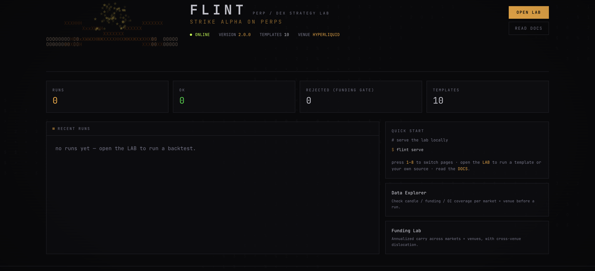
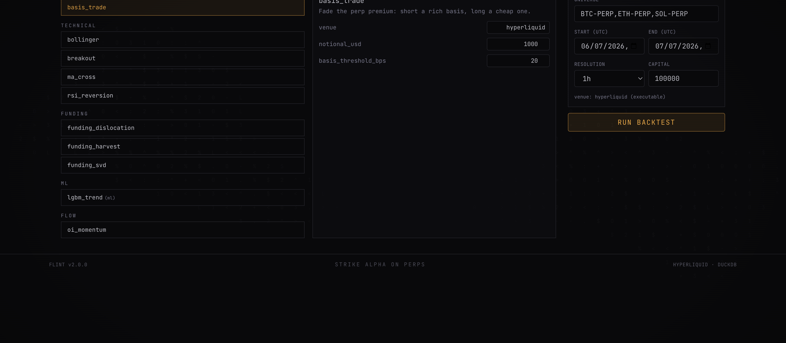
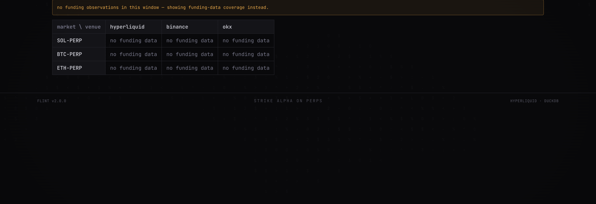
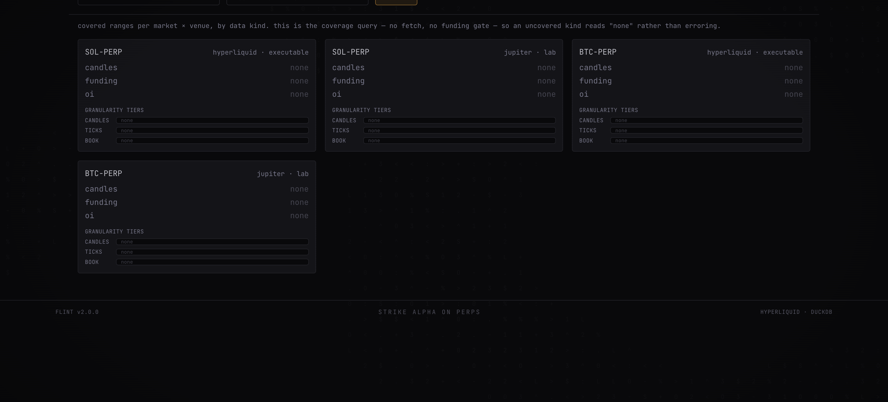
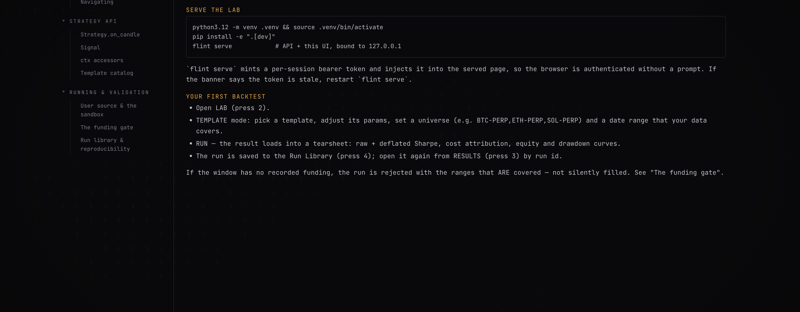

<p align="center">
  <br/>
  <strong>Flint — a local-first backtesting, paper, and live lab for perp/DEX strategies.</strong>
  <br/>
  <em>Hyperliquid-native · funding-honest · no synthetic data · ports-and-adapters</em>
  <br/>
  <br/>
  <a href="https://github.com/sohan-shingade/flint/releases/latest"></a>
  <a href="https://github.com/sohan-shingade/flint/actions/workflows/ci.yml"></a>
  
  
  
</p>

<p align="center">
  
</p>

---

## v2.0 — the greenfield rewrite

Flint 2.0 is a ground-up rewrite (~930 files changed vs v1.5.4): a strict
ports-and-adapters core, [Nautilus Trader](https://nautilustrader.io) as the only
simulation substrate (the legacy bar and Rust engines are deleted — parity goldens
were frozen first), tick-data foundations (Tardis vendor lane, live recorder,
BOOK_DELTA streaming), a native-L2 `TickStrategy` lane, and a new terminal-styled
web UI. Full notes: [release v2.0.0](https://github.com/sohan-shingade/flint/releases/tag/v2.0.0)
· honest build ledger: [`docs/redesign/STATUS.md`](docs/redesign/STATUS.md).

---

Flint is a **local power-user lab** for perpetual-futures / DEX strategy work. You
write a strategy once and run it three ways over the *same* engine, in increasing
order of trust:

1. **Backtest** against real recorded candles + funding with venue-accurate fills,
   per-venue margin, and honest liquidation.
2. **Paper trade** the same strategy fed live — the backtest engine consumes a live
   WebSocket feed instead of history, and survives a restart by folding its event log.
3. **Go live** on Hyperliquid through the same order state machine, fenced by hard
   risk caps and a kill switch.

It is **not** a hosted SaaS, a general trading bot, or a MEV scanner. Single machine,
local storage, your keys never leave it.

Hyperliquid is the only executable venue today (Jupiter and Phoenix are planned
expansion). The core is venue-agnostic — a new venue is an adapter, not an engine
rewrite.

---

## Quick start

Requires **Python ≥ 3.11** (the repo targets 3.12).

```bash
python3.12 -m venv .venv && source .venv/bin/activate
pip install -e ".[dev]"        # editable install + pytest/ruff
pytest tests/ -q               # the whole suite — fully mocked, no network, no keys

flint serve                    # local API at http://127.0.0.1:8000 (prints the session token)
```

For the web UI, run the Vite dev server against the API (serving the built UI
straight from `flint serve` is a v1.x deferral):

```bash
cd ui && npm install
VITE_FLINT_TOKEN=<token printed by flint serve> npm run dev   # UI at http://localhost:5173
```

`flint serve` binds `127.0.0.1` and prints a per-session bearer token; every API
route requires it. Everything runs on your machine.

---

## The five surfaces

Every surface talks **only** to `services/` — never to the engine or a store directly
— and every services call is tenant-scoped. They are five doors onto the same core:

| Surface | Entry | What it is |
|---|---|---|
| **CLI** | `flint …` | `backtest`, `optimize`, `paper`, `live`, `serve`, `data {coverage,cache,import-legacy}`, `export`, `recorder start`. |
| **SDK** | `from flint.sdk import Lab` | `Lab.backtest/optimize/paper`; `result.tearsheet()` renders the §11 report. |
| **REST/WS API** | `flint serve` | FastAPI under `/api/v1`; per-session bearer token + Origin check on the code-executing server. |
| **Web UI** | `cd ui && npm run dev` | Results/tearsheet, funding+basis heatmap, data explorer, live monitor, run library. Pure API client over the served API. |
| **MCP agent** | `python -m flint.mcp_srv.server` | Eight JSON tools (`validate_strategy`, `run_backtest`, `get_results`, `explain_failure`, `optimize`, `compare`, …) for an LLM author→validate→backtest→revise loop. |

---

## A look around

| The Lab — 10 built-in templates (basis, funding, technical, ML, flow) | Funding Lab — carry per market × venue, honest coverage fallback |
|---|---|
|  |  |

| Data Explorer — coverage per market × venue × granularity tier | Docs — built into the served UI |
|---|---|
|  |  |

---

## Writing a strategy

A strategy is a Python class with one method returning a list of `Signal`s:

```python
from flint.strategy import Strategy
from flint.core.models import Signal

class Momentum(Strategy):
    params = {"lookback": 1}

    def on_candle(self, candle, history, ctx):
        if len(history) < 2:
            return []
        if candle.close > history[-2].close:
            return [Signal.long(candle.market, candle.venue, size_usd=2000.0)]
        return [Signal(market=candle.market, venue=candle.venue, action="close")]
```

Run it from the SDK:

```python
from flint.sdk import Lab

lab = Lab()                                   # local, runnable out of the box
result = lab.backtest("momentum", universe=["SOL-PERP"], venues=["hyperliquid"],
                      start=..., end=...)
print(result.tearsheet())
```

Untrusted **user source** submitted through the agent/MCP surface runs inside an
OS-isolated sandbox — that boundary, not the AST lint, is the security guarantee.

---

## The honesty guarantees

Flint's whole point is that the numbers don't lie. Four rules are load-bearing:

- **Funding is a hard gate.** A backtest over a window without *real* funding data is
  **rejected** — with the ranges that do exist and the fix — never silently zero-filled
  or interpolated. Scarcity surfaces as a structured `rejected` payload, not a stack trace.
- **No synthetic data, ever.** Tests and probes use hand-authored inputs or real recorded
  fragments. There are no random price series and no fabricated fills anywhere.
- **The Deflated Sharpe is always shown.** A single un-tuned run reports `DSR: n/a (N trials)`
  honestly; an optimize run reports the real DSR over its trial family. Raw Sharpe, the
  annualization factor, and the effective evaluated range sit beside every metric.
- **The sandbox is the boundary.** User strategy code executes in an OS-isolated subprocess
  (env-scrub + resource limits on macOS; nsjail/seccomp on Linux), for the full run — not
  just a pre-flight probe.

Expected scarcity is *data* (`rejected`/`degraded` payloads); only genuine faults are
errors, and a real bug is loud (a 500 with an incident id), never a silent wrong number.

---

## Architecture

Ports-and-adapters, strictly one-directional — nothing lower reaches up:

```
Surfaces      api/  sdk/  mcp_srv/  agent/  ui/     (talk ONLY to services/)
Application   services/     ← every function takes a TenantContext
Domain core   engine/  research/  strategy/  core/  (pure logic, no I/O)
Venues        venues/  (hyperliquid = the only executable v1 venue)
Ports         ports/   MarketData · UserData · JobRunner · Secrets · EventBus · Identity
Adapters      adapters/  (v1: all local — DuckDB, in-memory bus, .env, in-proc jobs)
```

The engine never touches storage — all I/O goes through `ports/`. Money is `Decimal`
(never float-accumulated); timestamps are integer unix-ms UTC. The event log is the
source of truth: a run replays exactly by folding it.

Canonical design spec: [`docs/redesign/DESIGN.md`](docs/redesign/DESIGN.md). What shipped,
what's degraded, what's deferred: [`docs/redesign/STATUS.md`](docs/redesign/STATUS.md).
Annotated package map: [`docs/codemap/`](docs/codemap/) (regenerate with
`python scripts/codemap.py`). AI-dev guide: [`CLAUDE.md`](CLAUDE.md).

---

## Going live (Hyperliquid)

```bash
flint live --market SOL-PERP --max-position-usd 5000 --max-daily-loss-usd 250
flint live --stop --all --flatten          # kill switch: cancel + flatten every live run
```

A live run **refuses to start** without `--max-position-usd` and a venue signing key
(resolved server-side from the `SecretsPort` — keys never touch the browser or a log).
Orders ride the same persisted state machine as paper, capped pre-trade; on reconnect the
executor reconciles local state against the venue clearinghouse and surfaces mismatches as
drift alerts rather than adopting either side. The executor logic is complete and tested
against a mocked venue; the real HL order transport and the continuous live feed loop are
v1.x deferrals (see [`STATUS.md`](docs/redesign/STATUS.md)).

---

## License

MIT.
