# Flint Greenfield Redesign — Full Design (Track 3)

**Status:** design **v3** — the review-hardened v2, rescoped 2026-07-02 to a **Hyperliquid-only v1** (D28)
**Date:** 2026-06-04 (v1) · 2026-06-11 (v2) · 2026-07-02 (v3)
**Program:** Flint greenfield rewrite — Track 1 (dev workflow, spec'd) · Track 2 (research, dossier done) · **Track 3 (this doc).**
**Inputs:** [research dossier](../research/2026-06-04-flint-research-dossier.md) · [dev-workflow spec](2026-06-04-flint-dev-workflow-design.md) · [venue data-sourcing dossier](../research/2026-06-05-venue-data-sourcing-dossier.md) · [round-1 expert review](../research/2026-06-05-design-review.md) (7 experts: 8 blockers / 25 major / 5 minor) · [round-2 deep audit](../research/2026-06-10-v2-deep-audit.md) (market research + production-readiness; wedge verdicts, cut list)
**Supersedes:** the incremental refactor plan `../plans/2026-06-04-perp-dex-first.md` (refactor-in-place path; we chose a full rewrite).

**v2 changes in one paragraph.** The two-round review confirmed the architecture but found the spec "right in prose, underspecified where it claims to win." v2: repositions the wedge honestly against NautilusTrader/LEAN (§1.2); locks 8 user decisions (D20–D27, §1.3); makes the flagship cross-venue strategy actually buildable (multi-leg Signal API §8.1 + cross-venue portfolio model §6.6); pins funding semantics (predicted vs final, §6.4) and a ctx data-visibility contract (§8.2); specifies fill parameters, intrabar policy, and per-venue liquidation (§6); rescopes the data lake to a legally-clean core + BYO vendor lane (§9, forced by verified Tardis ToS); drops Honker from v1; moves OS-level sandbox isolation to Phase 1–2; pulls a minimal Hyperliquid live executor and the Deflated Sharpe Ratio into v1; bans synthetic data product-wide (D26); and adds production-readiness sections (testing, errors, observability, performance budget, versioning, migration, non-goals — §19).

**v3 change in one paragraph.** v1 is **Hyperliquid-only** (D28, user-locked 2026-07-02): Binance execution, the Jupiter oracle-pool venue (adapter, fill model, on-chain recorders), and the cross-venue two-leg backtest all defer to v1.x+. What stays: the venue-parameterized shape everywhere — the multi-leg `list[Signal]` API with its required `venue` field (D21), per-venue accounts in the portfolio model (one account in v1), the `MarketStructure` abstraction (CLOB implemented; oracle-pool specified, deferred), and the funding/basis lab with **read-only** multi-venue funding ingestion (Binance/Bybit/OKX rates — a wrong number there can't fill an order). The flagship v1 workflow becomes HL-native funding strategies (harvest / dislocation vs the cross-venue benchmark) with the lab surfacing the spreads; the two-leg arb is the first v1.x milestone and lands as adapters + one already-written build phase, never an engine or API break. Deferral cost, stated honestly: Jupiter's now-or-never on-chain recording starts later (its ~90-day real-data accumulation clock starts only when its recorders do), and Binance depth Tier-A history likewise starts only when its recorder ships.

---

## 0. How to read this document

This is the end-to-end design for a from-scratch rebuild of Flint. It is written to be understood by someone who has *not* been in the prior conversations. It moves from **why** → **concepts** → **what the user actually does** → **how the system is built** → **how we build it**.

- If you want the rationale and vocabulary: read §1–§2.
- If you want to see Flint in use: read §3 (the workflows — this is the heart of the design).
- If you want the engineering: read §4–§14.
- If you want how agents use Flint: read §13.
- If you want the build order: read §17–§18, and the production bar in §19.
- Lost on a term: jump to the **Glossary** (§21).

Every design decision traces back to a locked decision (§1.3) or the research dossier.

---

## 1. What Flint is, who it's for, and why

### 1.1 The one-sentence definition

**Flint is a local-first lab where a quant trader writes a perpetual-futures trading strategy in Python, backtests it against realistic market data, checks it isn't overfit, paper-trades it against live data, then goes live small on Hyperliquid — all through one engine that treats perps and DEXes as first-class, not bolted-on.**

It is **DEX-first but CEX-capable**: DEX-native correctness is the differentiator, but real perp strategies are cross-venue — the canonical funding arbitrage is *long Binance perp / short Hyperliquid perp* — so the design supports the CEX leg too. *(v3 revision:)* CEX **execution is deferred** — v1 executes **Hyperliquid only** (D28); Binance/Bybit/OKX funding rates still ingest read-only into the lab, and the Binance adapter is the first v1.x expansion. This is "support the CEX leg a real strategy needs," not "become a CEX bot platform."

### 1.2 Who it's for, and the problem they have

The user is a **semi-pro / serious retail quant**: comfortable writing Python, reads performance tearsheets, has been burned by a strategy that looked great in a backtest and lost money live. They trade **perpetual futures** (perps) on **decentralized exchanges** (DEXes) like Hyperliquid and Solana venues.

Their problem: **most existing backtesting tools were built for stocks or spot crypto and lie to them about perps** — and the one tool that gets fills right (NautilusTrader) demands expert-level assembly. The honest competitive picture (verified against current docs, June 2026 — round-2 audit):

| Capability | freqtrade | backtrader | LEAN / QC | NautilusTrader | **Flint v1** |
|---|---|---|---|---|---|
| Funding accrual in backtest | partial (defaults to 0 if data missing; 1h intervals only since 2025.12) | no | partial (`MarginInterestRateModel`, not auto-applied) | **yes** (`FundingRateUpdate`, user supplies data) | **yes, auto, hard-gated** (no data → no backtest) |
| Oracle / mark / last separation | no | no | no | **no** (single price stream) | **yes** (model-level, §2.4) |
| DEX CLOB fills vs recorded L2 history | no | no | no | no (HL adapter can't replay history) | **yes** (Tier A/B, §6.3) |
| Oracle-pool perp fills (Jupiter/GMX) | no | no | no | no | **designed; deferred to v1.x** (unique, §6.3, D28) |
| Cross-venue funding lab + two-leg backtest | no | no | manual | manual (multi-venue possible, no funding normalization) | **lab yes (read-only); two-leg deferred to v1.x** (§6.6, §10, D28) |
| On-demand hosted data | no | no | **yes** (CEX only; pay-per-file) | no | yes (DEX-native coverage) |
| Agent/MCP backtest surface | no | no | **yes** (60+ tools, CEX data) | no | yes (perp-DEX-correct, sandboxed) |
| Live trading | yes | partial | yes | yes | **minimal HL executor** (§3.6) |
| Overfit correction | no | no | partial | no | **walk-forward + Deflated Sharpe** (§11) |

What this table says: "everyone hand-waves funding" is no longer true — NautilusTrader does real funding settlement and has best-in-class fill models *if you are expert enough to assemble the data and configure them*. LEAN has the on-demand data model and an agent surface *for CEX venues*. Nobody has: the three-price separation, fills against recorded DEX book history, oracle-pool fills, normalized cross-venue funding, or any of it **by default**.

**Flint's bet (the wedge): perp-correct BY DEFAULT, venue-exact, zero-config.** Where Nautilus is correct-if-expert, Flint is correct out of the box: funding accrues automatically with each venue's exact semantics (HL hourly oracle-priced with its 4%/hr cap; Binance 8h mark-priced) and is a *hard gate*, fills run against recorded depth when it exists and say so when it doesn't, the three prices never conflate, and backtest, paper, and live run the *same code*. That defaults-are-correct posture — plus the genuinely unique pieces (oracle-pool fills, the cross-venue funding lab, the sandboxed agent engine) — is the product.

### 1.3 Locked decisions (the constraints this design honors)

These were decided collaboratively before this doc. Everything below obeys them.

| # | Decision | Choice | Why |
|---|----------|--------|-----|
| D1 | Rewrite vs refactor | **Greenfield rewrite** on a new long-lived git branch in this repo; old code deleted as new lands | Current codebase is messy and doesn't serve the perp/DEX mission |
| D2 | Languages | **Python** (strategy API + reference engine) + **Rust** (fast engine port, added later) + **TypeScript/React** (UI). No C. | Devs know Python+Rust; Rust covers the speed role C would, memory-safe |
| D3 | Target user | Semi-pro / serious retail quant who codes Python | The wedge |
| D4 | v1 venues | **Hyperliquid** (DEX, CLOB) + **Jupiter Perps** (DEX, oracle-pool) + **Binance** (CEX, CLOB). *(v2 revision:)* Bybit/OKX/Gate execution **deferred** — unvalidated data quality contradicts the correctness wedge; their funding rates still ingest read-only into the lab. Jupiter v1 = recorders + fill model; real backtests unlock when recorded data exists (D26). *(v3 revision — superseded by D28:)* **Hyperliquid only** in v1; Binance and Jupiter defer to v1.x+ with their funding rates ingesting read-only. | Two *different* market structures AND DEX↔CEX from day one so the design can't over-fit; Binance is the CEX leg of cross-venue strats. *(v3:)* the anti-over-fit goal is served by the `MarketStructure` seam + venue-parameterized contracts instead of parallel implementations. |
| D5 | v1 execution modes | **Backtest + paper + a minimal Hyperliquid live executor** (D20) | Earn trust before risking real money — then let the user act on it without leaving the product |
| D6 | Funding/basis lab | Pull funding from many venues, normalized; analyze basis | The documented differentiator the wedge user wants |
| D7 | Historical depth/OI data | **Self-record from day one** | No venue sells this history; if we don't record now it's gone forever |
| D8 | Primary surface | **Python SDK + CLI + notebooks**; focused web UI second | The user codes |
| D9 | Trust tooling in v1 | Walk-forward validation + trial counting + full-cost tearsheet + **Deflated Sharpe Ratio** (D22); CPCV later | An uncapped optimizer with only a trial counter contradicts the trust wedge (round-1 B3); DSR is one formula, not a big lift |
| D10 | Engine build order | **Python reference engine first**, Rust port later behind a parity test | Iterate on hard correctness in Python; optimize once correct |
| D11 | Fill realism default | **Pessimistic** (real spread, latency, full taker fees, auto-funding); optimism is opt-in | The opposite of freqtrade's trap |
| D12 | Cloud-readiness | A thin seam ("ports", §2.7) installed now; no cloud infrastructure built yet | Cheap now, a rewrite later |
| D13 | Local storage | DuckDB, hidden behind an interface so it can be swapped later | Fast local analytics; swappable for the cloud |
| D14 | Liquidation margin tables | Verify Hyperliquid's exact numbers against live docs before coding them | They change; getting them wrong is dangerous |
| D15 | Data acquisition | **On-demand (QuantConnect-style):** a backtest just specifies a date range + universe; the engine fetches and caches missing data transparently. No manual "download first" step. | Manual downloading is friction; the user wants to "just run it" |
| D16 | Data source of truth | A **hosted Flint Data API** permanently stores market data (candles, funding, OI, and centrally-recorded L2 depth) and serves it fast; local clients fetch from it and **cache locally**. Free venue APIs become the *ingestion* path into the lake (and a fallback for offline/self-hosted). *(v2 revision:)* the shared lake holds **legally-clean data only** (own recordings + free archives passing a ToS review); paid vendor data flows through a **BYO-license lane** into the *user's local cache only* (D23). | Makes data "just there + fast" for everyone and solves now-or-never depth recording centrally — without redistributing data we have no right to redistribute |
| D17 | Realtime / jobs / scheduling | *(v2 revision — Honker removed from v1.)* **In-memory event bus** (`EventBusPort`), **in-process thread-pool `JobRunnerPort`**, and a plain async cron loop for recorder/ingestion cadence (D24). Events are ephemeral across restarts (documented); order/fill state is durable in the store regardless (§6.2). DuckDB stays the analytical store. Honker may return behind the same ports after a peak-load stress test. | 5 of 7 review experts flagged one alpha, bus-factor-1 dependency holding three critical roles; the ports make it re-adoptable later at zero engine cost |
| D18 | Agent backtesting engine | Flint is a first-class **engine AI agents call** to author + backtest + refine strategies — MCP tools + structured JSON results + structured failure reasons + a sandbox hardened with resource quotas. Scope is the agent *tool* (serve an agent's loop), not an eval *gym* (ranking agents) for now. | A primary use case; agents need machine-readable feedback and safe execution of untrusted generated code, and reuse the existing engine/sandbox/queue |
| D19 | ML & continual-learning strategies | Support ML via a **declarative** API (feature hooks + target hook + a `Train()` phase outside the bar budget, FreqAI-style). *(v2 revision:)* allowlist = **tabular stack only** (numpy/pandas/polars/scipy/statsmodels/sklearn/xgboost/lightgbm + indicators); **pytorch and tensorflow cut from v1** (C-extension escape surface + safetensors complexity for the smallest user segment); **online/continual learning deferred to v2** (BLAS/architecture non-determinism breaks the bar-for-bar reproducibility claim without a restricted-model whitelist + determinism suite). `pickle/joblib/torch.load` of raw bytes never. A **managed model store** (safe formats, no exposed paths). **Look-ahead linter** + purge/embargo on ML walk-forward. | ML is where look-ahead leakage and untrusted-code RCE bite hardest; GBT-on-tabular covers the vast majority of trading ML |
| **D20** | **Live trading (v2 decision)** | **Minimal Hyperliquid live executor in v1**: market + limit orders only, hard position caps, a kill switch, same engine/order/fill code path as paper. No other live venue in v1. | LEAN/Nautilus/freqtrade/Jesse all trade live; ending the trust loop at paper is a churn risk — but the surface stays minimal |
| **D21** | **Multi-leg strategy API** | **Dual surface**: `on_candle` returns `list[Signal]`, each Signal carrying `venue` + `market` (the blessed, lintable path) — **plus** an imperative `ctx.submit_order(...)` escape hatch for power users (ladders, conditional legs). Cross-venue portfolio model in §6.6. *(v3:)* the API ships venue-parameterized in v1 but only `venue="hyperliquid"` is executable (D28); other venues return a structured `venue_not_executable` rejection. | The flagship cross-venue funding arb needs two legs in one bar; round-1 B1 found the v1 API couldn't express it |
| **D22** | **Optimizer trust posture** | **Deflated Sharpe Ratio ships in v1**: the tearsheet shows raw Sharpe AND DSR (penalized by trial count + return variance); trials uncapped *because* the correction exists. GA optimizer **cut** (Optuna TPE only). | A trial counter is a warning label, not a correction (round-1 B3) |
| **D23** | **Lake legal model** | **Clean shared lake + BYO vendor lane.** The shared lake serves only data Flint may legally redistribute (own recordings, HL S3 archive, exchange free archives after a per-source ToS pass). Users with their own Tardis/Kaiko subscription plug in a key; vendor data lands in **their local cache only**, never the shared lake. | Tardis ToS verified (round 2): redistribution prohibited except ≥10-minute aggregates — the vendor-seeded shared lake was illegal as designed |
| **D24** | **Honker** | **Out of v1** (see D17 revision). | Alpha + bus-factor-1 × three critical roles = unacceptable blast radius |
| **D25** | **Sandbox timing** | **OS-level isolation lands in Phase 1–2, before any strategy execution ships.** Subprocess with restricted builtins, cleared env, RLIMIT_CPU/AS + nsjail/seccomp where available. All execution paths (CLI, API, MCP/agent) route through it unconditionally. | Round-1 B4 verified the AST-only sandbox is bypassable and the agent path ran code unsandboxed; correctness products don't ship known RCE |
| **D26** | **No synthetic data — ever** | Flint never generates synthetic market data, never runs backtests on synthetic data, and never presents synthetic results. If real data doesn't exist for a (venue, range), the backtest is **unavailable** there — same philosophy as the funding hard gate. Engine *unit tests* use hand-built fixtures internally but these are never surfaced as backtest results. Jupiter v1 consequence: recorders + fill model ship; real Jupiter backtests unlock only as recorded history accumulates (~90 days). | User-locked. A correctness product that fabricates data destroys its own premise |
| **D27** | **Dynamic universes stay in v1** — with a point-in-time contract | `top:N:volume` resolves membership for bar *t* using **only data timestamped < t**, from point-in-time volume/OI in the lake; membership snapshots are written to the event log (deterministic replay); a `universe_exit_behavior` param (`hold_existing` default / `force_close` / `warn`); the look-ahead linter gets a universe check. | User-locked over the review's defer recommendation; the PIT contract is what makes it safe (round-1 M3) |
| **D28** | **v1 venue scope (v3 decision)** | **Hyperliquid only.** Binance execution, Jupiter Perps (adapter + fill model + on-chain recorders), and the cross-venue two-leg backtest defer to v1.x+. Everything stays venue-parameterized — `Signal.venue` required, per-venue accounts (§6.6, one account in v1), the `MarketStructure` enum (CLOB implemented, oracle-pool specified-only), `VenueSpec`-driven funding/liquidation — so venue expansion is adapters + data, never an engine or API break. CEX funding rates still ingest **read-only** into the lab (§10). | User-locked 2026-07-02. One venue done venue-exactly beats three venues shallow; cuts ~2 adapters, the on-chain decoders, and cross-venue margin from v1 while the venue-parameterized shape keeps the expansion path cheap. Cost acknowledged: Jupiter/Binance now-or-never recording clocks start later. |

---

## 2. Concepts you need (explained, not assumed)

This section teaches the vocabulary the rest of the doc uses. If you already know perps and hexagonal architecture, skim to §3.

### 2.1 Perpetual futures ("perps")

A **perpetual future** is a derivative that lets you bet on an asset's price with leverage and **no expiry date** (unlike a traditional future). You can go **long** (profit if price rises) or **short** (profit if price falls), and you post a fraction of the position's value as **margin** (collateral).

Because there's no expiry to pull the contract price back toward the real ("spot") price, perps use a **funding rate** to do that job.

### 2.2 Funding rate — the mechanism that defines perps

Every so often (hourly on Hyperliquid, every 8 hours on Binance), longs and shorts exchange a small payment called **funding**:

- If the perp is trading **above** the spot price (more longs than shorts), **longs pay shorts**. This nudges people to short, pushing the perp price back down.
- If the perp is **below** spot, **shorts pay longs**.

The payment = `position_size × reference_price × funding_rate`. A rate of `0.01%` per hour on a $10,000 position = $1/hour.

**Why this matters for a backtest:** if you hold a position for days, funding can dwarf your trading profit. A "funding harvest" or "funding arbitrage" strategy's *entire* profit *is* funding. Getting it wrong (or setting it to zero, like freqtrade defaults to) makes the backtest fiction. Four subtle traps:

1. **Interval and notional differ by venue.** Hyperliquid accrues hourly at 1/8 of the quoted 8h rate and prices the payment on the **oracle (spot) price**. Binance pays every 8h priced on the **mark price**. Mixing these up mis-scales the payment by ~8×.
2. **Normalization is linear for payment, not annualization.** `rate_hourly = rate_8h / 8` is correct for scaling a payment; annualizing multiplies by settlements-per-day × 365, never by compounding the division. The model carries both `rate_hourly` and the native `interval_s` so neither operation can be confused for the other.
3. **Predicted vs final rate.** Venues publish a continuously-updating **predicted** rate during the interval and commit the **final** rate only at the settlement second (Binance fixes it ~30 min early; HL at the hour). A strategy at decision time may only ever see the last *published predicted* rate; the *payment* uses the final settled rate. Feeding the settled rate to the strategy mid-interval is an engine-level look-ahead that no strategy linter can catch — and since funding mean-reverts, it dramatically inflates exactly the funding-arb strategies Flint exists for. The model encodes this as `rate_type: predicted | final` (§5) and the ctx contract enforces it (§8.2).
4. **Per-venue caps.** Funding rates are clamped per venue — **Hyperliquid caps at 4%/hour** (deliberately looser than CEXes; per HL docs, verify at coding time), Binance-style venues clamp far tighter. The cap lives in the venue spec as data (`rate_cap_hourly`), never hard-coded — and every such number requires a primary-source citation in the venue spec (a review-round rule, after round 1 itself mis-stated this cap).

### 2.3 Long / short / leverage / margin, in one breath

- **Long 10 SOL**: you profit `(exit − entry) × 10`.
- **Short 10 SOL**: you profit `(entry − exit) × 10`.
- **Leverage 20×**: a $10,000 position needs only $500 of margin. Amplifies gains and losses.
- **Initial margin**: collateral required to *open*. **Maintenance margin**: minimum to *keep it open*. Drop below maintenance → **liquidation** (§2.5).

### 2.4 The three prices (the most-conflated thing in crypto backtests)

A perp has **three distinct prices** at every instant. Naive tools use the candle close for all three; Flint keeps them separate:

| Price | What it is | What it drives |
|-------|-----------|----------------|
| **Oracle / index** | The "true" external spot price (e.g. from Pyth, or a blend of big exchanges) | **Funding** payments |
| **Mark** | The exchange's official valuation of the contract (oracle blended with the order book) | **Unrealized PnL** and **liquidation** |
| **Last / trade** | The price the most recent trade actually executed at | **Your fills** and stop/take-profit **triggers** |

Using candle close as "mark" mis-times when you get liquidated and how funding is sized. This separation is a core correctness feature.

### 2.5 Liquidation

If the market moves against a leveraged position far enough that your margin falls below the **maintenance** requirement, the exchange forcibly closes it — **liquidation** — usually at a price worse than mark (a penalty), and sometimes only partially. In extreme cases winners get **auto-deleveraged (ADL)** to cover the losers. A faithful backtest must model this on the **mark** price with the venue's **maintenance-margin tiers** (bigger positions require more margin). Ignoring liquidation lets a backtest "survive" drawdowns that would have wiped the account live.

### 2.6 How exchanges actually match trades — "market structures"

This is the single most important architectural concept, because Flint must support **two fundamentally different kinds of exchange** and the fill simulation differs between them:

- **CLOB (Central Limit Order Book)** — the model used by both DEXes (Hyperliquid, dYdX, Phoenix) **and centralized exchanges** (Binance, Bybit, OKX). There's a live book of resting buy/sell orders at various prices. A market buy "walks up" the book: it takes the cheapest sells first, then more expensive ones, so a big order gets a **worse average price** (this is **slippage / market impact**). To simulate fills faithfully you need the **historical order book depth** — which (per the dossier) **no one gives away for free** (CEX or DEX), so Flint records it itself (D7). *A CEX perp venue is therefore just another CLOB `VenueAdapter` — same fill model as Hyperliquid, no engine change.*

- **Oracle-pool** — e.g. Jupiter Perps, GMX. There's no order book. You trade against a shared liquidity pool at the **oracle price**, plus a **price-impact fee** and a **borrow fee**. This is actually the *easiest* to backtest faithfully: no book to reconstruct, just oracle price + two formulas.

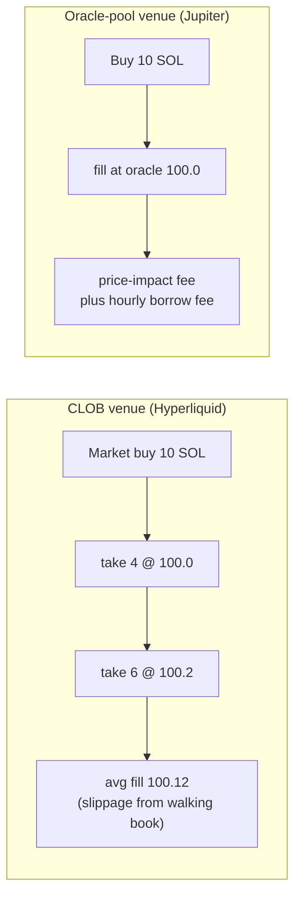

**Design consequence:** the fill simulator is chosen by the venue's market-structure *type*, not hardcoded. *(v3 — D28:)* v1 implements the CLOB model only (Hyperliquid); the oracle-pool model stays fully specified here and lands with Jupiter in v1.x. The `MarketStructure` seam is built from day one so that arrival is an adapter, not an engine change — that seam, not a parallel second implementation, is what keeps the engine from hardening into CLOB-only assumptions.

### 2.7 "Ports and adapters" (hexagonal architecture) — explained plainly

You asked what "ports" are. Here is the whole idea in concrete terms.

**The problem it solves:** today's Flint sprinkles `duckdb.connect(...)` calls throughout the code. If you later want to run in the cloud on Postgres, you'd have to hunt down every one. That's the mess we're escaping.

**The fix:** the core trading logic should never know *where* data lives or *how* jobs run. It should only know an **interface** — a promise like "something can save and load candles." That interface is a **port**. The concrete thing that fulfills it (DuckDB on your laptop, or S3 in the cloud) is an **adapter**.

Concretely, a port is just a Python abstract class:

```python
# flint/ports/storage.py
from abc import ABC, abstractmethod
import pyarrow as pa

class MarketDataPort(ABC):
    """A promise: 'I can store and fetch market data.'
    Market data is the same for everyone -- no tenant parameter.
    The engine depends on THIS, never on DuckDB or S3 directly."""

    @abstractmethod
    def save_candles(self, venue: str, market: str, candles: pa.Table) -> int: ...

    @abstractmethod
    def load_candles(self, venue: str, market: str,
                     start_ts: int, end_ts: int) -> pa.Table: ...

class UserDataPort(ABC):
    """A promise: 'I can store and fetch per-user data (runs, orders, models).'
    EVERY call takes a TenantContext; every query filters by tenant_id."""

    @abstractmethod
    def save_run(self, tenant: "TenantContext", run: "RunRecord") -> str: ...

    @abstractmethod
    def load_run(self, tenant: "TenantContext", run_id: str) -> "RunRecord": ...
```

And an adapter is a class that implements it:

```python
# flint/data/store/duckdb_adapter.py  (the only v1 adapter)
class DuckDBMarketData(MarketDataPort):
    def save_candles(self, venue, market, candles): ...   # writes to a local .duckdb file
    def load_candles(self, venue, market, start_ts, end_ts): ...  # returns an Arrow table
```

Later, going to the cloud is **writing one new adapter** (`S3ParquetStorage(MarketDataPort)`) and swapping which one gets injected — **zero changes to the engine**. That swappability, installed now while it's cheap, is decision D12.

Flint has **five ports** (the only things that differ between "laptop" and "cloud") **— plus a split inside `StoragePort`** that the review forced into the open. Market data (candles, funding, the lake) is the *same for everyone* — tenant-agnostic. Run results, orders, positions, and trained models are *per-user*. Passing a `TenantContext` to a market-data call that ignores it confuses every adapter, so the storage promise is split:

| Port | The promise | Tenant-scoped? | v1 adapter (laptop) | Future adapter (cloud) |
|------|-------------|----------------|---------------------|------------------------|
| `MarketDataPort` | save/fetch market data, keyed `(venue, market, ts)` | **no** — shared namespace | DuckDB file | Parquet on S3 / the hosted lake |
| `UserDataPort` | save/fetch runs, orders, positions, models | **yes** — every call takes `TenantContext`, every query filters by it | DuckDB file (tenant column from day one) | Postgres + RLS |
| `JobRunnerPort` | run a backtest job, with CPU/mem/wall quotas | yes | in-process thread pool | worker container off a queue |
| `SecretsPort` | get an API key | yes | read `.env` (server-side only) | KMS / vault |
| `EventBusPort` | publish "a fill happened" | yes (topic-scoped) | in-memory bus (ephemeral across restarts — durable state lives in the store, §6.2) | Redis pub/sub |
| `Identity` | who is this user | — | single local user | Clerk/Auth0 |

(The walking skeleton ships a **two-tenant cross-leak test**: two `TenantContext`s write through `UserDataPort`, each asserts it cannot read the other's rows. That test is the proof the seam is real, not claimed.)

**What happened to Honker** (D17/D24): v1 dropped it. The review found one alpha, bus-factor-1 dependency holding the event bus, the durable job queue, AND the scheduler — a single failure taking down paper, optimization, and ingestion together. v1 uses an in-memory bus, an in-process thread-pool runner, and a plain async cron loop. Honker (or anything else) can come back later behind these same ports after a peak-load stress test — that swappability is the point of the ports.

### 2.8 `TenantContext` — the thing threaded everywhere

A **tenant** is "whose data is this." On your laptop there's one implicit tenant (you). In a hosted multi-user version, every query must be scoped to the right user or you leak data between accounts.

The cheap-now/expensive-later move: pass a `TenantContext` object into **every** service call from day one. Locally it's a constant. Hosted, it carries a `tenant_id` and every storage query filters by it. Adding that scoping after the fact is how data leaks happen, so we thread it now even though it does almost nothing yet.

### 2.9 Backtest vs paper vs live

- **Backtest**: replay historical data fast, simulate fills, see how the strategy *would* have done.
- **Paper**: run the strategy against *live* market data in real time, but with fake money — same code path as live, no risk.
- **Live** (v1, minimal — D20): real orders on **Hyperliquid only**, market + limit only, hard position caps, a kill switch. Broader live (more venues, more order types) is v2.

The design's parity promise: **backtest, paper, and live run the exact same order/fill/funding/liquidation code.** The only thing that changes is where fills come from (simulated vs the venue). If paper diverges from backtest, that's surfaced as **drift** (§6.7) with defined metrics — not hand-waved.

### 2.10 Event sourcing (how a run is reproducible)

Instead of only storing the *final* state of a backtest, Flint appends every meaningful thing that happens (order placed, fill, funding charged, liquidation, universe-membership change) to an **append-only event log**. The final state is computed by **replaying** those events. Benefits: a run is perfectly reproducible, auditable ("why did this trade happen?"), and exportable as a reproducibility bundle (§12).

Two rules the review made non-negotiable:
- **Versioning from the first persisted run.** Every event carries an `event_version: int`, and replay runs each event through an **upcaster registry** (v*N* → v*N+1* transforms) before folding. Without this, the first field added to `Fill` makes every stored run unreplayable — and the Python models *will* iterate before the Rust port. Compatibility contract: **upcast-on-read**; on-disk events are never rewritten.
- **It's scheduled, not assumed.** The event log + emit seam + upcaster registry land in **Phase 1** (the walking skeleton emits no-op events end-to-end); replay/fold lands in Phase 3 with the engine (§18). The v1 UI has no replay-scrubber screen (deferred) — the log and the replay API exist; the screen comes later.

### 2.11 On-demand data and universes (the QuantConnect-style model)

You should never have to "download data" before running a backtest. You **declare what you want** — a date range and a **universe** (the set of instruments to trade) — and the engine makes the data appear.

- A **universe** is the set of markets a backtest considers. It can be **static** (`["SOL-PERP", "BTC-PERP"]`) or **dynamic** (a rule like "the top 20 perps by 30-day volume," re-evaluated on a schedule). The strategy only ever sees instruments in its universe.
- **Dynamic universes obey the same no-look-ahead law as prices (D27).** Resolving "top 20 by volume" with *today's* volume applied backward selects hindsight winners — survivorship bias by another name. The `UniverseResolver` therefore: (1) ranks bar *t*'s membership using only volume/OI data timestamped **< t**, from point-in-time history in the lake; (2) writes each membership snapshot to the **event log** so replay is deterministic; (3) applies `universe_exit_behavior` when a held market drops out — `hold_existing` (default: keep the position, accept no new entries), `force_close`, or `warn`; (4) on a ranking-data gap at a re-eval point, holds the previous membership and flags it (never silently re-ranks on partial data); (5) is checked by the look-ahead linter. If a universe member fails the funding hard gate mid-range, the run is rejected up front with the per-market coverage map (§6.3) — never partially dropped mid-run.
- **On-demand fetching:** when a backtest asks for `SOL-PERP` over Jan–May, a **data manager** checks the local cache, then the **hosted Flint Data API** (a permanent, fast data lake, §9 / D16), caches what it gets, and serves it. You see a quick progress bar the first time, then instant cache hits. Free venue APIs are only a fallback for offline/self-hosted use.

Because the Flint Data API stores data **permanently** — including the L2 order-book depth captured by **central recorders** — even the data that has no public history is "just there" for everyone. The only case where data can't be conjured is a self-hosted/offline user, with no access to the lake, asking for a range no one recorded:

| Tier | Data | How "just run it" works |
|------|------|--------------------------|
| **Always available (via Flint Data API)** | candles, funding, OI, and centrally-recorded L2 depth | Served fast from the hosted lake + cached locally. Truly zero-setup. |
| **Fallback-only** | anything the lake lacks, for an offline/self-hosted user | Lazily fetched from free venue APIs where a history exists; L2 depth needs a local **recorder** (§3.5) that was running then. |

When the highest-fidelity inputs (recorded depth) genuinely aren't available for a range, the backtest **gracefully degrades** the fill model to a depth-free estimate and **clearly flags it** ("no recorded book for this range — using spread/impact model"). You always get a run; you're always told what fidelity you got. This is the QuantConnect "data is just there" feel — made real by the hosted lake, with an honest local fallback.

**One exception — funding is a HARD requirement, not a degradable input.** A perpetual's PnL is wrong without funding, so if funding data is missing for a (venue, market, period) the backtest is **rejected for that period**, not degraded (vs L2 depth, which degrades the *fill fidelity tier*, §6.3). Missing borrow data on Jupiter is gated the same way. So: no funding → no backtest there; no book → a run at a lower, clearly-labelled fidelity tier.

**And the gate's UX is specified, not a wall.** A rejection always prints the available coverage and the fix: `Available range for SOL-PERP@hyperliquid: 2025-03-01 → present. Re-run with --from 2025-03-01, or pass --clip-to-coverage.` `flint data coverage --market SOL-PERP --venue hyperliquid` shows per-kind availability before you run. Two explicit modes: `--strict` (default: any gap rejects) and `--clip-to-coverage` (run the covered intersection, stated on the tearsheet).

**No synthetic data — ever (D26).** Flint never fabricates market data to fill a gap, never interpolates across an outage (that's leaking), and never presents a synthetic run as a result. Where real data doesn't exist, the honest answers are the two gates above: reject (funding/borrow) or degrade-with-flag (depth). This is the same product philosophy as the hard gate, applied uniformly.

---

## 3. End-to-end user workflows (the heart of the design)

This section shows Flint *in use*, concretely. If the design serves these workflows cleanly, it's right. Each is a real path the wedge user takes.

### 3.1 Workflow: install and run your first backtest (5 minutes)

```bash
pip install flint
flint backtest --template ma_cross --market SOL-PERP --from 2026-01-01 --to 2026-05-01
flint serve                # opens the web UI + API at localhost:8000
```

That first `backtest` command **just runs** — there is no download step. The data manager (§2.11) transparently fetches the SOL-PERP candles + funding it needs for that range, caches them, runs a built-in moving-average strategy, and prints a tearsheet. A progress bar shows the one-time fetch; re-running is instant from cache. This is the "it works" moment — and the data model the whole product is built around.

### 3.2 Workflow: build and backtest a funding-arbitrage strategy (the core loop)

The user's hypothesis: *"When Hyperliquid's funding rate is much higher than Binance's, I can short the expensive one and long the cheap one and collect the difference."*

*(v3 — D28:)* this two-leg workflow is the **north star** and is kept here in full because the Signal API and portfolio model are designed for it — but in v1 only the Hyperliquid leg is executable. The same strategy runs today by reading Binance funding from the lab (read-only ingestion, §10) and trading the HL side of the dislocation; a `Signal(..., venue="binance")` returns a structured `venue_not_executable` rejection, and the full two-leg version unlocks in v1.x when the Binance adapter lands (§18 Phase 4).

There is **no "get the data" step.** The user writes the strategy and runs it; whatever funding/candle history the backtest touches (including the Binance/Bybit funding the cross-venue logic reads) is fetched and cached on demand (§2.11).

**Step 1 — write the strategy** in Python (`strategies/funding_arb.py`):

```python
from flint import Strategy, Signal

class FundingArb(Strategy):
    # These become tunable knobs in optimization (§3.3).
    params = dict(entry_spread_bps=5.0, exit_spread_bps=1.0, size_usd=1000.0)

    def on_candle(self, candle, history, ctx):
        # ctx is the read-only window into the world (§8.2).
        # Both rates are the last PUBLISHED predicted rate as of this bar's
        # start -- never a rate settled later in the bar (§6.4).
        hl = ctx.funding_rate("SOL-PERP", venue="hyperliquid")
        bn = ctx.funding_rate("SOL-PERP", venue="binance")
        spread_bps = (hl - bn) * 10_000

        hl_pos = ctx.position("SOL-PERP", venue="hyperliquid")
        if hl_pos is None and spread_bps > self.params["entry_spread_bps"]:
            # HL funding richer: short HL (collect rich funding),
            # long Binance (pay cheap funding) -- BOTH legs, one decision (D21).
            return [
                Signal.short("SOL-PERP", venue="hyperliquid",
                             size_usd=self.params["size_usd"]),
                Signal.long("SOL-PERP", venue="binance",
                            size_usd=self.params["size_usd"]),
            ]
        if hl_pos is not None and spread_bps < self.params["exit_spread_bps"]:
            return [
                Signal.close("SOL-PERP", venue="hyperliquid"),
                Signal.close("SOL-PERP", venue="binance"),
            ]
        return []          # nothing to do this bar
```

The user only writes trading logic. Funding accrual, fees, fills, and liquidation checks are the engine's job — the user never re-implements them (the freqtrade anti-pattern where funding is the user's manual chore). The two legs are margined in **separate per-venue accounts** (you can't double-spend collateral across venues — §6.6), and if one leg fills while the other is rejected, the surviving **naked leg** is recorded and flagged, exactly as it would happen live.

**Step 2 — backtest it.** Just specify the date range and the universe — no prior download:

```bash
flint backtest --strategy strategies/funding_arb.py \
    --universe SOL-PERP,BTC-PERP,ETH-PERP \   # static list; or --universe "top:20:volume" (dynamic, D27)
    --venues hyperliquid,binance \            # every venue a Signal may target; funding gate checks ALL
    --from 2026-01-01 --to 2026-05-01 \
    --fill realistic            # pessimistic defaults (D11); --fill optimistic to compare
```

The data manager fetches and caches every market in the universe (and the cross-venue funding the strategy reads) for that range, then runs. If recorded order-book depth exists for the range you get high-fidelity fills; if not, it degrades to the spread/impact model and says so (§2.11).

Or from a notebook via the SDK:

```python
from flint import Lab
lab = Lab()                      # local, single-tenant
result = lab.backtest("strategies/funding_arb.py",
                      universe=["SOL-PERP", "BTC-PERP", "ETH-PERP"],
                      venues=["hyperliquid", "binance"],
                      start="2026-01-01", end="2026-05-01")
# No download call anywhere — data is fetched + cached on demand.
result.tearsheet()              # renders inline in the notebook
print(result.funding_collected, result.total_fees, result.sharpe)
```

**Step 3 — read the tearsheet.** It shows equity curve, Sharpe, max drawdown, and — critically for a perp strategy — a **full cost breakdown**: trading PnL vs **funding collected** vs fees vs slippage. The user can immediately see "my profit is 90% funding, 10% price" and whether costs ate the edge.

This idea → data → strategy → backtest → read loop is the product's center of gravity. Everything in §4+ exists to make this loop fast and *honest*.

### 3.3 Workflow: make sure it's not overfit (walk-forward optimization)

The user wants the best `entry_spread_bps`, but tuning on all the data and then trusting the result is the classic overfitting mistake. Flint forces honesty:

```bash
flint optimize --strategy strategies/funding_arb.py --market SOL-PERP \
    --param entry_spread_bps=2:10:0.5 \
    --param exit_spread_bps=0.5:3:0.5 \
    --method walk-forward --windows 6
```

**Walk-forward** (explained, since it's the trust mechanism): split the history into chunks. Tune on chunk 1, test on chunk 2 (data the tuning never saw). Then tune on 1–2, test on 3. And so on. The reported result is the *out-of-sample* performance — what it'd have done on data it wasn't fitted to. If walk-forward results are far worse than the all-data fit, the strategy is overfit and the user learns that *before* risking money.

Flint also **counts how many parameter combinations were tried** and — the v2 upgrade (D22) — computes the **Deflated Sharpe Ratio**: the walk-forward Sharpe penalized for how many trials it took to find it and the variance across them. A Sharpe of 1.8 found in 10 trials and a Sharpe of 1.8 found in 10,000 trials are very different evidence; DSR is the number that says so. The tearsheet always shows **raw Sharpe + DSR + trial count** side by side. Trials are uncapped *because* the correction exists. (CPCV — a distribution over many train/test splits — remains v2.)

### 3.4 Workflow: paper trade and monitor

Satisfied with the backtest, the user runs it live-but-fake:

```bash
flint paper --strategy strategies/funding_arb.py --market SOL-PERP --venue hyperliquid
```

Now the strategy receives **live** Hyperliquid data (via the `LiveFeed`, §6.7) and places **simulated** orders through the **same fill/funding/liquidation code the backtest used** (the parity promise). The web UI's **live monitor** shows open positions, current funding accrual, distance-to-liquidation, and — the key trust feature — **backtest-vs-paper drift**, with a real definition (§6.7): *structural* drift (the fill/funding model disagrees with reality → alert) is separated from *market* drift (the regime changed → chart, not alarm), each with numeric thresholds.

Paper is useful unattended, not just while watched: a minimal **alerting layer** (§6.7) fires on liquidation distance, drift breach, funding-spread reversal, or the paper process dying (heartbeat), to a webhook or email. Reconnects **replay the gap from the lake** through the same engine loop, so a 2-hour disconnect can't silently skip a near-liquidation.

### 3.6 Workflow: go live, small (the v1 live executor — D20)

When paper has run clean for a while, the user flips the same strategy live:

```bash
flint live --strategy strategies/funding_arb.py --market SOL-PERP --venue hyperliquid \
    --max-position-usd 500 --max-daily-loss-usd 100
```

The v1 live surface is deliberately tiny: **Hyperliquid only**, **market + limit orders only**, **hard caps required** (the command refuses to start without `--max-position-usd`), and a **kill switch** (`flint live stop --all`, also a UI button, which cancels open orders and optionally flattens). It is the *same* engine, order state machine, and monitor screen as paper — the only difference is the executor adapter signs and submits real orders. Wallet keys come from `SecretsPort` (`.env`), never touch the browser, and never appear in logs. Anything fancier (other venues, stops/TP server-side, scaling) is v2.

### 3.5 Workflow: recorded depth — central by default, local if you need it

For a normal connected user there is **nothing to do here**: the hosted Flint Data API runs **central recorders** that continuously capture L2 order-book depth + open interest into the permanent lake (D16), so depth-aware fills "just work" over any range the lake covers.

A local recorder exists only for the edge cases — a self-hosted/offline deployment, or capturing a niche/private market the central lake doesn't cover:

```bash
flint recorder start --venue hyperliquid --markets SOL-PERP,BTC-PERP,ETH-PERP
```

It subscribes to the venue WebSocket and saves **L2 depth + trade prints + OI** snapshots to the local store, which the DataManager then prefers over (or merges with) the lake. (Trade prints are what lift fills to Tier A — queue-aware limit modeling, §6.3.) The key property is unchanged — this is **now-or-never** data; the difference is that, with the hosted lake, *Flint* shoulders the now-or-never recording centrally instead of every user doing it themselves.

---

## 4. System architecture

### 4.1 The big picture

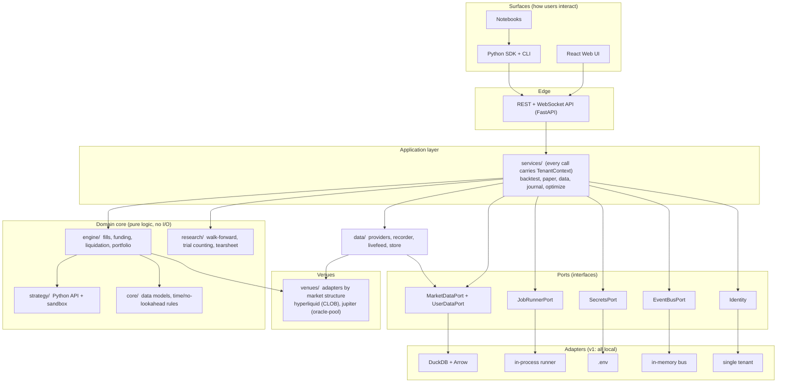

**The one rule that keeps it clean:** UI, SDK, CLI, and notebooks talk *only* to `services/`. They never reach into the engine or storage directly. The engine never reaches into storage directly either — it goes through ports. This is what lets us swap infrastructure and test pieces in isolation.

### 4.2 Why this shape (and how it pays off)

Three concrete payoffs:

1. **Testability.** Because the engine depends on the `MarketDataPort`/`UserDataPort` interfaces, tests inject a fake in-memory store and run the whole engine with zero files or network. Fast, deterministic tests.
2. **Cloud later = adapters, not rewrites.** §2.7 — one new adapter per port.
3. **You can hold a piece in your head.** Each module has one job and a small interface. The fill engine doesn't know about HTTP; the API doesn't know about funding math. (This directly serves Karpathy rule #2, Simplicity First, from Track 1.)

### 4.3 Layer-by-layer (what each does, why it exists, how you use it, what it depends on)

**`core/` — the vocabulary.** Pure data models (Candle, Order, Fill, Position, FundingRate, MarkSnapshot, OrderbookSnapshot, OpenInterest, BorrowSnapshot) and the time/no-lookahead helpers. *Why:* everything speaks these types; they have no logic and no I/O so they can't cause surprises. *Depends on:* nothing. (Models in §5.)

**`engine/` — the simulator + executor.** The heart. Replays bars, runs the strategy, simulates fills against the right market structure, accrues funding, checks liquidation, tracks the portfolio, emits events. Backtest and paper both use it. *Why:* one engine = parity. *Depends on:* `core`, `venues`. (Internals in §6.) Sub-parts:
- `engine/context/` — the `ExecutionContext` plus the seven managers that own state (positions, cash, fills, orders, funding ledger, borrow ledger, market-data feed). The strategy talks to a read-only *view* of this.
- `engine/fills/` — the `FillModel` interface and its CLOB and oracle-pool implementations (§6.3).
- `engine/funding/` — venue-specific funding accrual + the ledger (§6.4).
- `engine/liquidation/` — mark-based liquidation with margin tiers (§6.5).
- `engine/portfolio/` — cross-position risk + the event log/replay/snapshots (event sourcing, §2.10).

**`venues/` — pluggable exchanges.** Each venue is an adapter declaring its **market structure** (CLOB or oracle-pool) and its fee/margin specs. *Why:* adding dYdX or Phoenix later = one new adapter, no engine change. *Depends on:* `core`. (§7.)

**`data/` — getting and storing market data.** Four parts: `providers/` (fetch candles/funding/OI/borrow from free sources), `recorder/` (the always-on WebSocket capture of depth + OI), `livefeed/` (the **live market-data feed for paper/live sessions** — subscribes venue WebSockets through the *same normalization code the recorders use*, hands the engine live candles/marks/funding, and on reconnect replays the gap from the lake; §6.7), `store/` (the DuckDB `MarketDataPort` adapter + Arrow-returning repositories). *Why:* faithful backtests need faithful data; paper needs a live feed that is one component, not duplicated WS logic. *Depends on:* `core`, `ports`. (§9.)

**`strategy/` — the user's surface.** The `Strategy` base class, the read-only `ctx` API, the security sandbox (an import allowlist so user code can't read your disk or hit the network), and the built-in strategy templates. *Why:* the user writes Python here and nothing else. *Depends on:* `core`. (§8.)

**`research/` — trust tooling.** Walk-forward, trial counting + **Deflated Sharpe**, the tearsheet generator, and the optimizer (Optuna TPE; vectorized parameter sweeps for speed — never vectorized fills). *Why:* the anti-overfitting promise. *Depends on:* `core`, `engine`. (§11.)

**`services/` — the application layer / front door.** Thin orchestration functions: "run a backtest," "pull data," "start paper." Every one takes a `TenantContext`. The API, SDK, and MCP all call *these* — never the engine directly. *Why:* one place where authorization, tenancy, and orchestration live; the seam the cloud version grows from. *Depends on:* everything in the domain + ports.

**`ports/` — the five interfaces.** §2.7. *Depends on:* nothing.

**`api/` — REST + WebSocket.** FastAPI. Translates HTTP/WS calls into `services/` calls. WebSocket streams live paper/monitor updates. *Why:* the universal, cloud-ready channel between any UI and the backend. *Depends on:* `services`.

**`sdk/` — Python SDK + CLI.** The `Lab` object and the `flint` command. The primary surface for the wedge user (D8). *Depends on:* `api` (or `services` in-process for local speed).

**`rust/` — the speed port (added later).** A Rust reimplementation of the hot loops (fills/funding/liquidation), validated against the Python engine by a **parity test** that asserts identical results on fixtures (D10). *Why:* 10–50× faster backtests/optimization once correctness is locked.

**`ui/` — focused React app.** Five screens: results/tearsheet, funding-and-basis heatmap, data explorer, live monitor, run library (§11.2). *Not* a 10-page rebuild. *Depends on:* `api`.

---

## 5. The core domain model (the actual data)

These are the frozen dataclasses in `core/models/`. Field meanings matter — they encode the correctness rules.

**Conventions (stated once, used everywhere):**
- **Timestamps** are unix **milliseconds**, UTC, `int`. A candle's `ts` is the bar **start**. "As of *t*" always means "the last value with timestamp strictly < *t*" (§8.2).
- **Numerics:** accumulating quantities (funding ledger, fee totals, realized PnL, cash) use `Decimal` (or scaled integers); Solana on-chain amounts are stored in **native integer units** (lamports / token base units) and converted to float only at the tearsheet/display layer. Floats are fine for prices and intermediate math that doesn't accumulate. This is decided *before* the Python engine is written because it defines the **Rust parity contract** (§19.4): event ordering, fill yes/no, and order-state transitions must be **bit-exact**; accumulated PnL/Sharpe match to documented tolerances.
- **Schema versioning:** every persisted event carries `event_version: int` (upcast-on-read, §2.10); every Parquet file carries `schema_version` in metadata with a migration registry (§9).

```python
@dataclass(frozen=True)
class Candle:
    ts: int            # bar START, unix ms
    open: float; high: float; low: float; close: float
    volume: float      # base-asset units
    market: str        # "SOL-PERP"
    resolution_s: int  # bar width in seconds, e.g. 3600
    venue: str

@dataclass(frozen=True)
class MarkSnapshot:        # the "three prices" live here together
    market: str; ts: int
    mark_price: float      # drives PnL + liquidation
    index_price: float     # oracle; drives funding
    venue: str
    oracle_confidence_bps: float = 0.0  # Pyth conf interval as half-spread (Jupiter fills/liqs)
    oracle_lag_s: float = 0.0           # staleness of the oracle vs venue time
    @property
    def basis_bps(self) -> float:   # perp premium/discount vs spot
        return 0.0 if self.index_price <= 0 else \
               (self.mark_price - self.index_price) / self.index_price * 10_000

@dataclass(frozen=True)
class FundingRate:
    market: str; ts: int       # ts = when this rate value was PUBLISHED
    rate_hourly: float         # normalized to 1h (linear: native/interval_h) regardless of venue
    interval_s: int            # the venue's native interval (3600 or 28800)
    price_basis: str           # "oracle" (HL) or "mark" (Binance) -- the §2.2 trap
    rate_type: str             # "predicted" (what strategies may see) or "final" (what payments use)
    venue: str
    # The venue's rate cap lives in the VenueSpec (e.g. HL: 4%/hour -- primary-source
    # cited there), NOT here: a rate row is an observation; the cap is venue law.

@dataclass(frozen=True)
class OrderbookSnapshot:   # one moment of CLOB depth (recorded/archived)
    market: str; ts: int
    bids: tuple            # ((price, size), ...) best-first
    asks: tuple
    venue: str

@dataclass(frozen=True)
class BorrowSnapshot:      # Jupiter/GMX carrying cost -- NOT a funding analog (§6.3)
    market: str; ts: int; venue: str
    rate_hourly: float         # derived, for display
    utilization: float         # borrowed/size of the custody pool -- the rate DRIVER
    pool_size: float; borrowed_size: float   # raw inputs so rate = f(utilization) is reconstructable

@dataclass
class Order:
    market: str; side: Side; type: OrderType    # MARKET | LIMIT | STOP | TAKE_PROFIT
    size: float                # base units, tick/lot-rounded by the engine (§8.1)
    price: float = 0.0         # 0 = market order
    client_order_id: str = ""  # idempotency key (§6.2)
    venue: str = ""
    tif: TimeInForce = TimeInForce.IOC          # IOC | GTC | FOK
    margin_mode: str = "cross" # "cross" | "isolated" (§6.5) -- per-order, like HL
    reduce_only: bool = False  # Signal.close() maps to a reduce-only full-size order
    builder_code: str = ""     # reserved (monetization, live-only, v2)

@dataclass(frozen=True)
class Fill:
    market: str; side: Side; price: float; size: float
    fee: float; ts: int
    client_order_id: str
    is_partial: bool = False
    slippage_bps: float = 0.0      # how much worse than mid (attribution)
    venue: str = ""
    liquidity: str = "taker"       # "maker" | "taker" -- recorded per fill (§6.3 reclassification)
    fidelity_tier: str = "C"       # "A" | "B" | "C" -- recorded PER FILL, aggregated in tearsheet

@dataclass(frozen=True)
class Position:
    market: str; venue: str
    side: Side; size: float
    entry_price: float
    margin_mode: str               # "cross" | "isolated"
    isolated_margin: float = 0.0   # if isolated: the dedicated collateral
    # liq_price, unrealized_pnl are computed properties off current MarkSnapshot
```

The presence of `index_price` *and* `mark_price` in one snapshot, `price_basis` + `rate_type` on the funding rate, `utilization` on the borrow snapshot, and `margin_mode`/`liquidity`/`fidelity_tier` on orders/fills is the model-level encoding of the correctness rules — you literally cannot write the funding, borrow, or liquidation code without choosing correctly, and every fill carries an audit trail of how faithful it was.

---

## 6. The execution engine (internals, with worked examples)

### 6.1 The per-bar loop

A backtest walks candles in time order. For each bar:

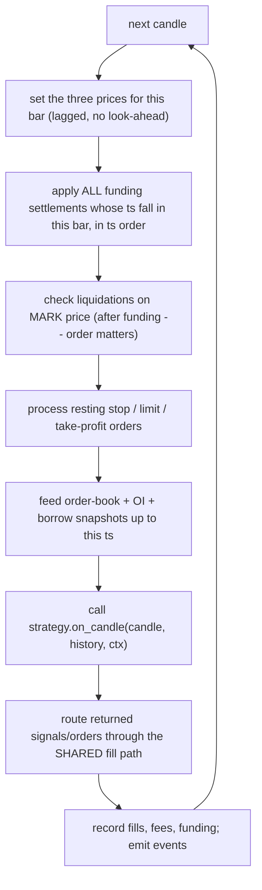

The "lagged, no look-ahead" step is enforced in `core/time`: at bar *t*, the strategy can only see data knowable at *t*, and market orders execute at *t+1*'s open, not *t*'s close. This single rule kills the most common source of fake backtest profits.

**Within-bar ordering is locked, not incidental** (the review found the old order could liquidate a position that a funding *receipt* would have saved):
1. **Funding settles before the liquidation check.** All funding settlements whose timestamp falls inside the bar are applied first, **each individually in timestamp order** (a 4h bar over hourly HL funding applies 4 settlements, each at its own rate — never one lumped payment).
2. **Mark within a bar** for the liquidation check is the bar's mark-snapshot series where we have it (Tier A/B); on OHLCV-only segments it is evaluated against the bar's **adverse extreme** for each position (low for longs, high for shorts) — see the intrabar policy below.
3. **Intrabar price-path policy (Tier C, locked):** with only OHLCV, the order in which high/low were visited is unknowable, and stop vs take-profit vs liquidation outcomes depend on it. Flint assumes the **adverse extreme is visited first** (pessimistic, D11): for a long with both a stop and a TP in range, the stop fires; a liquidation in range fires before a TP. Every intrabar-triggered event on a Tier-C segment is flagged `intrabar_ambiguous` in the event log so the tearsheet can show how much PnL rests on path assumptions.

*Worked example (funding-before-liquidation):* long 10 SOL, margin $26 above maintenance, mark dipping to the liquidation price inside this bar — and an hourly funding settlement of **+$30 receivable** (shorts pay longs) lands at minute 12. Old order: liquidated. Locked order: funding credits first → margin clears maintenance → position survives, exactly as HL's own engine (which settles funding continuously) would have it. The opposite case (funding *debit* pushes you under) also resolves correctly: debit first, then liquidate.

### 6.2 The shared order/fill path + idempotent orders

Both backtest and paper call the *same* function to turn an `Order` into a `Fill`. Each order carries a `client_order_id` (a unique key the *client* generates). If the same id is submitted twice (e.g. a paper-trading reconnect), it's recognized and not double-filled. Orders move through a persisted state machine:

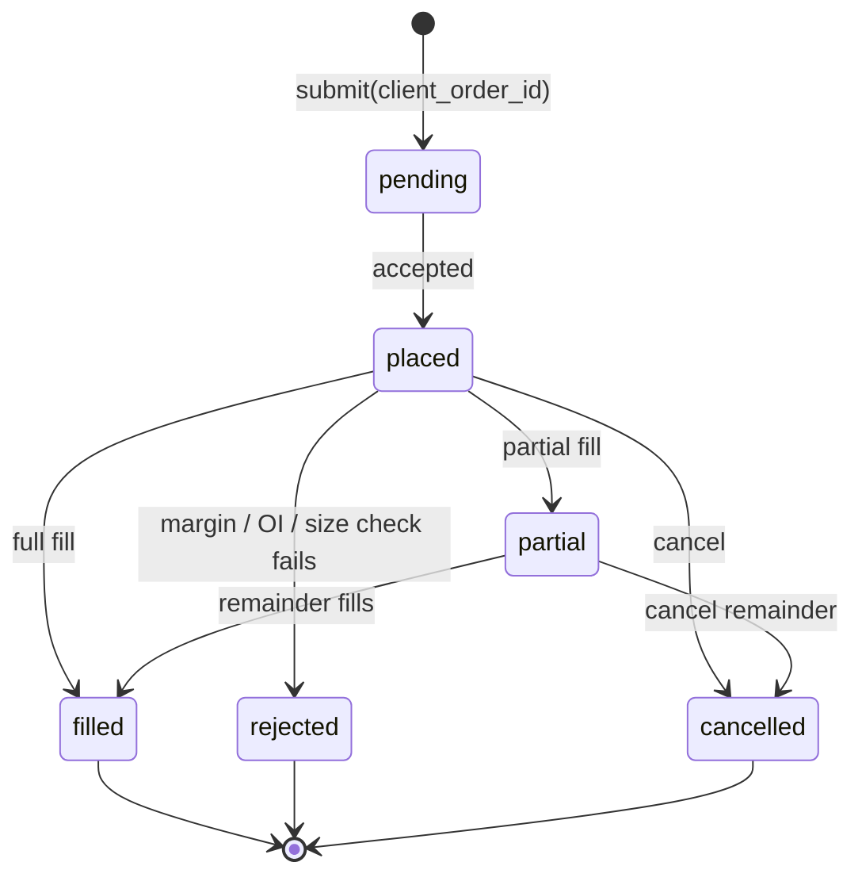

Persisting this even in paper mode means paper survives a restart and live (v2) can reconcile against the exchange after a dropped connection — the same machinery either way.

### 6.3 Fill simulation — fidelity tiers and what we model

Simulated fills are the wedge — this is exactly where freqtrade/backtrader lie and lose perp traders. Fill accuracy is **bounded by the data available**, so the engine is explicit about the **fidelity tier** it achieved per market × period and never pretends to more precision than the data supports.

**Fill-fidelity tiers (recorded per market × period, reported on every result):**

| Tier | Data available | Market-order fills | Limit / maker fills |
|------|----------------|--------------------|---------------------|
| **A (highest)** | L2 book + trade prints | walk real book depth (VWAP, partial/reject) | **queue-position aware** — fill only after enough volume clears the queue ahead of you |
| **B** | L2 book, no trades | walk real book depth | **probabilistic** queue fill (volume-at-price proxy) — flagged estimated |
| **C (coarse)** | OHLCV only (no book) | next-bar-open + parametric spread + square-root impact | price-cross heuristic (low<=limit) — flagged optimistic |

A single backtest can span tiers (e.g. SOL-PERP is Tier A for dates we have book, Tier C before recording started). The tier is recorded **per fill** (`Fill.fidelity_tier`, §5) and aggregated per segment in the tearsheet, so nobody mistakes a Tier-C run for a faithful one — and a "Tier A run" where 15% of fills silently used stale books is visible too:

- **Book staleness threshold (per venue):** if the nearest book snapshot at a fill's effective time is older than the venue's threshold (defaults: HL **30s**, Binance **5s** — the recorder cadences make these generous), the snapshot is treated as **absent** and that fill degrades to Tier C with a `stale_book` flag. A recorder WebSocket drop during a volatile hour therefore shows up as flagged fills, not as fake Tier-A confidence.

**Two data rules — hard vs soft, on purpose:**
- **Funding is a HARD gate.** A perp's PnL is wrong without funding, so if funding data is missing for a (venue, market, sub-range), the backtest is **rejected for that period + venue** — not silently degraded. The DataManager validates funding coverage up front and returns the exact missing ranges plus the fix (§2.11); the user/agent picks a covered range or explicitly passes `--clip-to-coverage`.
- **Multi-venue runs gate on the INTERSECTION.** For a strategy targeting several venues (D21), the DataManager computes the funding-coverage intersection across **all** of them before the run and rejects the *whole run* on any gap — never a per-leg partial rejection that would leave a naked leg the user didn't choose. The rejection includes the per-venue coverage map. `compare(run_ids)` (§13) warns when two runs cover different effective ranges (their Sharpes aren't comparable).
- **L2 depth is a SOFT gate.** Missing book degrades fill *fidelity* (Tier A/B → Tier C) but PnL is still meaningful, so the run proceeds with a clear flag.
- **The gate also shapes optimization honestly.** Because gated strategies are only ever evaluated where data exists (operational, liquid periods), the tearsheet states the **effective evaluated range** next to every metric, and a `--stress-early-data` mode exists to deliberately include sparse/early periods at Tier C for robustness checks.

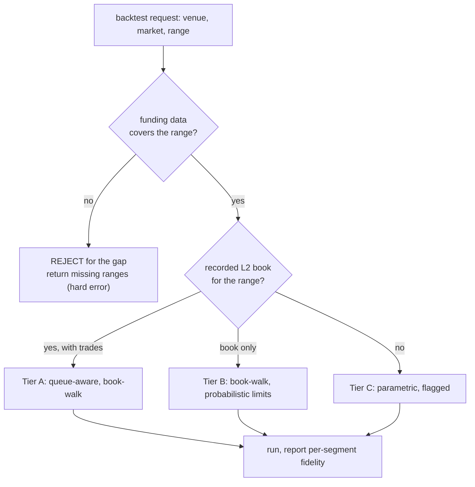

**CLOB market orders — what we model (Tier A/B):**
1. **Effective time, not bar time.** The order becomes eligible at `submit_ts + latency` (venue base + jitter — table below). We fill against the book snapshot at/just-before that effective time — the book has *moved* since the strategy decided. Filling at bar-open ignores this; we don't.
2. **Cross the spread.** A buy lifts the **ask**, a sell hits the **bid**. We never fill at mid or close — that silently hands you half the spread.
3. **Walk real depth.** Take levels until filled: VWAP price, `slippage_bps` recorded. Size beyond visible depth → **partial fill** (IOC) or **reject** (FOK); never assume hidden infinite liquidity.
4. **Tick / lot / price band.** Round price to tick, size to lot; reject orders outside the venue's allowed band (HL rejects resting orders >1% from oracle).
5. **Taker fee** at the account's volume tier.
6. **Hyperliquid override — the oracle band.** HL market orders execute against an **oracle-bounded price band** (orders rejected beyond a max deviation from oracle), so during a fast oracle move a naive book-walk *overstates* slippage (the venue would have rejected, or the band clipped the price). The HL fill model clips the walked VWAP to the oracle band at effective time and uses the band for the rejection/partial threshold. This is an adapter-level override on the shared CLOB model — the kind of venue-exact behavior the wedge claims.

**Latency model (locked defaults — calibratable, never silent):**

| Venue | Base (one-way submit→book) | Jitter | Source / note |
|---|---|---|---|
| Hyperliquid | 250 ms | lognormal, σ such that p95 ≈ 600 ms | block inclusion ≈ 1 block (~70–500 ms post-HyperBFT) + network; verify against current block time at coding |
| Binance | 30 ms | lognormal, p95 ≈ 100 ms | typical co-located-to-retail REST/WS round trips |
| Jupiter (on-chain) | 800 ms | lognormal, p95 ≈ 2 s | Solana slot (~400 ms) × inclusion uncertainty + RPC |

Latency is **one-way** (decision → order eligible at the venue); seeded from `ctx.rng` so runs are deterministic; a visible parameter (`--latency-profile`), and recorded into cost attribution (the tearsheet shows PnL lost to latency). On OHLCV bars coarser than the latency scale, latency resolves *which bar* an order lands in (sub-bar jitter folds into the next-bar-open rule).

**Maker/taker classification (locked rules):**
- **Tier A/B:** evaluated against the book at **effective time** — a limit that crosses the spread *when it arrives* (after latency) is a **taker** at the taker fee, even if it was passive at signal time. A limit passive at arrival is maker.
- **Tier C** (no book): any limit that executes on its **placement bar** is classified **taker** (it almost certainly crossed); a resting order that executes on a later bar is maker.
- The classification is recorded on every fill (`Fill.liquidity`, §5) — HL's maker/taker spread (0.01%/0.035% base tier; verify at coding) is 3.5× and silently misclassifying it flatters limit strategies.

**Tier-C parametric model (the defaults, stated — not "a formula exists"):**
- **Spread estimate:** per-venue-tier fixed half-spread by market-cap bucket (majors 1 bps, mid-caps 3 bps, tail 10 bps) **or** Corwin-Schultz from OHLC where bars are fine enough — whichever the calibration fixture supports per venue; the choice is recorded on the run.
- **Impact:** square-root law `impact_bps = k × sqrt(order_notional / bar_dollar_volume) × 10⁴`, with per-venue `k` calibrated against our own Tier-A segments (default `k = 0.1` until calibrated — flagged `uncalibrated`). Zero-volume bars: order rejected (no liquidity evidence — D26 forbids inventing it).
- **Execution price:** next-bar **open** ± (half-spread + impact) in the adverse direction, taker fee on top.
- Tier-C fills carry a **wider uncertainty band** in cost attribution; the tearsheet shows it.

**CLOB limit / maker orders — the queue-position problem (the #1 maker-fill error):**
A limit order does **not** fill just because the bar's low touched it. You join the **back of the queue** at that price; `queue_ahead` = the resting size already there when you posted. You fill only after the cumulative volume traded at that price exceeds `queue_ahead` (Tier A uses recorded trade prints; Tier B estimates from volume-at-price and is flagged). What naive `low<=limit` gets wrong and we get right:
- **Maker vs taker.** A limit that crosses the spread on arrival is a **taker** (pays the taker fee), not a maker rebate. Assuming maker while crossing is a common, large error.
- **Partial maker fills** when only part of the queue clears.

This is why naive backtests make passive / market-making strategies look far better than they trade live; modeling the queue is the fix.

**Oracle-pool fills (Jupiter / GMX) — and what Jupiter actually is** *(v3: deferred to v1.x with Jupiter — D28; the spec below is locked now so the `FillModel` seam is designed against both structures)*:
- **Fills at the spot oracle price** valid at the effective time (respect the oracle's update cadence and Pyth's `oracle_confidence_bps`; no look-ahead to a later tick) **plus the venue's actual price-impact fee formula** (size vs pool depth), not a generic bps.
- **Liquidations use Jupiter's EMA oracle price, not spot** — Jupiter values positions for liquidation on a smoothed price. Conflating the two mis-times liquidations in exactly the fast-move-then-revert cases that matter. The adapter declares which oracle stream drives which check.
- **Borrow is NOT funding.** Jupiter's borrow fee accrues on position value at a rate that is a **non-linear function of pool utilization** (it spikes 50–200%+ APR when the custody pool is near cap). Recording a scalar `rate_hourly` understates stressed-period cost massively — so `BorrowSnapshot` carries `utilization`/`pool_size`/`borrowed_size` (§5) and the engine computes `rate = f(utilization)` per custody. **Borrow is gated like funding** (no borrow/utilization history → reject Jupiter over that range).
- **Reject** if size exceeds the pool/position limit, or if modeled slippage exceeds the swap's tolerance (a real on-chain swap would fail).
- **MEV, framed correctly:** Jupiter Perps is oracle-priced — there is no AMM to sandwich; the relevant adversarial cost is **oracle-lag arbitrage** and inclusion priority. v1 models this as **one configurable haircut parameter per venue type** with a documented default (perp opens/closes: 0 bps default — the impact fee already prices size; large *swap-leg* trades: 5 bps default) plus a **flat-lamport Jito tip** as a fee line, not bps. A real oracle-lag model is v2; the v1 parameter is honest and visible rather than wrong and hidden.
- **No real recorded data → no Jupiter backtest (D26).** The oracle-pool fill model and the on-chain recorders (Doves oracle + custody accounts) ship in v1; historical Jupiter backtests become available only as recorded history accumulates (and if Helius archival reconstruction of historical utilization proves out, §19.5). The UI/CLI say exactly that — never a synthetic stand-in.

**Worked example (Tier A CLOB market buy).** Buy 10 SOL; effective-time ask book `[(100.00, 4), (100.10, 5), (100.30, 8)]`: take 4@100.00 + 5@100.10 + 1@100.30 → VWAP **100.08**, slippage 8 bps recorded, plus taker fee. A size-20 order against only 17 visible → fills 17, remainder partial/rejected per TIF.

**Default posture (D11):** pessimistic everywhere — full taker fees, real spread, latency, conservative impact, queue-aware maker. `--fill optimistic` exists only for explicit comparison, and the result *always* states the fidelity tier so optimism is never silent.

> **Recorder implication:** Tier A needs **trade prints**, not just book snapshots. The recorder (§3.5) and the paid vendors (§9) therefore capture **L2 depth + trades + OI**; the Flint Data API serves all three.

### 6.4 Funding — worked example + the predicted/final contract

Holding a long 10 SOL on Hyperliquid; the settlement-time oracle price is 100.00; the **final settled** hourly rate for this settlement is `+0.01%`:
- Payment = `size × oracle_price × final_rate` = `10 × 100.00 × 0.0001` = **$0.10**, and since the rate is positive, **longs pay**, so −$0.10 to this position. *(Erratum fixed during build: this previously read "$1.00"; the formula is normative and `10 × 100 × 0.0001 = 0.10`.)*
- The **notional snapshot**: the payment is sized on the oracle price **at the settlement second** (interpolated from the nearest mark snapshots when the settlement falls inside a bar) — not the bar close, which can differ by percent in a fast market.
- The same on Binance would price on **mark**, not oracle, and settle every 8h not hourly. The engine reads `price_basis` and `interval_s` off the `FundingRate` to do the right thing per venue, and clamps to the venue-spec `rate_cap_hourly` (HL: 4%/hr — primary-source cited in the spec, §2.2).
- Only positions open *at the settlement timestamp* are charged.

**The predicted/final split (the engine-level look-ahead the linter can't see):**
- `ctx.funding_rate(market, venue)` returns the last **published predicted** rate with `ts < bar_start_ts` — what a trader actually knew when deciding. It **never** returns the final rate settled later in the bar.
- The **payment** at a settlement uses the **final** rate for that settlement.
- Both series are stored (`rate_type` on each row, §5). The engine test suite includes a fixture window where predicted and final diverge materially and asserts the strategy saw only predicted (§19.3) — because funding mean-reverts, leaking the settled rate inflates funding-arb results dramatically, and this is precisely the strategy class Flint exists for.

### 6.5 Liquidation — per-venue spec, cross vs isolated, and what happens after the trigger

Long 10 SOL, entry 100.00, 20× leverage so $50 margin, maintenance margin 2.5%. As mark falls, unrealized loss grows. Liquidation triggers when margin left < maintenance requirement:
- `liq_price ≈ entry − (margin − maint% × notional) / size`. With these numbers, roughly `100 − (50 − 0.025·1000)/10 = 100 − 2.5 = **97.5**`.
- For big positions it uses the venue's **tiered** maintenance margin (more margin required for larger size). Computed every bar against **mark** (not candle close), so liquidations time correctly. (Exact HL tier numbers verified against primary docs before coding, with cited URLs + a unit test per number — D14.)

**Every venue adapter carries a `LiquidationSpec`** — the trigger is universal; what happens *after* differs per venue and changes the loss:

| Field | What it encodes | HL example |
|---|---|---|
| `liquidation_fee` | the penalty formula | distance-based: close lands between mark and the **bankruptcy price** via the HLP vault |
| `bankruptcy_price` | the price at which margin is exactly zero | `entry − margin/size` for a long |
| `insurance_fund` | who absorbs the gap below bankruptcy | v1 simplification: **assumed solvent** (documented on the tearsheet whenever a liq event occurs) |
| `adl_rank` | how counterparties are chosen if the fund fails | HL: by PnL% × leverage rank — **not** "largest loser" |
| `maint_tiers` | size-tiered maintenance margin table | verified per D14 |

- **Cross vs isolated (per-order `margin_mode`, §5):** an account can hold both simultaneously (HL allows it). The **cross pool = total equity − sum of isolated margins**; one cross position breaching maintenance endangers *all* cross positions, so the engine evaluates **cross-pool depletion across all cross positions each bar** — not per-position independently — and closes the largest-loss position first, repeating until the pool clears maintenance. Isolated positions consume only their own `isolated_margin` and close whole.
- `ctx.account(venue)` exposes `cross_margin_available` and per-position isolated margin separately — a scalar `margin_used` hides exactly the thing that gets leveraged traders killed.
- **ADL of winners** is recorded as an event type (it can close *your profitable* position); v1 triggers it only in the modeled "fund insufficient" case, which under the solvency simplification means: never silently — if a liq event's loss would pass bankruptcy, the event log says so.
- **HL settlement realities** (paper/live): order landing is block-quantized (the latency table, §6.3); the on-chain clearinghouse state is the **reconciliation source of truth** for live (v2 expands this) — not the lagging REST `orderStatus`.

### 6.6 The cross-venue portfolio model (what makes two-leg strategies honest — D21)

*(v3 — D28: cross-venue **execution** defers to v1.x. The model below is the locked design for when it lands; v1 builds the per-venue account structure with a single Hyperliquid account, so the upgrade is additive — a second account, not a portfolio-model rewrite.)*

The flagship strategy holds positions on two venues at once. The portfolio model is explicit because the naive version (one pooled equity number) lets a backtest double-count collateral and understate liquidation risk:

- **One simulated wallet, per-venue isolated sub-accounts.** Each venue has its own margin account with its own cash allocation. Opening the Binance leg consumes *Binance-account* collateral; the HL leg consumes *HL-account* collateral. You cannot margin a position on venue A with equity sitting on venue B — exactly like reality, where moving collateral is a slow, explicit transfer.
- **Equity = sum of per-venue equity.** The tearsheet shows total and per-venue curves; cross-venue PnL netting is **display-only**.
- **Liquidation is evaluated per-venue in isolation.** A blown HL leg liquidates by HL's rules even while the Binance leg is green — the precise risk a real funding-arb carries (the spread is hedged; the *legs* are not).
- **Partial-fill / one-leg-rejected = a recorded naked leg.** If leg 1 fills and leg 2 rejects (margin, size, band), the engine does **not** unwind leg 1 retroactively (live wouldn't). It records the surviving naked directional position, emits a `naked_leg` event, and the tearsheet counts naked-leg exposure time. Strategies can react on the next bar (`ctx.position(market, venue=...)`).
- **Capital allocation** is a strategy-visible parameter (`allocations={"hyperliquid": 0.5, "binance": 0.5}` by default, configurable); rebalancing across venue accounts is an explicit action with a modeled delay, not free.

### 6.7 Paper and live: the LiveFeed, the clock, drift, and alerts

Paper/live is the same engine fed by the **`LiveFeed`** (`data/livefeed/`) instead of historical replay. The review found this component simply didn't exist in the architecture; now it does, with a contract:

- **LiveFeed** subscribes to venue WebSockets using the **same normalization code the recorders use** (one implementation of "parse HL's `l2Book` message," not two), and emits candles/marks/funding/book updates to the engine. The lake is not in the live hot path — it serves **gap replay** only.
- **The paper clock:** a bar "closes" when the **venue-reported event timestamp** crosses the boundary (never the local wall clock — clock skew becomes phantom drift otherwise). `ctx.now` in paper = the latest venue event timestamp. T+1 execution maps to "orders submitted after bar close become eligible at `close_event_ts + latency`," with the *same* latency model as backtest — so the comparison is apples-to-apples and live latency shows up as measurable drift, not definitional noise.
- **Reconnect protocol:** WS drop → on reconnect, fetch the missed candles + funding from the lake, **replay the gap through the same engine loop** (positions, funding accrual, liquidation checks update as if live), surface "recovered from *N*-minute gap" on the monitor, and flag `degraded_fidelity` if the lake lacked the gap data. `client_order_id` idempotency means replays can't double-fill (§6.2). Missed bars are never skipped (state gap) and never forward-filled (look-ahead).
- **Drift, defined** (the parity promise with numbers, not vibes):
  - **Structural drift — alert.** The *model* disagrees with reality: paper fill slippage z-score > 3 vs the backtest's slippage distribution over a rolling 20-trade window; any funding payment mismatch beyond rounding; any unexpected liquidation/rejection. These mean the simulator is wrong → fix the model.
  - **Market drift — chart, not alarm.** Performance decay vs the backtest period (rolling Sharpe, hit rate). The regime changed; that's a finding, not a bug.
  - The monitor shows a per-component **attribution table**: fills +2.1 bps vs sim · funding matched · latency p50 380 ms vs modeled 250 ms · no unexpected events. Thresholds configurable; defaults stated here.
- **Alerts + heartbeat (the unattended contract):** rule-based alerts on `liq_distance_pct < X` (default 10), structural-drift breach, funding-spread sign flip, and **process death** (a heartbeat with `last_event_ts`; silence > 2× bar interval fires). One channel in v1 — **webhook** (covers Discord/Telegram/Slack) — plus the UI. `POST /api/v1/alerts` to manage rules (§12).

---

## 7. Venues and the market-structure abstraction

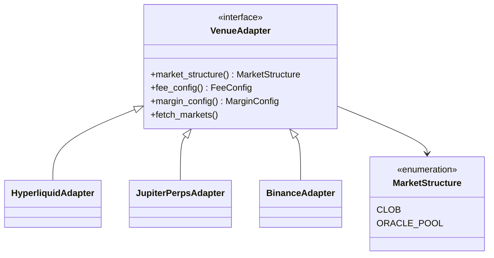

Adding a venue is: implement `VenueAdapter`, declare its `MarketStructure`, provide fee/margin specs. The engine reads `market_structure()` and automatically selects the CLOB or oracle-pool fill model.

- **Hyperliquid** (DEX) is `CLOB` — the only executable v1 venue (D28), via its native API + signing.
- **Binance** (CEX) is also `CLOB` *(v1.x — D28)* — it shares HL's fill model and differs only in fee/margin specs, funding convention (Binance: 8h, mark-priced; HL: hourly, oracle-priced), and the data/execution client (**CCXT** / native REST).
- **Jupiter** (DEX) is `ORACLE_POOL` *(v1.x — D28)* — fills at oracle + price-impact fee, and it charges an hourly **borrow fee**, not funding.
- dYdX (CLOB), Phoenix (CLOB), and GMX (oracle-pool) drop in later as new DEX adapters with **no engine changes** — the whole point of the abstraction.

**All CEXes go through one `CCXTVenueAdapter`** parameterized by exchange id — CCXT is a single library wrapping 100+ centralized exchanges behind a uniform API. So adding Bybit, OKX, Gate, etc. is **config (exchange id + fee/margin/funding specs), not new code** — but config is not validation. *(v3 — D28:)* **no CEX is executable in v1.** Binance is the first v1.x execution venue (its data quality, funding semantics, and archives are already verified); Bybit/OKX/Gate follow **only after each passes the same validation** (their OI/funding retention is literally marked UNVERIFIED in the venue dossier — shipping them "available" would contradict the correctness wedge). In v1 the CCXT path serves one purpose: CEX funding rates (and OI where available) ingest **read-only** into the funding/basis lab (§10), where a wrong number can't fill an order.

What CCXT covers for major perp CEXes: OHLCV, funding rates, open interest, trades, mark/index/last prices, positions, leverage. **What it does NOT cover, and how the design fills the gap:**
- **Historical L2 order-book depth** — CCXT gives only *live* snapshots. But **historical L2 depth is sourceable** (§9.1): major CEXes from paid vendors (Tardis/Crypto Lake/Kaiko), **Hyperliquid from its own free S3 archive**, OKX/Gate from their CSV archives — all ingested **once, centrally** into the lake so depth-aware fills work historically for everyone. Venues with no archive (Binance full book, Bybit, Phoenix) are **recorder-only**. Where nothing exists for a range, fills **degrade** with a flag (§2.11).
- **Uneven funding/OI *history*** — implemented for some exchanges, not all. Where missing, fall back to the venue's native API or accept snapshot-only.
- **Deepest bulk history** — better via native dumps for the majors (e.g. Binance's CSV archive back to 2019); CCXT paginates but inherits each venue's history ceiling. Bulk ingestion is special-cased for the big venues during central ingestion (§9).

---

## 8. The strategy API

### 8.1 What the user writes — and exactly what a Signal is

A subclass of `Strategy` with a `params` dict (the tunable knobs) and an `on_candle` method returning a **`list[Signal]`** (empty list = do nothing; a bare `Signal` is accepted and wrapped). See the full funding-arb example in §3.2. Design principles:
- The user writes *only* trading logic. Funding, fees, fills, liquidation are the engine's job.
- `params` are auto-exposed to the optimizer (§3.3) and the UI.

**Signal semantics (locked — this was the review's "undefined flagship type"):**

```python
@dataclass(frozen=True)
class Signal:
    market: str
    venue: str
    action: str                  # "long" | "short" | "close"
    size_usd: float = 0.0        # OR size (base units) -- exactly one
    size: float = 0.0
    limit_price: float = 0.0     # 0 = market order
    stop_loss: float = 0.0       # optional protective stop (resting order)
    take_profit: float = 0.0
    margin_mode: str = "cross"
    tif: TimeInForce = TimeInForce.IOC   # market default; GTC for limit

    # constructors: Signal.long(market, venue=..., size_usd=...),
    # Signal.short(...), Signal.close(market, venue=...)
```

**Signal → Order conversion rules (the engine's job, with the look-ahead trap closed):**
1. **Sizing price = the same price discipline as fills.** `size_usd` converts to base units at the **next bar's open mark** (the execution bar), never bar *t*'s close — sizing at the decision bar's close is a subtle look-ahead (you sized the notional with a price you couldn't trade at) that no strategy linter can see.
2. **Rounding** to the venue's tick/lot happens in the engine; the residual (sub-lot remainder) is recorded on the order, never silently grown.
3. **`Signal.close()`** maps to a **reduce-only** order for the full current position size at conversion time — it can never flip a position (a race that bites live).
4. **Defaults:** `size_usd=0` with `action != "close"` is a validation error (no implicit sizing); market signals are IOC; limit signals are GTC until cancelled or the run ends.
5. One signal per (market, venue, action) per bar; duplicates are a validation error, not a merge.

**Sizing helpers** (so users don't hand-roll the math that escapes the linter):

```python
ctx.account(venue).size_for_risk_pct(risk_pct, stop_distance_bps)  # risk a fixed % of equity
ctx.account(venue).size_for_target_leverage(target)                 # e.g. 2.0x of venue equity
ctx.account(venue).size_for_kelly(edge, win_rate, fraction=0.5)     # fractional Kelly
```

These return a `size_usd` computed off **current venue equity** — so position sizes compound with the account naturally instead of the fixed-USD anti-pattern.

**The escape hatch — `ctx.submit_order(...)` (D21).** Power users (ladders, conditional legs, partial scaling) may call `ctx.submit_order(market, venue, side, size, type, price=..., tif=..., margin_mode=...)` any number of times inside `on_candle`. Same Order model, same engine path, same caps. The trade-off is explicit: signals are the **lintable** path (the look-ahead linter reasons about them); `submit_order` strategies get a tearsheet note ("imperative orders — linter coverage partial"). Templates always use signals.

### 8.2 `ctx` — the read-only window into the world, with a visibility contract

`on_candle` receives `ctx`, a read-only **value object** (a strategy can't corrupt engine state, and — security-relevant — `ctx` holds **no reference path to config, secrets, or the store**; §8.3). It exposes:

```python
ctx.position(market, venue=None)    # Position or None; venue=None -> default venue
ctx.account(venue=None)             # per-venue equity, cross_margin_available, isolated margins (§6.5/6.6)
ctx.funding_rate(market, venue)     # last PUBLISHED predicted hourly rate as of bar start
ctx.basis_bps(market, venue=None)   # perp vs index premium
ctx.open_interest(market, venue=None)
ctx.orderbook(market, venue=None)   # latest recorded L2 snapshot, or None
ctx.candles(market, lookback, venue=None)
ctx.submit_order(...)               # the imperative escape hatch (§8.1, D21)
ctx.model_store                     # managed KV for trained models (§8.5) -- safe formats, no file paths
ctx.rng                             # seeded RNG (deterministic; strategies must NOT use `random`/os.urandom)
ctx.now                             # virtual clock = current bar time (strategies must NOT use wall-clock)
```

**The data-visibility contract** (one rule, every accessor — this generalizes the funding fix in §6.4; the review found each accessor was a separate potential engine-level leak):

| Accessor | Backtest returns | If missing (Tier C / gap) | Paper/live returns |
|---|---|---|---|
| `funding_rate` | last **predicted** rate with `ts < bar_start_ts` | can't happen (hard gate) | venue's current predicted rate at decision time |
| `orderbook` | last snapshot `ts < bar_start_ts`, within the staleness threshold (§6.3) | **`None`** + fidelity flag — never a stale book silently | live book at decision time (recorded for drift comparison) |
| `open_interest` | last value `ts < bar_start_ts` | `None` + flag | live value |
| `basis_bps` | from the last MarkSnapshot `ts < bar_start_ts` | `None` + flag | live |
| `candles` | bars with `bar_end_ts <= bar_start_ts` (closed bars only) | gap visible as missing bars — never forward-filled | closed live bars |

The universal rule: **strictly less than bar start, closed data only, `None` over stale, never synthetic** (D26). One truncated-frame engine test per accessor asserts the contract (§19.3).

### 8.3 The security sandbox (OS isolation from day one — D25)

Strategy code is **untrusted** — you run strategies you downloaded, and agents *generate* them (§13). The review verified the uncomfortable truth: an AST screen + import filter alone is **bypassable** (`getattr` chains to `__subclasses__` reach `os`/`subprocess`/secrets), and any path that skips sandbox routing is a hole regardless of how good the sandbox is. v2 therefore locks two principles:

1. **Isolation is structural, not syntactic.** The defense is the *process boundary*, not the code screen. The AST screen and allowlist remain — as *lint-grade UX* (fast, line-precise "you can't import requests" errors before a run) — but nothing relies on them for security.
2. **Every execution path routes through the sandbox unconditionally.** CLI, REST, MCP/agent, optimizer workers — there is exactly one `run_strategy_sandboxed()` entry and no in-process fallback for any argument combination. (Round-1 found the old design's service path skipped routing precisely when funding/orderbook args were present — the *normal* perp case.)

**The execution sandbox (ships in Phase 1–2, before any strategy ever runs):**
- **Subprocess per run**: spawned with `env={}` (no `FLINT_*` keys — secrets are unreachable by construction, not by filter), a minimal `__builtins__`, and data passed in/out as serialized Arrow/dicts over a pipe — the child holds no reference to config, store, or the parent's memory.
- **Resource limits**: `RLIMIT_CPU = wall_timeout` (kills busy-loop *threads* too — wall-clock alone doesn't), `RLIMIT_AS` (memory), wall-clock kill, output-size cap.
- **OS layer where available**: nsjail/bubblewrap with network namespace off, read-only rootfs, ephemeral scratch, seccomp-bpf, no new privileges. On platforms without it (macOS dev laptops), the subprocess + RLIMIT + env-scrub layer stands alone and the docs say exactly which guarantees remain. The hosted/agent deployment **requires** the full OS layer.
- **`ctx` is a value object** (§8.2): copied data, no live references. A test asserts no reachable attribute path from `ctx` to any credential (§19.3).
- **Known residual gap, documented:** C-extensions (numpy et al.) execute native code inside the boundary; the OS layer is what contains them. `threading.Thread` is not blocked in v1 (RLIMIT_CPU bounds it); seccomp `clone` filtering tightens this where the OS layer runs.

**Import allowlist.** Strategies may import only:
- **Stdlib-safe:** `math, statistics, collections, dataclasses, typing, enum, abc, functools, itertools, operator` + `flint`.
- **Tabular + classic ML:** `numpy, pandas, polars, scipy, statsmodels, scikit-learn, xgboost, lightgbm`, plus indicators (`pandas-ta`, optionally `ta-lib`). CPU, deterministic, covers the vast majority of trading ML.
- **Cut from v1 (D19):** `pytorch`, `tensorflow`/`keras` (C-extension surface + model-store complexity for the smallest segment), `river` (returns with online learning in v2).
- **Everything else denied** at import time, with the line-precise error.

**Hard prohibitions — a strategy MUST NOT** (enforced by the process boundary + screen):
- **Filesystem:** `open`, read/write/delete any path, or read another tenant's data/models. (Model persistence goes through `ctx.model_store` only — §8.5.)
- **Network:** sockets, HTTP, DNS — no exfiltration, no peeking at live data, no model downloads.
- **Process/OS:** `os`, `subprocess`, `sys`, `ctypes`/FFI, signals, env access (the child env is empty anyway).
- **Dynamic code:** `eval`, `exec`, `compile`, `__import__`, `importlib`, monkeypatching builtins, `__subclasses__`/`__globals__` escapes (screened for UX; contained by the boundary).
- **Unsafe deserialization:** `pickle.load(s)`, `joblib.load`, `torch.load`, `yaml.unsafe_load`, `marshal`, `dill` on **any** bytes — the #1 ML-supply-chain RCE vector. Models load only via the managed store (§8.5).
- **Non-determinism:** `random`/`os.urandom` (use `ctx.rng`), `time.time()`/`datetime.now()` (use `ctx.now`).

### 8.4 Built-in templates

Ship perp-native templates so users start from something real: funding harvest, funding arbitrage, basis trade, multi-venue funding, open-interest momentum, plus the classic technical set (MA/EMA cross, RSI, Bollinger, breakout, etc), plus an **ML template** (§8.5). All live in one registry that backtest, paper, and MCP read from — a single source of truth.

### 8.5 ML & continual-learning strategies

ML is supported through a **declarative** API (FreqAI's key lesson): the strategy describes *features* and a *target*, and optionally a `train()` method — it does **not** hand-roll the training loop. This is what lets the engine guarantee causality (no look-ahead) and run training outside the per-bar time budget.

```python
class MyMLStrategy(MLStrategy):
    params = dict(retrain_days=7, label_horizon=24, threshold=0.6)

    def features(self, market, history, ctx):
        # Return a feature row from data <= now ONLY. Engine forbids future reads.
        return {"rsi": rsi(history), "basis": ctx.basis_bps(market),
                "funding": ctx.funding_rate(market, "hyperliquid")}

    def target(self, market, history, future_window):
        # Label uses the forward window — only ever evaluated on CLOSED windows
        # during training; never available to on_candle at trade time.
        return 1 if future_window.return_pct > 0 else 0

    def train(self, X, y, ctx):
        import lightgbm as lgb
        model = lgb.LGBMClassifier(random_state=ctx.seed).fit(X, y)
        ctx.model_store.save("clf", model)        # safe-format, scoped, no path

    def on_candle(self, candle, history, ctx):
        model = ctx.model_store.load("clf")        # platform deserializes safely
        p = model.predict_proba(self.features(candle.market, history, ctx))[1]
        return Signal.long() if p > self.params["threshold"] else Signal.hold()
```

**How the engine enforces correctness (the anti-look-ahead rules, the whole point):**
1. **Causal feed.** `features()` and `on_candle()` only ever see data at-or-before the current bar; the engine never hands the strategy the full future frame to fit on.
2. **Per-window target derivation.** `target()` is re-computed *inside each walk-forward window*; a model is fit only on labels whose entire forward window has already closed.
3. **Purge + embargo.** Walk-forward splits drop training samples whose label window overlaps the test window and add an embargo gap (López de Prado) — prevents boundary leakage that ordinary splits miss.
4. **`train()` outside the bar budget**, on the schedule from `retrain_days` (FreqAI sliding-window); trained models cached per window for reproducible re-runs.
5. **Determinism.** Seeded `ctx.rng`/`ctx.seed`, pinned library versions, single-thread where needed (`lightgbm deterministic=true`) so a re-run reproduces bar-for-bar.

**Continual / online learning — deferred to v2 (D19 revision).** The v1 promise "a re-run reproduces bar-for-bar" cannot be honestly extended to per-bar `partial_fit` updates: sklearn's SGD paths depend on BLAS float-summation order, and a checkpoint restored on a different CPU architecture diverges silently. v2 brings it back with a **restricted whitelist of provably-deterministic models** (river tree/linear; sklearn configs verified non-BLAS-dependent) plus a determinism test (run a checkpointed learner twice → assert bitwise-identical outputs). v1 ships **batch ML with scheduled retraining** (`retrain_days` walk-forward windows) — which covers the dominant use case without the false promise.

**Feature-causality rule (linter-enforceable):** `features()` must use **expanding or rolling statistics only** — a full-window `mean()`/`std()` normalization leaks the future into every row and is exactly the leak the truncation test can miss when it's statistically subtle. The static AST pass flags unbounded aggregations in `features()` as errors, not warnings.

**The managed model store (`ctx.model_store`).** A QuantConnect-ObjectStore-style key-value store — `save(key, obj)`, `load(key)`, `exists(key)`, `keys()`, `delete(key)` — scoped server-side to `(tenant_id, strategy_id)`, quota-limited, with **no filesystem paths ever exposed** to strategy code. The *platform* serializes in safe formats (xgboost/lightgbm native JSON boosters; sklearn via ONNX — raw estimators are refused) so a strategy never hands over or loads raw pickle bytes. This is how a model persists between bars (within a run) and across runs (train-once/trade-many) without enabling arbitrary file I/O.

**Look-ahead linter (trust artifact, §11) — with its limits stated.** Before a backtest is trusted, Flint runs an automated detector (FreqAI-style) that flags future-reading code — `shift(-n)`, `.iloc[]` into future rows, unbounded full-frame `.mean()/.max()/.fit()`, degenerate label horizons — by (a) a **static AST pass** and (b) re-running on a truncated frame and detecting columns whose values change. What it **cannot** catch, stated on every result: label leakage via target definition, feature selection fitted on test-range correlations, and hyperparameter tuning against the OOS window (that one is DSR's job, §11). `lookahead_detected: false` therefore reads as "no leak *detected*," never "leak-free" — the agent schema (§13.3) words it exactly that way.

---

## 9. The data layer (on-demand, no manual download)

The center of the data layer is the **DataManager**, which makes §2.11's "just specify a range + universe" real, and the **Flint Data API** — a hosted, permanent, fast data lake that is the canonical source (D16). The engine never talks to data sources directly; it asks the DataManager, which resolves data through a **source chain**: local cache → Flint Data API → direct free-venue providers.

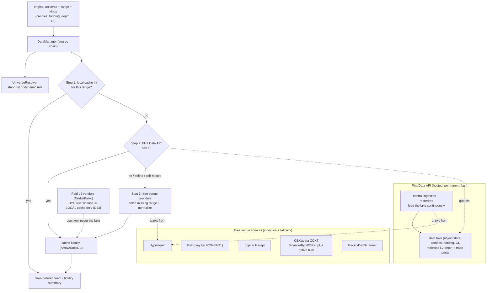

**Why a hosted Flint Data API (D16).** Three wins over each user fetching from free APIs themselves:
1. **Speed + "just there."** Pre-collected, pre-normalized, columnar — loading a year of SOL-PERP is a fast range query, not dozens of rate-limited paginated calls.
2. **Now-or-never depth solved centrally.** The recorders that capture L2 depth + OI run *once*, hosted, for everyone — so every user gets depth history without each running an always-on recorder. This is the big one.
3. **Consistency.** One normalized, gap-audited copy of the truth, instead of every user re-deriving "1m SOL" slightly differently from raw venue data.

**What the DataManager does, step by step**, when a backtest runs:
1. **Resolve the universe** — turn `["SOL-PERP", ...]` or a dynamic rule (`top:20:volume`) into a concrete instrument list for the range.
2. **Walk the source chain** per instrument × kind × range: serve from **local cache** if present; else query the **Flint Data API** (and cache the result locally for next time); else, if the API lacks it or the user is offline/self-hosted, fall back to **direct free-venue providers** (and cache that too).
3. **Serve a time-ordered feed** plus a **fidelity summary** — which kinds came at full vs degraded fidelity — so the tearsheet can show "fills: spread/impact model (no recorded book for this range)." Where the Data API has central depth, fills are high-fidelity automatically.

The engine is **source-agnostic** (it only sees the DataManager), so this composes cleanly: a fully local/offline user still works via the free-provider fallback; a connected user gets the fast hosted lake; and flipping the primary source never touches engine code. The lake itself is just a `MarketDataPort` adapter over object storage, returning the same Arrow tables (§2.7) — the abstraction we already committed to.

**Hard data realities the chain absorbs** (from the dossier's verified audit), now mostly handled centrally:
- **Historical L2 depth** → multiple paths (§9.1): **Hyperliquid's own free S3 archive** (depth from ~2023-09), **paid vendors** (Tardis/Crypto Lake) for CEX + HL trades, and **central recorders** for venues with no archive (Binance full book, Bybit, Phoenix). Oracle-pool DEXes (Jupiter/GMX) have no book at all. A self-hosted/offline user without the API falls back to their own optional recorder (§3.5).
- **Scarce historical OI** → ingested where an API exists (Bybit/Gate deepest); recorded centrally otherwise.
- **HL's 5000-candle/request cap** → handled once during central ingestion (and by paging in the local fallback); the lake serves arbitrary ranges directly.

**Two time-critical real-world deadlines** (operational, for central ingestion): **Pyth requires an API key from 2026-07-31**; **Jupiter's free-pricing migration deadline is ~2026-06-30** (keyless `lite-api.jup.ag` works for prototyping — reverify the tier).

### 9.0 The Flint Data API — the operational spec (the review's "placeholder, not a design")

The lake is the product's onboarding promise, so it gets a real spec, not a bullet:

**Legal model (D23 — forced by verified vendor ToS):**

| Lane | Sources | Who can read it |
|---|---|---|
| **Shared lake** | own WS recordings, HL S3 archive, exchange free archives (each behind a **per-source ToS review** recorded in the coverage matrix: `serve-raw` / `serve-derived` / `blocked`), Pyth (keyed) | all users |
| **BYO vendor lane** | user's own Tardis/Kaiko/Crypto Lake key → fetched by *their* client | **their local cache only** — vendor bytes never enter the shared lake |
| **Derived-aggregates lane (optional, later)** | ≥10-minute aggregates / fill-model calibration parameters computed from vendor data (the one redistribution Tardis's ToS permits) | all users, if/when a written vendor confirmation exists |

**Physical schema:** Parquet on object storage, partitioned `kind/venue/market/date/` (hour-partitioned for depth), `schema_version` in file metadata + a migration registry with **upgrade-on-read** in the storage adapter (so historical files are never mass-rewritten). DuckDB reads it natively.

**Serving contract:** a FastAPI **range endpoint** (`GET /v1/data/{kind}?venue&market&from&to` → Arrow IPC stream) as the v1 contract — simple to auth and meter; direct-parquet/HTTPFS access can come later behind the same client. The local client speaks this and writes through to the local cache.

**Auth + quotas:** bearer token per user (free registration); per-key quotas (default: 10 GB/day egress, 4 concurrent range requests); anonymous access only for the docs/coverage endpoints. This exists from the first deploy — retrofitting auth onto an open endpoint is a migration; shipping it is a header.

**Coverage floor (gates Phase 3)** *(v3 — D28)*: SOL/BTC/ETH-PERP × **Hyperliquid** × candles + funding + OI, continuous from ≥ 2025-01-01, plus HL depth from the S3 archive, plus **read-only cross-venue funding rates** (Binance/Bybit/OKX) for the lab — verified by the coverage matrix before the engine phase starts. Binance candles/depth and Jupiter on-chain data join the floor with their venues in v1.x. The matrix (`/v1/data/coverage`) is **public and honest**: per venue × kind × date-range, including the redistribution status column and the gaps (Jupiter pre-recorder ≈ zero; that's displayed, not hidden — D26).

**Ingestion quality bars (per worker, §9.1):** gap detection (WS sequence-number monotonicity; expected-vs-actual candle counts for REST), automated backfill triggers with a fallback source + retry policy, pre-write checks (timestamp ordering, duplicate keys, price-spike sanity, zero-volume-bug candles), and an exported **lag metric** (age of newest record per venue/market/kind) with alerting on staleness.

**Cache invalidation (local client):** cache keys are **content-addressed** — `hash(source, range, schema_version, lake_revision)` — so a lake-side correction (exchanges *do* retroactively revise funding) creates a new key instead of silently colliding; revisable kinds (funding, OI) carry a freshness TTL (24 h) while closed candles/depth are immutable; partial-range hits fetch only the missing sub-ranges and merge; `--no-cache` forces re-fetch. A re-run after a lake correction *says* the data changed (the run records its `lake_revision`) instead of silently producing different numbers.

**Cost reality (back-of-envelope, drives the quota defaults):** the coverage-floor lake is single-digit TB (depth dominates); at R2/B2 pricing that is tens of dollars/month storage and zero/low egress fees — the real cost driver is **vendor subscriptions we are not buying for redistribution (D23)** and the Helius archival key (~$500–1000/mo) for Solana history. Full L2 firehose serving for long-tail markets is deferred until the cost appendix justifies it (cut list).

### 9.1 Per-venue sourcing & the ingestion workers

The full per-venue × data-type matrix and pipelines live in the [venue data-sourcing dossier](../research/2026-06-05-venue-data-sourcing-dossier.md). *(v3 — D28: in v1 only the **Hyperliquid** workers + the Pyth oracle poller + read-only CEX funding-rate ingestion stand up; the Binance depth recorder, Binance/OKX/Gate bulk archives, and the Jupiter/Phoenix on-chain decoders defer with their venues. The full worker taxonomy stays specified below because it is the v1.x runbook — and note the deferral cost: each deferred recorder's now-or-never capture starts only when it ships.)* The lake is fed by **five worker classes**, all writing idempotent upserts keyed `(venue, market, ts)` (Solana: `(venue, market, signature, event_index)`):

1. **WS recorders — now-or-never, stand up FIRST.** Capture data with no historical source: Hyperliquid `trades`+`activeAssetCtx`+`l2Book`, Binance `@depth@100ms`+`!forceOrder`, Jupiter on-chain subscriptions (Doves price + custody accounts), and the Pyth SSE stream — immediately. Bybit/dYdX/Phoenix/Vertex/Aevo/Paradex order-book WS when each venue activates.
2. **REST/CSV backfillers — cheap, keyless, no rate limit where archives exist.** Hyperliquid S3 (`l2Book` from ~2023-09 + `asset_ctxs` daily OI/mark/oracle), Binance `data.binance.vision` (klines/trades/aggTrades/funding/`metrics` OI from ~2019-11), OKX/Gate/Bybit CSV archives. REST paging for gaps: HL candles/funding, Binance current-month + 30-day OI, dYdX funding/candles/trades, CCXT CEX candles/funding/OI.
3. **On-chain decoders.** Jupiter + Phoenix via a **Helius archival RPC** (`getSignaturesForAddress` + `getTransaction`, Anchor/IDL decode of the funding counter, OI, fills, liquidations) — scoped to custody/pool/market accounts (a full program scan is cost-prohibitive). GMX/Vertex via subgraph/indexer.
4. **Vendor backfillers — BYO-license only (D23).** Tardis (the only fix for HL's trade-tape + liquidation history before our recorders existed, from ~2024-10-29; dYdX L2 from ~2024-08-23), Crypto Lake (cheap Binance/Bybit/OKX L2 + trades), optional Kaiko/Amberdata. These run with a **user-supplied vendor key** and write to **that user's local cache only** — Tardis's ToS prohibits redistribution (verified, round 2), so vendor bytes never enter the shared lake. A platform redistribution license or the ≥10-min-aggregates lane (§9.0) are the only future paths to sharing vendor-derived data.
5. **Oracle poller.** Pyth Hermes (live) + Benchmarks / TradingView-shim (OHLC backfill on the 90-req/10s lane) feeding the shared index/oracle table.

**Correction to the depth-fidelity story** (from this research): "DEX depth = record-live only" is too pessimistic.
- **Hyperliquid depth** = **S3 archive backfill (free, ~2023-09 on)** + WS-rec for the gap between monthly drops → Tier A is *backfillable*, not just forward-recorded.
- **Hyperliquid trades** = WS-rec or Tardis (paid) — *this* is HL's now-or-never gap; Tier A *before* we start recording needs Tardis.
- **Binance full book** = WS-rec only (the free CSV `bookDepth` is a ±1/2/3/5% band proxy, not the book); history via Crypto Lake/Tardis. Trades/candles/OI are deep + free via the CSV archive.
- **Bybit / Phoenix / Vertex / Aevo / Paradex depth** = WS-rec mandatory (no archive exists).
- **Jupiter / GMX** = oracle-pool — no book exists, so the depth tier doesn't apply; fills are oracle + impact fee + borrow.

**Operational flags:** provision the **Pyth API key before 2026-07-31** (owner/billing to assign); a **Helius archival key** is required for any Jupiter/Phoenix history (public RPC prunes ~days); **Tardis (~$599/mo)** can seed HL/dYdX pre-recording history **for an individual user via the BYO lane only** (D23) — a platform purchase without redistribution rights buys nothing the lake can serve. Several retention depths are **UNVERIFIED** (Bybit/OKX intraday OI, Binance `liquidationSnapshot` start, Jupiter deci-bps funding scaling) — verify empirically and record live defensively.

---

## 10. The cross-venue funding & basis lab

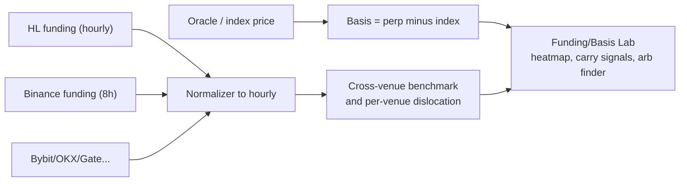

This is a headline differentiator for the wedge user (D6). It pulls funding from many venues, normalizes everything to a comparable hourly rate, computes each venue's deviation from the cross-venue average, and tracks **basis** (how far the perp trades from spot). The UI renders a heatmap (markets × venues) and the strategy `ctx` exposes the same numbers, so a user can both *see* dislocations and *trade* them. *(v3 — D28:)* in v1 the lab is **read-only** for every venue except Hyperliquid: a strategy sees every venue's normalized rate and trades the HL side of a dislocation; taking the full cross-venue position (e.g. long Binance / short Hyperliquid) unlocks with the Binance adapter in v1.x. No incumbent does cross-venue funding normalization well — it's a documented pain point, and the lab differentiates even before the second executable venue lands.

---

## 11. Research and trust artifacts

- **Walk-forward validation** (§3.3 explains it): the v1 anti-overfitting backbone. Out-of-sample results are what's reported. **Purge + embargo apply to ALL multi-bar strategies** (any strategy whose signal/label spans more than one bar — not only ML): the default purge ≥ the label horizon / average holding period, with a visible warning when configured below it.
- **Deflated Sharpe Ratio — in v1 (D22).** Walk-forward controls overfit for *one* strategy version; it cannot correct for *selection across thousands of trials* against the same OOS window. DSR does: it deflates the observed Sharpe by the number of trials and the variance of trial Sharpes (Bailey & López de Prado). Every optimization tearsheet shows **raw Sharpe + DSR + trial count**, and `overfit_suspected` (§13.3) keys off DSR, not the raw count. Trials are uncapped because the correction exists. (CPCV — the full distribution version — is v2.)
- **Look-ahead linter** (FreqAI-style, §8.5): static AST pass + truncated-frame re-run. Catches `shift(-n)`, future `.iloc`, full-frame aggregates; **documented blind spots** (label-definition leaks, test-range feature selection) stated on every result — `lookahead_detected: false` means "none detected," not "leak-free."
- **Trial counting:** every optimization records and *displays* how many parameter sets were evaluated — the input DSR consumes.
- **Full-cost tearsheet:** equity curve, Sharpe, Sortino, max drawdown, win rate — and always a **cost breakdown** (trading PnL vs funding vs fees vs slippage vs latency). There is no zero-cost mode by default (D11).
- **Optimizer:** Optuna (Bayesian TPE), with vectorized parameter sweeps for speed — vectorization is used *only* for sweeping parameters, never for the fill simulation itself (vectorized fills can't model limit/stop orders faithfully — a dossier finding). *(The GA optimizer is cut — D22: a second optimizer doubles the selection surface for zero added coverage.)*

### 11.1 Metric definitions (a trust product states its formulas once)

Two tools both reporting "Sharpe 1.8" with different conventions is the credibility gap Flint claims to close — so the conventions are pinned, implemented once, and locked by a golden-fixture test (§19.3):

- **Returns:** computed on **total account equity including accrued-but-unpaid funding**, per bar, arithmetic.
- **Annualization: 365 days** (crypto trades weekends), scaling by √(bars-per-year) for the run's resolution; the factor is printed on the tearsheet.
- **Sharpe:** mean(excess return)/std, risk-free = 0 (perp collateral earns nothing by default; configurable).
- **Sortino:** downside deviation vs 0.
- **Max drawdown:** on the total-equity curve including funding and unrealized PnL (a funding-arb that looks flat on realized PnL can have violent unrealized swings — hiding them defeats the product).
- **DSR:** per Bailey/López de Prado with trial count + trial-Sharpe variance as inputs; the exact formula in the implementation docstring with a cited source.
- **Effective evaluated range** (post-gate, §6.3) printed next to every metric — two runs with different effective ranges are not comparable, and `compare()` says so.

### 11.2 The Run Library (research memory for humans, not just agents)

The agent API gets `compare(run_ids)`; humans get the same thing as a surface — otherwise the product recreates the "scattered notebooks" problem it pitches against:

- Every run persists: stable `run_id`, strategy file + **content hash**, parameter snapshot, effective range, fidelity-tier summary, full metrics, engine version, seed, `lake_revision`, optional **tag** and free-text **note** ("hypothesis: spread>5bps is regime-dependent").
- The UI's Run Library screen: a sortable table per strategy (OOS Sharpe, DSR, max-DD, date), two-run **diff view** (params + metrics + cost attribution side by side).
- `flint export --run-id X` → a **reproducibility bundle**: strategy code + params + data manifest (sources, ranges, `lake_revision`) + engine version + seed. `flint run bundle.flint` re-executes it bit-for-bit (event-sourcing makes this real, §2.10).

---

## 12. Surfaces (how users actually touch it)

- **CLI** (`flint ...`): `backtest`, `optimize`, `paper`, `live` (D20), `serve` are the everyday drivers — each takes a range + universe and fetches data on demand. `data coverage` (what ranges exist before you run), `export --run-id` (reproducibility bundle, §11.2), `data cache --warm` (optional prefetch for offline work), and `recorder start` (self-hosted/niche capture) round it out. There is no required `download` step.
- **Python SDK** (`Lab`): the notebook/script surface — `lab.backtest(...)`, `lab.optimize(...)`, `result.tearsheet()`. Primary for the wedge user (D8).
- **REST + WebSocket API**: the only channel between any UI and the backend (cloud-ready). REST for actions, WS for live monitor streams.
- **Web UI** (focused, 5 screens): results/tearsheet, funding+basis heatmap, data explorer, live monitor, run library. Reads the API only.
- **MCP / agent engine** (§13): exposes author/backtest/optimize/explain tools to AI agents and assistants with structured JSON results, all through `services/`. This is how Flint serves as the backtesting engine behind agentic strategy development (D18).

Example API surface — with the **job lifecycle** the review found missing (long optimizations need status/cancel; agents need idempotency):

```
POST /api/v1/backtests             {strategy, universe, venues, range, fill_mode,
                                    idempotency_key}            -> {run_id}
GET  /api/v1/backtests/{id}/status -> {state: queued|running|done|failed|cancelled,
                                       progress_pct, queue_position}
POST /api/v1/backtests/{id}/cancel
GET  /api/v1/backtests/{id}        -> result + tearsheet data (404 until done)
GET  /api/v1/runs?strategy=...     -> the Run Library list (§11.2)
POST /api/v1/data/pull             {market, venues, kind, range}
GET  /api/v1/data/coverage         {market, venue}              -> per-kind ranges
POST /api/v1/alerts                {rule, threshold, channel}   (§6.7)
WS   /api/v1/paper/{id}/stream     -> live positions, funding, liq distance, drift
```

- **Idempotency:** `idempotency_key` on submission — a retried/duplicate POST returns the existing run instead of double-executing (pairs with at-least-once delivery if a durable queue ever returns).
- **Uniform error schema** shared with the agent surface (§13.3): `{error: {code, message, detail, hint}}` — the same machine-readable shape everywhere.
- **Local API security (this server executes code):** binds `127.0.0.1` by default; a per-session bearer token is generated at `flint serve` start and auto-injected into the local UI; state-changing routes and the WS check `Origin`; binding non-localhost requires an explicit `--host` flag that prints a warning. Without this, any local process or a DNS-rebinding page in the user's browser could submit strategy code to a code-executing endpoint.

---

## 13. Flint as an Agent Backtesting Engine

A first-class goal (D18): **AI agents use Flint as the engine behind their strategy development.** An agent writes a strategy, Flint backtests it, the agent reads structured results + failure reasons, and refines — a tight automated loop. This is not a new engine; it's a hardened **agent surface** over everything in §4–§12, because agent-authored code is untrusted and agents iterate fast and in parallel.

### 13.1 The agentic loop

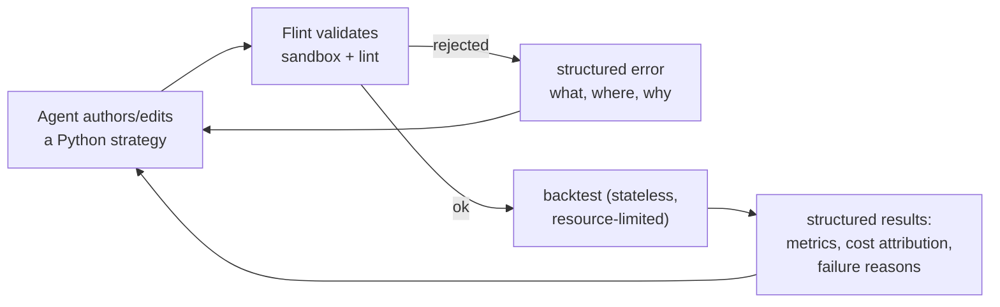

The agent never parses a human tearsheet or a stack trace — everything is machine-readable JSON it can reason over.

### 13.2 The agent API (MCP + programmatic)

Exposed as MCP tools (and the same REST contract), all JSON in / JSON out, all through `services/` with a `TenantContext`:

- `list_universe` / `data_coverage` — what markets/venues/ranges are available.
- `validate_strategy(code)` — sandbox + static checks; structured errors *before* any run.
- `run_backtest(code, universe, venue, range, fill_mode)` — returns a run id.
- `get_results(run_id)` — structured metrics, equity curve, per-trade log, and a **cost-attribution** block (trading PnL vs funding vs fees vs slippage).
- `explain_failure(run_id)` — structured "why it did poorly" hints (`funding_dominated`, `liquidated`, `no_trades`, `overfit_suspected`, `lookahead_detected`) the agent can act on.
- `optimize(...)` / `compare(run_ids)` — walk-forward param sweep / rank candidates.

### 13.3 Structured feedback (what makes agents converge)

Results are designed for an LLM to *act on*, not just display:
- Metrics plus the full cost breakdown (so the agent sees "funding was 90% of PnL").
- **Per-segment fill fidelity tier** (§6.3) on every result — the agent knows whether fills were Tier A (queue-aware) or Tier C (parametric) and can weight its confidence accordingly.
- **Hard-gate rejections are structured, not errors**: a request over a range with missing funding returns `{rejected: "funding_gap", missing: [[venue, market, start, end], ...]}` so the agent resubmits a covered range instead of guessing.
- **Failure reasons as enums with detail**, not exceptions: `{reason: "liquidated", at_ts, mark_price}`.
- Validation errors point at the line + the rule broken ("import `requests` not in the sandbox allowlist").
- Optimization returns **trial count + out-of-sample (walk-forward)** results, so an agent can't fool itself with in-sample overfit — and can be *told* it's overfit (`overfit_suspected`).

### 13.4 Safety: running untrusted agent code

Agent-generated strategies run through **the same OS-isolated sandbox as everything else** (§8.3, D25) — there is no separate "agent path" that could skip routing, because there is no unsandboxed path at all. The `JobRunnerPort` enforces per-run CPU/memory/wall quotas on top. Secrets are unreachable by construction (empty child env, value-object ctx). Because isolation ships in Phase 1–2, the agent surface launches *already* protected — no window where agent code runs with weaker guarantees than human code.

### 13.5 Scale: parallel, stateless evaluation — bounded in v1

Agents iterate; v1 supports **serial or low-concurrency** evaluation (a handful of in-flight runs per tenant, enforced by the JobRunner). The 50-candidate parallel fan-out is **deferred** until per-run quotas have soaked in practice and lake egress metering exists — un-quota'd fan-out is an algorithmic-DoS and data-egress amplifier (review M15/M18). Backtests are **stateless** (a design invariant), so raising the concurrency cap later is a config change, not engine work.

**Scope note:** this is the *agent tool* surface (an agent calls Flint to backtest its strategies). A standardized eval/benchmark/leaderboard *gym* for ranking agents is a deliberate non-goal for now — but the structured-scoring foundation here is exactly what such a layer would build on later.

## 14. Cloud-hostability (installed as a seam, not built)

We are **not building cloud infrastructure now.** We are installing the *seam* so it's a swap later (D12). What goes in day one, and why each is painful to retrofit:

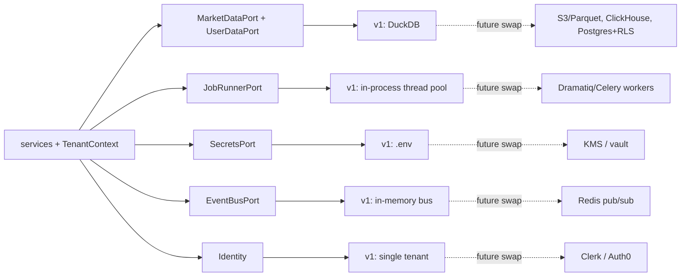

- **`TenantContext` on every service call** — retrofitting tenant scoping is how data leaks happen.
- **The five ports with local adapters only** — domain code depends on interfaces, never DuckDB/S3 directly.
- **Idempotent orders + persisted state machine** — the prerequisite for a hosted per-account execution worker.
- **REST/WS as the only UI channel** — no shared-memory shortcut the browser depends on.
- **Stateless backtests** (no global mutable engine state) — so a backtest can later run in a worker container unchanged.
- **Secrets only ever server-side** — exchange keys never reach the browser.

**The one hosted component pulled forward: the Flint Data API (D16).** Data is the highest-value, lowest-risk thing to host first because it's **read-mostly and tenant-agnostic** — market data is the same for everyone, so it needs none of the multi-tenant auth/billing/isolation machinery that real cloud compute does. It's just a fast, permanent lake behind the same `MarketDataPort` abstraction the local DuckDB cache uses, so the engine can't tell the difference. This keeps "local-first" honest in the way that matters — **your compute, strategies, and results stay local; only the shared market-data firehose is hosted** — while delivering the QuantConnect "data is just there, fast" experience.

**Local realtime/queue/cron (D17/D24):** an in-memory bus, an in-process thread-pool runner, and a plain async cron loop. Events are ephemeral across restarts — *state* is not (orders/positions/runs persist in the store and recover on start, §6.2). Durable queues/brokers (Honker, Redis, Dramatiq) slot into the same ports if/when scale demands them.

**"Local-first" stated honestly — the offline matrix.** The hosted lake is a cloud dependency, so what works without it is explicit:

| Capability | Fully offline / self-hosted | With the lake |
|---|---|---|
| Backtests on locally-cached / self-recorded / free-API data | ✅ (free-provider fallback; own recorder) | ✅ faster, deeper history |
| Funding hard gate | applies the same — may reject more ranges (your coverage is smaller) | more ranges covered |
| Tier A/B fills | only over ranges your own recorder captured | over everything the central recorders + HL S3 cover |
| Paper / live | ✅ (LiveFeed talks to venues directly; gap-replay degrades without the lake — flagged) | ✅ + gap-replay |
| Compute, strategies, results, keys | **always local** — the lake never sees your strategy or results | same |

Everything *else* cloud (multi-tenant Postgres+RLS for user data, KMS, billing, managed auth) is explicitly **deferred** — each is one adapter behind a port, not a rewrite.

---

## 15. v1 scope vs deferred

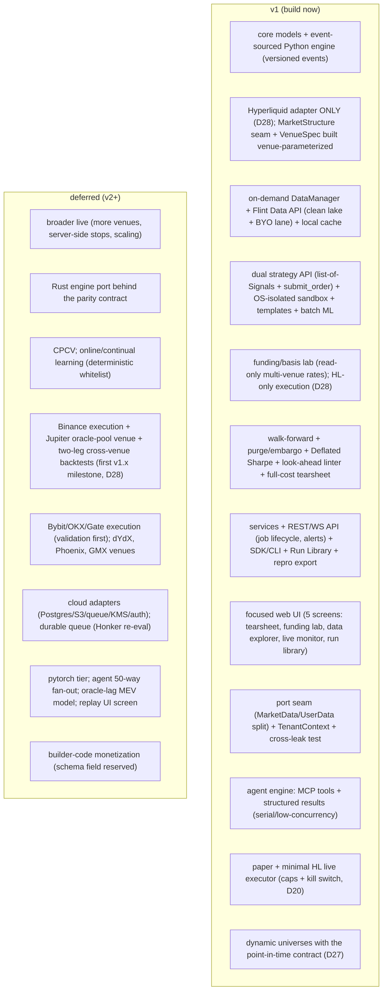

**Cut entirely (not deferred):** the GA optimizer (D22), tensorflow support, synthetic-data anything (D26).

---

## 16. Edge cases the engine must handle (prioritized)

From the dossier's "edge cases naive tools miss," ordered by trust impact:

1. **Funding HARD gate** — no funding for (venue, market, period) → **reject the backtest** for that period (§6.3). Borrow data on Jupiter gated the same. (Funding/borrow is a perp's PnL, not an optional input.)
2. **No-look-ahead funding at bar boundaries** — oracle-priced, hourly 1/8 accrual, capped, using the rate known at decision time, charging only positions held at settlement.
3. **Oracle vs mark separation** — funding on oracle, liquidation on mark.
4. **T+1 execution** with lagged high/low so a strategy can't "see" the bar it trades on.
5. **Fill fidelity tiers + reporting** — Tier A (book+trades, queue-aware) / B (book only) / C (OHLCV, parametric); every result reports the per-segment tier so a coarse run is never mistaken for a faithful one (§6.3).
6. **Queue position for limit/maker fills** — fill only after volume clears the queue ahead; classify crossing limits as taker, not maker. (The #1 maker-fill over-optimism.)
7. **Effective-time fills** — fill against the book at `submit_ts + latency`, crossing the spread (buys lift the ask), not at bar-open/mid/close.
8. **Depth-aware fills + partial fills + tick/lot/price-band** — walk the real recorded book; reject what exceeds depth or sits outside the venue's price band.
9. **DEX thin-pool slippage + MEV/sandwich haircut** — model impact against pool reserves; apply a haircut on large swaps; reject swaps past slippage tolerance. *(v1.x — lands with Jupiter, D28.)*
10. **Liquidation realism** — maintenance-margin tiers, partial (cross) vs full (isolated), ADL of winners.
11. **Data-gap vs downtime** — distinguish a genuine no-trade gap from an outage; never forward-fill across an outage (that's leaking future data).
12. **Survivorship/delisting** — keep delisted markets in history so backtests aren't biased toward survivors.
13. **Overfitting controls** — walk-forward + trial count now; CPCV + Deflated Sharpe later.
14. **Backtest↔paper parity** — shared code path + a live drift alert.
15. **Time-varying fees** — fee tiers change; account for fee + funding + slippage + latency always.
16. **ML look-ahead / leakage** — causal feature feed, per-window target derivation, purge+embargo, and the look-ahead linter (§8.5); deterministic seeding so ML runs reproduce.
17. **Untrusted-code safety** — OS-isolated subprocess sandbox on every path (D25); never deserialize raw pickle/torch bytes; models only via the managed store (§8.3/§8.5).
18. **Predicted vs final funding** — strategies see only the last published predicted rate; payments use the final rate (§6.4). The engine-level leak no strategy linter can catch.
19. **Intrabar ambiguity** — adverse-extreme-first on OHLCV segments, every intrabar trigger flagged (§6.1).
20. **Naked legs** — a partially-filled cross-venue pair records the surviving directional leg and its exposure time; never retroactively unwound (§6.6). *(v1.x — lands with cross-venue execution, D28.)*
21. **Dynamic-universe survivorship** — point-in-time membership, event-logged snapshots, exit behavior (§2.11/D27).
22. **Stale-book honesty** — book older than the venue staleness threshold = treated absent, fill degrades with a flag (§6.3).

---

## 17. Directory layout (every folder explained)

```
flint/
  core/            # pure data models + time/no-lookahead rules. No I/O. Depends on nothing.
    models/        #   Candle, Order, Fill, Position, FundingRate, MarkSnapshot, ...
    time/          #   bar alignment + the no-look-ahead guarantees
  engine/          # the simulator/executor shared by backtest + paper
    context/       #   ExecutionContext + the 7 state managers
    fills/         #   FillModel interface + CLOB + oracle-pool models
    funding/       #   venue-specific funding accrual + ledger
    liquidation/   #   mark-based liquidation + margin tiers
    portfolio/     #   cross-position risk + event log/replay/snapshots
  venues/          # one adapter per exchange, keyed by market structure
    base.py        #   VenueAdapter interface + MarketStructure enum
    hyperliquid/   #   DEX, CLOB adapter + specs (native API) -- the ONLY executable v1 venue (D28)
    jupiter/       #   DEX, oracle-pool adapter + specs (on-chain) -- v1.x (D28)
    ccxt_cex.py    #   ONE CCXTVenueAdapter for ALL CEXes (CLOB); v1: read-only funding/OI ingestion only (D28)
    cex_specs.py   #   per-exchange fee/margin/funding config (binance, bybit, okx, ...)
  data/            # on-demand data layer (no manual download)
    manager.py     #   DataManager: source chain = local cache -> Flint Data API -> providers
    universe.py    #   UniverseResolver: static list or point-in-time dynamic rule (D27)
    livefeed/      #   live market-data feed for paper/live (§6.7): venue WS via recorder-shared
                   #   normalization; lake used for reconnect gap-replay only
    migrate.py     #   one-shot importer: legacy Flint v1.x DuckDB -> the new store (§19.6)
    ingest/        #   the 5 lake-ingestion worker classes (§9.1)
      recorders/   #     now-or-never WS recorders (HL trades/ctx/book, Binance depth/forceOrder, ...)
      backfillers/ #     REST + bulk CSV/S3 (HL S3, data.binance.vision, OKX/Gate/Bybit archives)
      onchain/     #     Solana/EVM decoders (Jupiter, Phoenix via Helius archival RPC; GMX subgraph)
      vendors/     #     paid backfill (Tardis, Crypto Lake, Kaiko, Amberdata)
      oracle.py    #     Pyth Hermes/Benchmarks poller (key before 2026-07-31)
    store/         #   MarketDataPort adapters: DuckDB local cache (+ object-store lake, hosted)
    api_client.py  #   client for the hosted Flint Data API (the canonical source, D16)
  strategy/        # the user's surface
    base.py        #   Strategy base class + the Signal model (§8.1)
    ml.py          #   MLStrategy: declarative features/target/train (batch; online learning v2)
    context.py     #   the read-only ctx value object (+ model_store, rng, now, submit_order)
    sandbox/       #   the OS-isolated runner (D25): subprocess + RLIMIT + env-scrub + nsjail/seccomp
    screen.py      #   import allowlist + AST pre-screen (lint-grade UX, not the security boundary)
    model_store.py #   managed KV for models (tenant-scoped, safe formats, no exposed paths)
    templates/     #   built-in strategies incl. an ML template (single registry)
  research/        # trust tooling
    walkforward.py #   out-of-sample validation (+ purge/embargo, all multi-bar strategies)
    deflated.py    #   Deflated Sharpe Ratio (D22)
    lookahead.py   #   look-ahead/leakage linter: static AST pass + truncated-frame re-run
    optimize.py    #   Optuna TPE + vectorized parameter sweeps
    tearsheet.py   #   full-cost performance report (metric definitions, §11.1)
    runlib.py      #   Run Library + reproducibility export (§11.2)
  live/            # the minimal v1 live executor (D20): HL only, caps, kill switch
  ports/           # the interfaces (MarketDataPort, UserDataPort, JobRunnerPort, SecretsPort, EventBusPort, Identity)
  adapters/        # concrete port implementations (v1: all local)
    marketdata_duckdb.py #   MarketDataPort over DuckDB (+ the lake client adapter)
    userdata_duckdb.py   #   UserDataPort over DuckDB (tenant column + scoping predicate from day one)
    eventbus_memory.py   #   in-memory EventBusPort (ephemeral; state durability lives in the store)
    jobs_inprocess.py    #   thread-pool JobRunnerPort with per-run CPU/mem/wall quotas
    scheduler.py         #   plain async cron loop (recorder/ingestion cadence)
    secrets_env.py       #   SecretsPort over .env (server-side only)
    identity_local.py    #   single-tenant Identity
  services/        # the front door; every function takes TenantContext
  api/             # FastAPI REST + WebSocket -> services
  mcp/             # MCP tools (agent + AI-assistant surface) -> services
  agent/           # agent engine: structured result + failure-reason schemas, validate_strategy, quota wiring
  sdk/             # Lab object + `flint` CLI
  rust/            # (v2) hot-path port, parity-tested vs the Python engine
ui/                # focused React app (5 screens) -> API only
docs/              # guides, this spec, plans, the research dossier
tests/             # all mocked; engine tests inject fake ports
```

---

## 18. How we build it (decomposition into phases)

This design is too big for one implementation plan, so Track-3 implementation is decomposed into **independently shippable phases**, each getting its own `writing-plans` pass and each producing working, tested software. (v2 re-ordering: OS isolation moved to 1–2 per D25; event sourcing scheduled explicitly; a minimal strategy interface pulled into Phase 3 so the engine phase has something to run; legacy migration added; live executor added.)

1. **Walking skeleton + the security floor.** Repo scaffold on the new branch + Track-1 `CLAUDE.md`/handbook + the ports (incl. the MarketData/UserData split) with local adapters + `core` models (numeric policy locked, §5) + `TenantContext` **with the two-tenant cross-leak test** + the **event log: emit seam + `event_version` + upcaster registry** (no-op events flow end-to-end) + the **sandbox skeleton** (subprocess runner, env-scrub, RLIMIT). End state: an empty engine runs a no-op backtest end-to-end through `services`, inside the sandbox, emitting versioned events.
2. **On-demand data + ingestion + isolation hardening.** The `DataManager` source chain + `UniverseResolver` (point-in-time, D27) + DuckDB cache store + the **Flint Data API per §9.0** (schema, range endpoint, auth+quotas, coverage matrix — clean-lake only, D23) + **BYO vendor lane**. Stand up ingestion in the §9.1 order, HL-scoped per D28: **Hyperliquid WS recorders FIRST** (now-or-never), then the HL S3 backfiller, then REST gap-fillers + read-only CEX funding-rate ingestion for the lab — each with the §9.0 quality bars. **Legacy migration:** the one-shot importer from the current Flint DuckDB (candles/funding/recorded depth/OI — that recorded data is itself now-or-never) + a strategy-porting note; legacy file stays read-only until verified. Finish the sandbox OS layer (nsjail/seccomp where available). **Run the Python-throughput spike on one real HL S3 depth day against the §19.4 budget** — if it fails, the Arrow-native fill path gets designed *now*, not after the engine exists. End state: range+universe in, data appears; recorders live; coverage floor visible; legacy data preserved; isolation complete.
3. **The honest engine.** Three-price model + the locked per-bar loop (funding-before-liquidation, intrabar policy, §6.1) + CLOB fills (effective-time, spread-crossing, queue-aware limits, tiers A/B/C with per-fill recording, HL oracle-band override, the §6.3 parameter tables) + funding engine (predicted/final, §6.4) + the hard gate + liquidation (`LiquidationSpec`, cross-pool semantics, §6.5) + **replay/fold over the event log** + a **minimal internal strategy interface** (Strategy/Signal/ctx core — no sandbox-UX, no ML, no templates) so the engine has something real to run. End state: a faithful Hyperliquid backtest of a simple internal strategy, full-cost tearsheet, per-fill fidelity, hard-gate rejections with actionable messages.
4. **Cross-venue + market structures — DEFERRED to v1.x (D28).** The Binance (CEX, CLOB) adapter on the CCXT base + the **cross-venue portfolio model (§6.6)** + multi-venue funding-gate intersection + the Jupiter oracle-pool **fill model** (real-data-gated, D26; its recorders start when this phase does, which starts its ~90-day data clock). Kept fully written so v1.x is a planning exercise, not a redesign. End state (v1.x): the flagship two-leg funding-arb backtest runs with per-venue margin and naked-leg handling. **v1 skips from Phase 3 to Phase 5**; the only remnant of this phase in v1 is read-only CEX funding ingestion, which lands with the lab in Phase 6.
5. **Strategy surface + ML + paper.** Full strategy API (list-of-Signals + `submit_order`, sizing helpers) + the screen/allowlist UX on top of the Phase-1 sandbox + declarative batch **MLStrategy** + the managed model store + templates + **LiveFeed + paper trading** (clock, reconnect gap-replay, drift metrics, alerts/heartbeat — §6.7). End state: classic + ML strategies run; paper survives restarts/reconnects; drift is measured, not vibed.
6. **Trust + lab.** Walk-forward (+ purge/embargo for all multi-bar strategies) + **Deflated Sharpe** + the look-ahead linter (static pass + truncation) + metric-definitions appendix implementation + the **Run Library + reproducibility export** + the cross-venue funding/basis lab (read-only Binance/Bybit/OKX funding ingestion included — D28).
7. **Surfaces + agent engine + live.** REST/WS API (job lifecycle, local auth) + SDK/CLI + the 5-screen web UI + the **agent surface** (MCP tools, structured results, serial/low-concurrency) + the **minimal HL live executor** (D20: caps, kill switch, same code path). End state: an agent loops author→backtest→refine safely; a human goes paper→live-small on the same screen.
8. **(v2) Speed + breadth.** The Rust port behind the §19.4 parity contract; online learning behind the determinism whitelist; broader live; venue expansion as each passes validation.

---

## 19. Production engineering (the sections a production-ready spec can't skip)

### 19.1 Error taxonomy — every failure has a class, and each class has a surface

| Class | Examples | CLI | UI | API/agent |
|---|---|---|---|---|
| **User error** | bad param, sandbox-denied import, malformed strategy | line-precise message + hint | inline validation | `{error: {code: "validation", line, rule, hint}}` |
| **Data gap (expected)** | funding hard-gate, depth degrade, universe-rank gap | rejection + available ranges + the fix (§2.11) | coverage panel | structured `rejected`/`degraded` payloads — **not** errors (§13.3) |
| **Venue/network fault** | WS drop, REST 5xx, rate limit | retry + surface after N failures | banner + last-data timestamp | `{error: {code: "venue_unavailable", retry_after}}` |
| **Internal bug** | engine invariant violation, replay mismatch | panic loudly with run_id + "this is a Flint bug" + issue link | error screen | 500 + incident id |

The rule: **expected scarcity is data, faults are retried then surfaced, bugs are loud.** Nothing is silently swallowed; nothing expected (a funding gap) ever stack-traces.

### 19.2 Observability (local app + hosted lake)

- **Local:** structured JSON logs (`run_id`, `tenant`, component) with `--verbose` human mode; per-run **timing breakdown** (data fetch / fill sim / strategy time / funding accrual) on the tearsheet — "why is my backtest slow" is answerable from the output; engine **invariant counters** (orders in vs fills+rejects out, funding settlements applied vs expected) asserted at run end — "my backtest is wrong" fails loudly at the source.
- **Hosted lake:** per-worker lag metric (§9.0) + gap alerts; request metrics per key (egress, latency); a public **status page** with per-venue ingestion freshness — users see "Binance funding delayed 2h" rather than discovering it as a mystery rejection.
- **Telemetry: none.** The local app phones home nothing (a positioning asset; stated in §19.7).

### 19.3 Testing strategy (what "the engine is correct" means operationally)

1. **Golden-fixture engine tests** — hand-built scenario fixtures (D26: real recorded fragments or hand-authored unit inputs, never generated "market-like" data) with exact expected outputs: the §6.4 funding example, the §6.5 liquidation example, funding-saves-position ordering (§6.1), naked-leg recording (§6.6), the predicted/final divergence window, one full HL S3 day replayed against invariants.
2. **Contract tests per port** — every adapter passes the same behavioral suite; the **two-tenant cross-leak test** (Phase 1) is the canonical one.
3. **ctx visibility tests** — one truncated-frame test per accessor asserting the §8.2 contract.
4. **Security tests** — the known escapes (`getattr` chains, `__subclasses__`, env access, credential reachability from ctx) run as *expected-fail* attacks against the sandbox in CI.
5. **Metric goldens** — §11.1 formulas pinned against hand-computed values.
6. **Venue-number tests** — every hard number from venue docs (fee tiers, funding caps, margin tiers) is a unit test with the primary-source URL in the test docstring (the round-1-M10 lesson: a review *correction* was itself wrong).
7. **Parity suite (v2-ready)** — the fixtures above are the future Rust parity corpus from day one.

### 19.4 Performance budget + the numerics/parity contract

- **Budget (Phase-2 spike gates this):** a 6-month, 3-market, 1-minute-bar Tier-C backtest ≤ **60 s**; the same at Tier A (HL S3 depth) ≤ **15 min**; peak RSS ≤ 4 GB. If the spike fails, book/trade data feeds the fill model via an **Arrow-native columnar path** (dataclasses stay for orders/fills/events only — they're low-volume).
- **Tier-A snapshot policy:** depth replays at recorded cadence; an optional documented down-sample (e.g. 1s) is a *visible* run parameter, never silent.
- **Numerics** (§5): `Decimal`/scaled-int for accumulators; integer lamports; floats for prices.
- **Rust parity contract (v2):** bit-exact = event order, fill/no-fill, order-state transitions, event counts. Tolerance = monetary accumulators (|Δ| ≤ 1e-9 rel) and derived stats (Sharpe to 4 sig figs). Accumulation order specified (sorted by `(ts, event_seq)`); Kahan summation where float accumulation survives. "Identical results" without this contract either never passes or hides drift — so it's written *before* the Python engine exists.

### 19.5 Pre-build verification checklist (empirical, before the relevant phase locks)

1. ☐ Exchange free-archive ToS pass → `serve-raw`/`serve-derived`/`blocked` per source in the coverage matrix (the Tardis lesson: "probably fine" isn't a basis). *(v3 — D28: v1 needs the HL S3 pass + the read-only CEX funding-rate sources; Binance Vision / OKX / Gate dump passes defer to their venues.)*
2. ☐ HL primary-source numbers: maintenance tiers, ADL rank formula, funding cap (4%/hr) + interest component, oracle-band width — cited + unit-tested (D14).
3. ☐ Jupiter empirics: Helius reconstruction of historical custody utilization (decides whether *any* pre-recorder Jupiter backtest can exist), `hourlyFundingDbps` scaling, candle-volume synthesis from on-chain fills. *(v3 — D28: deferred; verify before the v1.x Jupiter phase, not before v1.)*
4. ☐ Python throughput spike vs the §19.4 budget on one real HL S3 day.
5. ☐ Pyth key + billing owner before **2026-07-31**; Jupiter lite-api tier reverified before **~2026-06-30**.
6. ☐ UNVERIFIED retention depths (Bybit/OKX intraday OI, Binance `liquidationSnapshot` start) probed empirically; recorders running defensively meanwhile.

### 19.6 Versioning, migration, distribution

- **Engine version stamped on every run** (and in the repro bundle). Tearsheets of runs from older engine versions show a "re-run to compare" notice rather than pretending comparability.
- **Strategy API stability:** pre-1.0 = breaking changes allowed with a CHANGELOG entry + a porting note; post-1.0 = deprecation cycle (one minor version with warnings).
- **Event/lake schemas:** `event_version` upcasters (§2.10) + Parquet `schema_version` migration registry (§9.0). Adding nullable fields = compatible; renames/retypes = new version + upcaster, enforced by a CI check that replays a corpus of old-version fixtures.
- **Legacy Flint (v1.x) migration:** the Phase-2 importer (candles, funding, **locally-recorded depth/OI** — now-or-never by our own argument — run metadata) + a strategy-porting guide (old API → Strategy/Signal). The greenfield branch deletes old *code*, never old *data*.
- **Distribution:** `pip install flint` (Python ≥3.11); the UI ships pre-built inside the wheel (`flint serve` needs no node); Rust later via `maturin` binary wheels. Update = pip; the CLI prints a non-blocking notice when the lake API reports a newer client.

### 19.7 Non-goals (v2 explicitly does NOT)

- No HFT/sub-second strategy support — bar-driven (1s floor); queue modeling makes *fills* honest, not latency arbitrage.
- No spot/options/prediction markets; no stocks. Perps only.
- No no-code strategy builder; no social/copy-trading; no signal marketplace.
- No agent eval gym/leaderboard (the agent *tool* is in scope; ranking agents isn't — §13.5).
- No portfolio margin optimization across venues (per-venue isolated is v1 law — §6.6).
- No telemetry/analytics phoning home. No custody of user funds — keys stay in the user's `.env`; Flint never holds money.
- No synthetic data, anywhere, ever (D26).

### 19.8 Success metrics (how we know v2 worked)

- **Activation:** install → first completed backtest < 10 minutes (measured by docs-reported flow, not telemetry — §19.2).
- **Truth-in-fills:** for strategies run in both, paper-vs-backtest structural drift within thresholds (§6.7) over 30 days — *the* product claim, measured.
- **Trust adoption:** % of optimization runs where DSR is reported (always) and looked at (UI event, local only).
- **The wedge demo** *(v3 — D28)*: an HL-native funding strategy (harvest / dislocation vs the lab's cross-venue benchmark) backtests + papers + goes live-small end-to-end without leaving Flint. The two-leg cross-venue demo becomes the v1.x acceptance test.
- **Agent loop:** an agent (Claude via MCP) authors → backtests → reads structured failure → improves a strategy, unattended, ≥ 3 iterations — the §13 acceptance test.

---

## 20. Open questions and decisions to confirm

*(v2 note: the original list shrank — the two review rounds + the 2026-06-11 decision session resolved most of it: Tardis spend → BYO lane (D23); Jupiter v1 shape → D26; HL numbers + builder-code → §19.5 / the Order schema. Still genuinely open:)*

- **Where the recorder runs locally** — it's an always-on background process; confirm it's a managed `flint recorder` daemon vs a user-run command. (Central recorders make this an edge case, but self-hosted users hit it.)
- **Pyth post-2026-07-31** — decide whether Pyth stays the index anchor after mandatory auth or Hyperliquid's own oracle suffices. (The key gets provisioned either way — §19.5.)
- **Phoenix-perp schema pre-build** — verify live Phoenix/Jupiter program IDs on-chain and pre-build the Phoenix recorder schema so recording starts the instant beta access lands (nothing is backfillable). Kept as a near-zero-cost option.
- **Candle derivation from recorded trades** — venues with no candle API (Jupiter/GMX/Phoenix) get candles derived from our own recorded fills/oracle ticks. This is *derivation from real data*, not synthesis (D26-compatible) — but the Jupiter volume-source question (§19.5 item 3) decides whether those candles carry real volume or an honest `volume=NULL`.
- **Derived-aggregates lane** (§9.0) — pursue written vendor confirmation for the >=10-min aggregates / calibration-parameter lane, or skip it in v1.
- **Local UI auth-token UX** — `flint serve` prints the token vs writes it to a well-known local file the UI reads (one paragraph in the Phase-7 plan).

---

## 21. Glossary

- **Perp (perpetual future):** a no-expiry leveraged derivative; uses funding to track spot.
- **Funding:** periodic payment between longs and shorts that pulls the perp price toward spot. Often a perp strategy's whole edge or cost.
- **Long / short:** bet price up / down.
- **Leverage / margin:** trade more than your collateral; margin is the collateral posted.
- **Liquidation:** forced close when margin falls below maintenance.
- **Oracle / index price:** external "true" spot price; drives funding.
- **Mark price:** the exchange's contract valuation; drives PnL and liquidation.
- **Last price:** most recent trade price; drives your fills.
- **Basis:** how far the perp trades above/below spot.
- **CEX / DEX:** centralized exchange (Binance, Bybit, OKX — off-chain, API-key access) / decentralized exchange (Hyperliquid, Jupiter — on-chain). Flint is DEX-first but supports CEX venues because real perp strategies span both.
- **CLOB:** central limit order book exchange; fills walk the book. Used by DEXes (Hyperliquid, dYdX) *and* CEXes (Binance) alike.
- **Oracle-pool:** order-book-less exchange; fills at oracle + fees (Jupiter, GMX).
- **CCXT:** a library wrapping 100+ centralized exchanges with one API; Flint's CEX adapters sit on it.
- **Slippage / market impact:** getting a worse average price because your order moved the book.
- **Fill fidelity tier:** how faithful the simulated fills are, set by available data — A (L2 book + trades, queue-aware), B (book only, probabilistic), C (OHLCV only, parametric). Reported per market×period.
- **Queue position:** where your limit order sits in line at a price level; you only fill after the resting size ahead of you clears. Modeling it stops backtests from over-counting maker fills.
- **Effective time:** when an order actually hits the book = submit time + latency; fills use the book at this moment, not the bar's.
- **Hard gate vs soft gate:** missing funding/borrow → backtest *rejected* for that period (hard); missing L2 book → run proceeds at a lower, flagged fidelity tier (soft).
- **Open interest (OI):** total size of open positions in a market.
- **Backtest / paper / live:** historical sim / live-data fake-money / real money.
- **Look-ahead bias:** accidentally using future information; produces fake backtest profits.
- **Walk-forward:** tune on past data, test on later unseen data; the honesty check.
- **Port / adapter (hexagonal architecture):** an interface the core depends on / a concrete implementation of it. Lets us swap DuckDB→S3 without touching the engine.
- **Tenant:** "whose data is this"; threaded everywhere so the cloud version can't leak between users.
- **Event sourcing:** store every event and replay to get state; makes runs reproducible and auditable.
- **Universe:** the set of instruments a backtest considers — static (a list) or dynamic (a rule like "top 20 perps by volume").
- **On-demand data:** you declare a date range + universe and the engine fetches/caches data automatically; no manual download step (QuantConnect-style).
- **Honker:** a SQLite extension giving Postgres-style NOTIFY/LISTEN pub/sub + queues. Considered for v1's bus/queue/scheduler, **dropped** (D24: alpha + bus-factor-1 across three critical roles); re-evaluable behind the ports after a stress test.
- **Deflated Sharpe Ratio (DSR):** the walk-forward Sharpe penalized by how many trials it took to find it and their variance — the multiple-comparison correction that makes an uncapped optimizer honest (D22, §11).
- **Predicted vs final funding rate:** the continuously-published estimate a trader can see mid-interval vs the rate actually settled; strategies may only see predicted, payments use final (§6.4).
- **LiveFeed:** the component feeding paper/live sessions venue data over WebSocket using the recorders' normalization code; the lake serves reconnect gap-replay only (§6.7).
- **Structural vs market drift:** paper differing from backtest because the *model* is wrong (alert) vs because the *market* changed (chart) — with numeric thresholds (§6.7).
- **Naked leg:** the surviving directional position when one leg of a cross-venue pair fills and the other rejects; recorded and flagged, never retroactively unwound (§6.6).
- **Reproducibility bundle:** `flint export --run-id` — strategy code + params + data manifest + engine version + seed; re-runs bit-for-bit (§11.2).
- **BYO vendor lane:** paid vendor data fetched with the *user's own* license key into their local cache only — never the shared lake (D23).
- **Flint Data API:** the hosted, permanent, fast data lake that is the canonical market-data source; local clients fetch from it and cache. Free venue APIs feed it (ingestion) and serve as an offline fallback.
- **DataManager:** the component that resolves a backtest's data needs through a source chain (local cache → Flint Data API → free providers) and reports a fidelity summary.
- **Declarative ML strategy:** the user supplies feature + target functions (and optional `train`), not a training loop — so the engine can enforce causality and run training off the bar clock (FreqAI's pattern).
- **Online / continual learning:** a model that updates as each bar closes (`river.learn_one` / `partial_fit`). **Deferred to v2** behind a provably-deterministic model whitelist (D19 revision) — BLAS/architecture float ordering otherwise breaks bar-for-bar reproducibility.
- **Purge + embargo:** dropping training samples whose label window overlaps the test window, plus a gap after it — stops multi-bar features/labels leaking across the walk-forward boundary.
- **Look-ahead linter:** an automated check that flags code reading future data (`shift(-n)`, future `.iloc`, full-frame aggregates) before a backtest is trusted.
- **Model store:** a managed, tenant-scoped key-value store for trained models with safe serialization and no exposed file paths (QuantConnect-ObjectStore-style).
- **Pickle RCE:** loading untrusted pickle/`torch.load` bytes runs arbitrary code — the top ML supply-chain attack; strategies are forbidden from it.
- **MCP:** the protocol exposing Flint's tools to AI assistants.

---

## Self-Review (v2)

- **Review-hardened:** every round-1 blocker (B1–B8) and round-2 blocker has a section resolving it — multi-leg API + cross-venue margin (§6.6/§8.1), predicted/final funding (§6.4), DSR (§11/D22), OS-isolated sandbox on every path (§8.3/D25), the Data API operational spec (§9.0), the vendor legality restructure (D23), event versioning scheduled (§2.10/§18), per-venue liquidation spec (§6.5). ✅
- **Honest positioning:** §1.2 carries the verified competitor table; the wedge is "perp-correct by default," not "nobody does funding." ✅
- **Buildable workflows:** the §3.2 flagship example places both legs through an API that §8.1 actually defines; every CLI flag shown has a §12 surface. ✅
- **Contracts, not vibes:** ctx visibility (§8.2 table), Signal→Order conversion (§8.1), within-bar ordering + intrabar policy (§6.1), fill parameter tables + staleness (§6.3), drift thresholds + paper clock + reconnect (§6.7), metric formulas (§11.1), numerics/parity (§19.4). ✅
- **Production sections present:** error taxonomy, observability, testing strategy, performance budget, versioning/migration (incl. legacy-data import), distribution, non-goals, success metrics (§19). ✅
- **Consistency:** D1–D27 thread through the body; §15 scope = §18 phases = §17 tree (Honker absent everywhere; live executor, Run Library, LiveFeed present everywhere they belong). ✅
- **No synthetic data anywhere** (D26): Jupiter gated on real recordings; Tier-C zero-volume bars reject; fixtures are hand-built or real fragments and never surface as results. ✅
- **Mermaid:** all diagrams use Obsidian-safe syntax (quoted subgraph titles, ASCII labels, explicit edges). ✅
- **Remaining inputs:** the §19.5 empirical checklist (ToS pass, HL numbers, Jupiter reconstruction, throughput spike) — verification work, not design gaps. ✅

## Self-Review addendum (v3)

- **D28 (Hyperliquid-only v1) threaded consistently:** §1.1/§1.2 (positioning + competitor table), D4/D21 (revision notes), §2.6 (CLOB-only implementation, seam kept), §3.2 (north-star workflow labeled, HL-leg-only in v1), §6.3 (oracle-pool fills deferred-but-specified), §6.6 (cross-venue model deferred-but-locked; single account in v1), §7 (no executable CEX; CCXT read-only), §9.0/§9.1 (HL-scoped coverage floor + workers), §10 (lab read-only outside HL), §15/§16/§17/§18 (scope, edge cases, tree, Phase 4 deferred), §19.5/§19.8 (checklist + wedge demo rescoped). ✅
- **Nothing deleted, everything deferred-in-place:** the Binance/Jupiter/cross-venue designs remain fully specified so v1.x is a planning exercise, not a redesign; all contracts stay venue-parameterized (`Signal.venue`, per-venue accounts, `MarketStructure`, `VenueSpec`). ✅
- **Deferral costs stated, not hidden:** later start of the Jupiter and Binance now-or-never recording clocks (v3 paragraph, §9.1, D28 rationale); the wedge demo narrowed to HL-native funding strategies until v1.x. ✅
